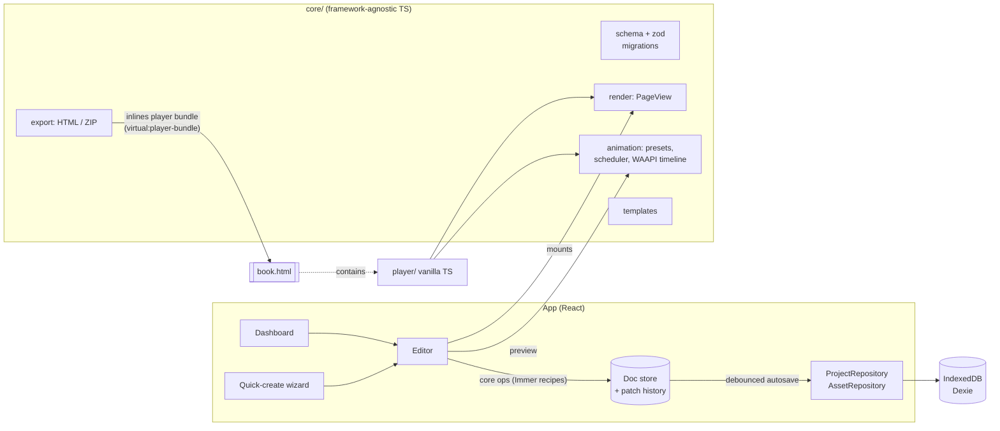

# Folio

**Folio** (working name) is a browser-based editor for **interactive, animated ebooks**. It works
like a simplified Canva or PowerPoint, built around book pages. The payoff is the export:
**one standalone HTML file** that anyone can open by double-clicking. It works offline, needs no
install or account, and looks and behaves exactly like the editor's preview.

| Editor (dark theme)                                | Animation Pane                                         |
| -------------------------------------------------- | ------------------------------------------------------ |
|              |  |
| **Quick create**                                   | **Exported book (`file://`, zero network requests)**   |
|  |    |

## Features

- **Quick create**
  - Name the book and pick a page size: Landscape 4:3 (default), Portrait, Square or 16:9.
  - Add pages as rows of _text line + image_, one at a time or in bulk: drop many images and paste
    multi-line text, and they pair up by order.
  - Reorder rows and swap images between them.
  - Pick a layout template (with live previews), colors and a font.
- **Editor**
  - Page sidebar (virtualized; add, duplicate, delete, drag to reorder).
  - Stage with zoom (fit or 25–200%).
  - Selection: click, shift-click, marquee.
  - Drag, resize and rotate with snapping and guides.
  - Context-sensitive properties panel and a layers panel (reorder, rename, lock, hide).
  - Undo/redo, keyboard shortcuts, copy/paste and debounced autosave with a status indicator.
- **Text:** inline editing on double-click, 10 bundled fonts, size, weight, italic, color,
  alignment, line height, letter spacing, highlight and shadow. Bold, italic and underline also
  work per selection with ⌘/Ctrl+B/I/U.
- **Images**
  - Upload by button, drag-drop or paste. Images are downscaled to ≤2400 px, encoded as WebP and
    deduplicated.
  - Non-destructive crop, filters and adjustments, flip, corner radius, replace and reset.
  - Alt text, and "use as page background".
- **Animation:** a PowerPoint-style Animation Pane.
  - 10 presets: fade, slide, zoom, pop, typewriter, Ken Burns, pulse and exits.
  - Triggers: on page open, with previous, after previous, on click.
  - Duration, delay, easing and parameters for each step.
  - Preview a single step or the whole page.
  - Page transitions: fade, slide, flip, zoom.
- **Preview and reader**
  - Full-screen reader built on the same runtime as the export.
  - Navigation: buttons, arrow keys, click to advance, swipe.
  - Click groups, page indicator, progress bar and fullscreen.
  - Letterboxed scaling, and it respects `prefers-reduced-motion`.
- **Export**
  - **Single HTML file** (default) or **ZIP** (`index.html` + `assets/`).
  - Size estimate with a warning above 25 MB.
  - Optional "Made with Folio" badge (on by default).
  - Only the fonts actually used are embedded, as base64 woff2.
  - A strict Content-Security-Policy keeps the book fully offline.
- **Dashboard:** live covers, create, rename, duplicate and delete, plus a generated sample book.
  Light and dark themes.

## Getting started

Requirements: **Node 22+** (developed on Node 24 LTS) and **pnpm** (via Corepack).

```bash
corepack enable pnpm
```

```bash
pnpm install
```

```bash
pnpm dev
```

Open http://localhost:5173. Everything is stored locally in your browser (IndexedDB).

### Scripts

| Script                                   | What it does                                                                                      |
| ---------------------------------------- | ------------------------------------------------------------------------------------------------- |
| `pnpm dev`                               | Dev server with HMR (the export's player bundle rebuilds on demand)                               |
| `pnpm build`                             | Production build into `dist/` (a static site; hash routing works from any sub-path)               |
| `pnpm preview`                           | Serves the production build                                                                       |
| `pnpm typecheck`                         | TypeScript, strict mode                                                                           |
| `pnpm lint` / `pnpm format`              | ESLint / Prettier                                                                                 |
| `pnpm test`                              | Unit tests (Vitest + happy-dom + fake-indexeddb)                                                  |
| `pnpm test:e2e`                          | Playwright E2E, including the export round trip over `file://`                                    |
| `pnpm build:player` / `pnpm size:player` | Builds the standalone reader and checks it against the 150 KB gzip budget (currently about 10 KB) |
| `pnpm check`                             | typecheck + lint + format check + unit tests                                                      |

The first E2E run needs a browser: `pnpm exec playwright install chromium`.

## Architecture



The design rules that make "preview = export" true:

1. **The project JSON is the single source of truth.** It is plain, versioned data, validated with
   zod, loaded through a migrations pipeline (`src/core/migrations`), and edited only through core
   ops (`src/core/ops`). No state lives only in the DOM.
2. **One renderer.** `core/render`'s `PageView` builds each page as absolutely positioned DOM, not a
   canvas. The editor stage, thumbnails, dashboard covers, the in-app preview and the exported player
   all mount this same code. Each element has three layers:
   - **frame:** layout, and the target for transform handles
   - **anim:** the only layer the animation runtime touches
   - **content**

   User text is never parsed as HTML: rich text is stored as structured runs and rendered with
   `textContent`.

3. **One animation runtime.** `core/animation` turns animation steps into Web Animations API
   animations, grouped by click.
4. **Non-destructive images.** Crop, filters, flip and radius are parameters applied with CSS. The
   original bitmap is never changed.
5. **Local-first, cloud-ready.** Persistence sits behind `ProjectRepository` and `AssetRepository`
   (`src/storage/repository.ts`). Dexie is the current implementation; a cloud backend can replace
   it without touching the editor.

### Folder structure

```
src/
  core/        pure TS (no React): schema, migrations, ops, history, render, animation,
               templates, fonts, image pipeline, export
  player/      standalone reader runtime (built as an IIFE into exported books)
  storage/     repository interfaces + Dexie implementation
  editor/      React editor: stage, selection (react-moveable + selecto), panels, Animation Pane,
               preview, export dialog, autosave, shortcuts
  dashboard/   book list, covers, sample book
  wizard/      quick-create flow
  ui/          shadcn/ui components, theme, shared bits
vite-plugins/  player-bundle: builds src/player in memory, exposes it as a string
tests/e2e/     Playwright specs
```

### Key decisions

- **The Web Animations API instead of GSAP.** GSAP's license forbids use in "tools that allow users
  to build visual animations without code" that compete with Webflow, and the Animation Pane is
  exactly such a tool. WAAPI is native, license-free and adds 0 KB to exports. Presets are plain
  keyframe data, so the engine stays swappable.
- **Patch-based undo/redo (Immer patches), not snapshot history.**
  - Only the document is tracked; selection and zoom stay out of history.
  - Explicit transactions make a whole drag or slider scrub a single undo step.
  - Patches are serializable, which suits future sync.
- **Gestures render live through `PageView` and commit to the document once, at the end.**
- **Fonts:** 10 OFL-licensed variable fonts from `@fontsource-variable`, latin and latin-ext
  subsets. The same woff2 files serve the editor and get embedded in exports.
- **The export is a vanilla-TS player** (no React), so exported books stay tiny.

## Extending

### Add an animation preset

Create one file in `src/core/animation/presets/` and list it in `presets/index.ts`:

```ts
// src/core/animation/presets/spin-in.ts
import type { AnimationPreset } from '../types';

export const spinIn: AnimationPreset = {
  id: 'spinIn',
  label: 'Spin in',
  kind: 'entrance', // 'entrance' | 'emphasis' | 'exit'
  // appliesTo: ['image'],     // optional: restrict to element types
  defaults: { duration: 800, delay: 0, easing: 'backOut', params: { turns: 1 } },
  params: [{ key: 'turns', label: 'Turns', type: 'number', min: 0.25, max: 5, step: 0.25 }],
  build: ({ params }) => [
    {
      target: 'element', // or 'chars' (split text) / 'media' (the  inside an image)
      keyframes: [
        { opacity: 0, transform: `rotate(${-360 * Number(params.turns)}deg) scale(0.5)` },
        { opacity: 1, transform: 'rotate(0) scale(1)' },
      ],
    },
  ],
};
```

It then shows up in the Animation Pane, including its parameters. It works in the preview and in
exports, and the registry tests cover it automatically.

### Add a layout template

Create one file in `src/core/templates/layouts/` and list it in `templates/index.ts`:

```ts
export const myLayout: LayoutTemplate = {
  id: 'my-layout',
  label: 'My layout',
  description: 'What it looks like',
  usesImage: true,
  build({ text, asset, pageSize, palette, fontId, animate }) {
    // Return ordinary elements (use the factories in core/schema) + optional animations.
    return { background: { type: 'color', color: palette.background }, elements: [...], animations: [...] };
  },
};
```

The wizard renders a live preview of it, and the template tests check that its output is
schema-valid.

### Change the schema

Bump `SCHEMA_VERSION` in `src/core/schema/project.ts` and add a migration in
`src/core/migrations/index.ts`. Stored books and exported files carry their version.

## Testing

- **Unit (Vitest):**
  - schema validation and migrations
  - undo/redo on every core op
  - the renderer, including HTML-injection safety and image geometry
  - the animation registry, scheduler and timeline
  - export packaging: JSON/`</script>` escaping, asset and font inlining, zip layout, size estimate
  - templates and wizard pairing
  - repositories (fake-indexeddb)
- **E2E (Playwright, Chromium):**
  - dashboard CRUD
  - editing with autosave and reload persistence
  - one drag = one undo, shortcuts, clipboard
  - image tools and dedupe
  - Animation Pane
  - the reader: click groups, keyboard/click/swipe, letterboxing, reduced motion
  - quick-create
  - a 100-page performance smoke test
  - **the export round trip**: export, open via `file://` in a fresh context, then check that
    page 1 renders, animations run, next page works, fonts are embedded and **no network requests**
    are made (both HTML and ZIP)

## Known limitations

- Rich text per selection is limited to bold, italic, underline and color, through shortcuts.
  There is no inline formatting toolbar yet.
- Bundled fonts cover Latin and Latin Extended. Other scripts fall back to system fonts.
- Animated GIFs become still images (they are re-encoded).
- E2E tests run in Chromium only. Firefox and Safari have been designed for but not verified in CI.
- The editor is built for desktop screen sizes. Exported books are fully responsive.

## Roadmap (designed for, not built)

Accounts, cloud sync and share links, real-time collaboration, narration and audio, video,
EPUB3/PDF export, a template marketplace, brand kits, AI helpers, comments, reader analytics, 3D
page-curl transitions, quizzes and hotspots.
