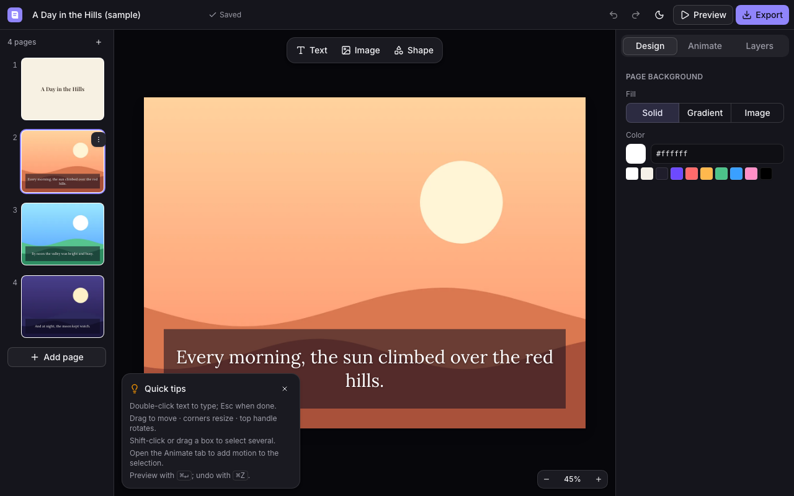
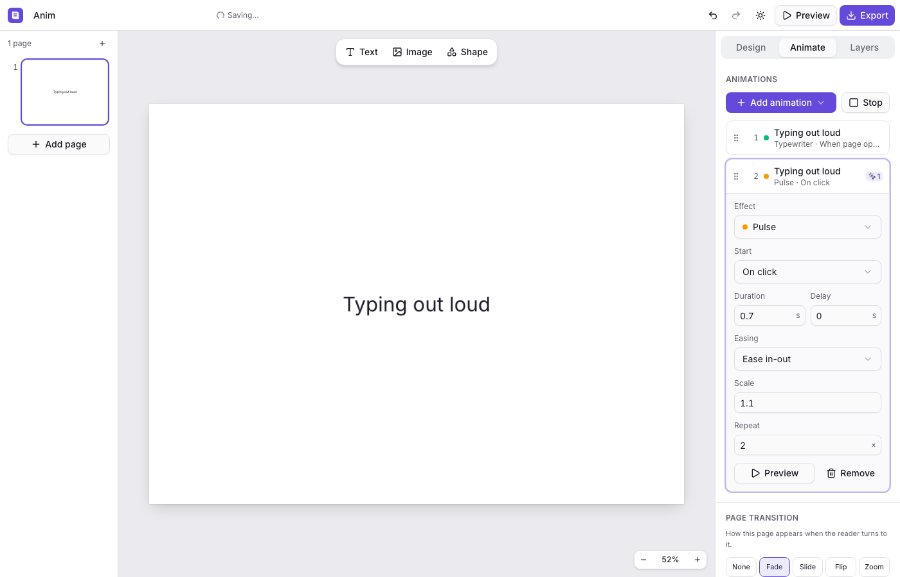
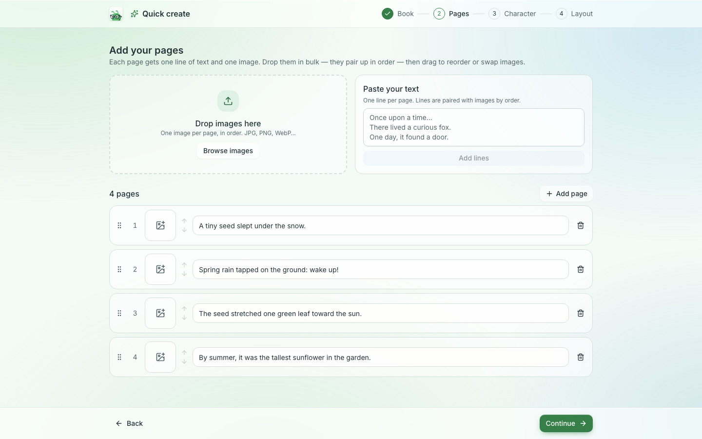
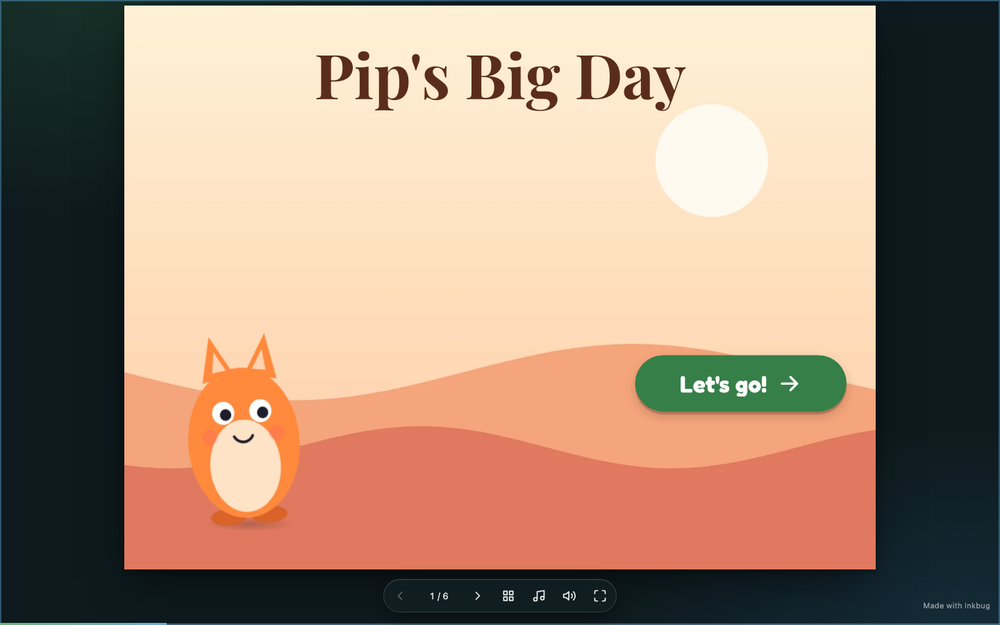
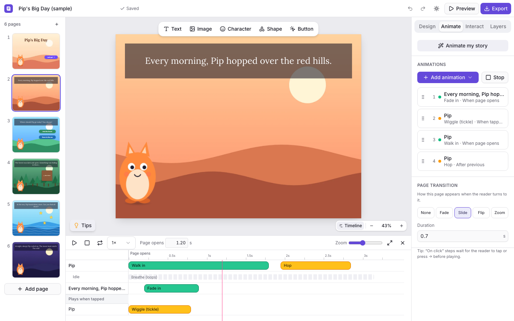
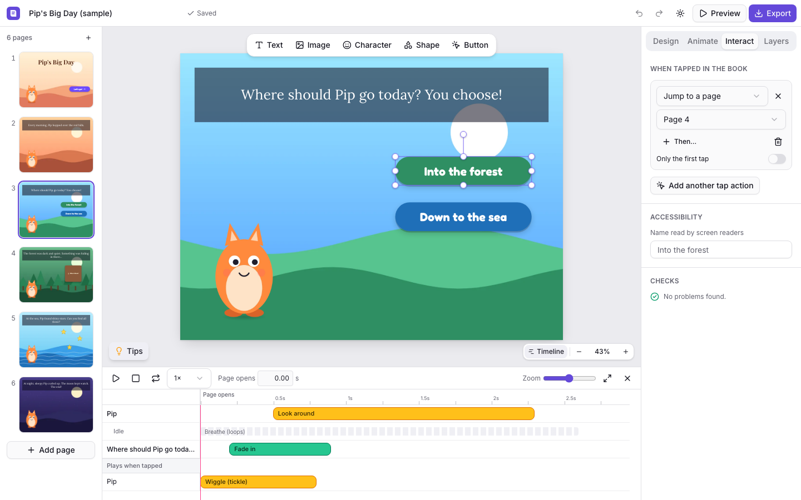
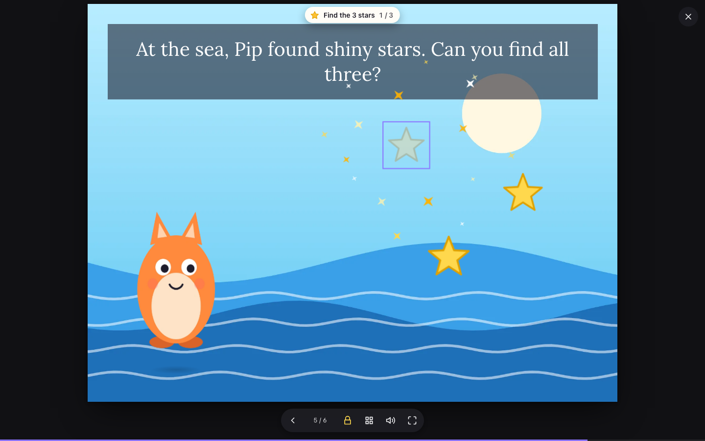
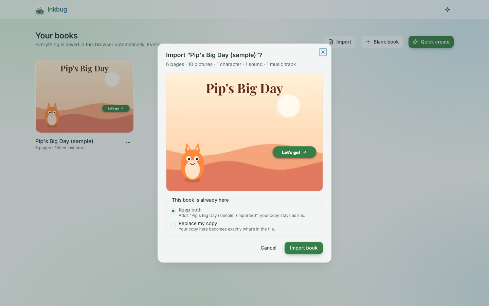
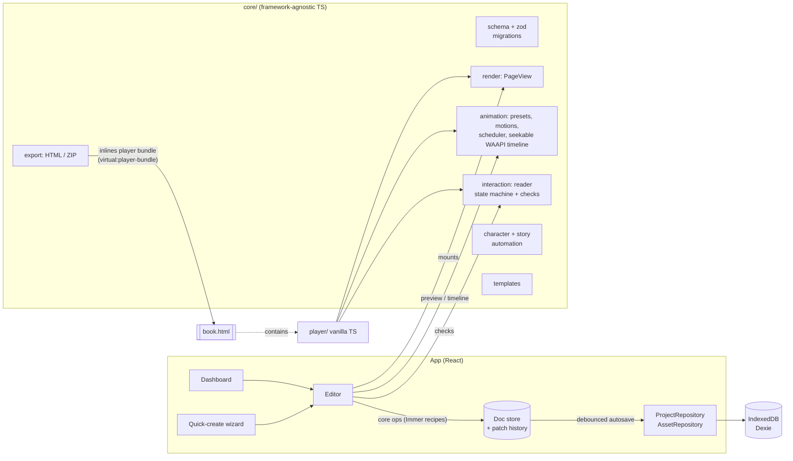

# Folio

**Folio** (working name) is a browser-based editor for **interactive, animated ebooks**. It works
like a simplified Canva or PowerPoint, built around book pages. The payoff is the export:
**one standalone HTML file** that anyone can open by double-clicking. It works offline, needs no
install or account, and looks and behaves exactly like the editor's preview.

| Editor (dark theme)                                            | Animation Pane                                         |
| -------------------------------------------------------------- | ------------------------------------------------------ |
|                          |  |
| **Quick create**                                               | **Exported book (`file://`, zero network requests)**   |
|              |    |
| **A character and the page timeline**                          | **Interact tab: choices, flow and checks**             |
|  |          |
| **Reading: a treasure hunt that unlocks the page**             | **Import: every export is a backup**                   |
|      |                  |

## Features

- **Quick create**
  - Name the book and pick a page size: Landscape 4:3 (default), Portrait, Square or 16:9.
  - Add pages as rows of _text line + image_, one at a time or in bulk: drop many images and paste
    multi-line text, and they pair up by order.
  - Reorder rows and swap images between them.
  - Pick a layout template (with live previews), colors and a font.
- **Editor**
  - Page sidebar (virtualized; add, duplicate, delete, drag to reorder).
  - Stage with zoom (fit or 25–200%).
  - Selection: click, shift-click, marquee.
  - Drag, resize and rotate with snapping and guides.
  - Context-sensitive properties panel and a layers panel (reorder, rename, lock, hide).
  - Undo/redo, keyboard shortcuts, copy/paste and debounced autosave with a status indicator.
  - **Resizable panels:** drag or keyboard-resize the page list, the properties panel and the
    timeline; collapse them, or hide both side panels with ⌘/Ctrl+\. Sizes are remembered.
  - **Right-click menu** on the stage and in the layers panel, with every edit and arrange
    command and its shortcut.
  - **Grouping:** ⌘/Ctrl+G groups, ⌘/Ctrl+Shift+G ungroups. Groups move, resize, rotate and
    animate as one; double-click to edit inside; up to 3 levels deep; the layers panel is a
    tree.
  - **Replace, keeping the animation:** drop a picture onto a picture, or right-click →
    Replace with…; position, animations and tap actions stay. Replacing a character's picture
    can update it on every page.
- **Text:** long text always shows in the reader and the export. Each box can **grow** to fit,
  **shrink** its text to fit, or stay **fixed**; text that doesn't fit is flagged on the
  stage with one-click fixes. Inline editing on double-click, 10 bundled fonts, size, weight, italic, color,
  alignment, line height, letter spacing, highlight and shadow. Bold, italic and underline also
  work per selection with ⌘/Ctrl+B/I/U.
- **Images**
  - Upload by button, drag-drop or paste. Images are downscaled to ≤2400 px, encoded as WebP and
    deduplicated.
  - Non-destructive crop, filters and adjustments, flip, corner radius, replace and reset.
  - Alt text, and "use as page background".
- **Animation:** a PowerPoint-style Animation Pane.
  - 10 presets: fade, slide, zoom, pop, typewriter, Ken Burns, pulse and exits.
  - Triggers: on page open, with previous, after previous, on click.
  - Duration, delay, easing and parameters for each step.
  - Preview a single step or the whole page.
  - Page transitions: fade, slide, flip, zoom and a **page curl** (with a rounded bend and
    shadows). Readers can drag the page's bottom corner to turn it; locked pages resist; reduced
    motion fades instead. "Use on every page" applies a transition to the whole book.
- **Preview and reader**
  - Full-screen reader built on the same runtime as the export.
  - Navigation: buttons, arrow keys, click to advance, swipe.
  - Click groups, page indicator, progress bar and fullscreen.
  - Letterboxed scaling, and it respects `prefers-reduced-motion`.
- **Export**
  - **Single HTML file** (default) or **ZIP** (`index.html` + `assets/`).
  - Size estimate with a warning above 25 MB.
  - Optional "Made with Folio" badge (on by default).
  - Only the fonts actually used are embedded, as base64 woff2.
  - A strict Content-Security-Policy keeps the book fully offline.
- **Characters ("make it move")**
  - Turn a transparent PNG into a character. The feet (pivot) are found from the transparent
    pixels, and it gets a soft ground shadow, a breathing idle loop and a wiggle when tapped.
    Opaque images work too, with a warning.
  - 26 character moves: entrances (walk, hop, drop, pop up, peek), actions (hop, wave, bow, dance,
    talk, blink, spin, turn around, look around…), bends (sway, jelly, lean) and exits.
  - **Poses:** extra pictures (mouth open, eyes closed…) that Talk, Blink and Show pose swap in.
  - **Animate my story** reads each page's words ("jumped" → hop, "night" → sleepy) and proposes
    moves you can review; one click applies them, one undo removes them. The wizard can do it too.
- **Speech bubbles:** speech, thought, shout, whisper and caption bubbles whose tail points at
  a character and follows it (the bubble can walk with its speaker). Pop from tail, Pop into
  tail and Wobble animations, Typewriter inside bubbles, "Show when Pip is tapped", and screen
  readers hear "Pip says: …".
- **Page timeline:** every animation on the page as bars on a time ruler. Scrub, play at 0.25–2×,
  drag bars to retime (snapping, one undo per drag), edit custom moves as keyframes, and drag the
  motion path on the stage. The editor and the exported book show the same frame at the same time.
- **Interactive storybook**
  - Story buttons (Next, Back, Choice, Start over, Tap me!), invisible tap areas and
    lift-the-flap.
  - Tap actions, chained: go to a page, play an animation, unlock the page, burst of confetti /
    sparkles / hearts, collect it, play a sound — optionally only on the first tap.
  - Page flow: branch to any page or to The End, and lock a page until the reader chooses or
    finds everything ("Find the 3 stars"). Back follows the reader's path.
  - Live checks for dead ends, deleted targets, unnamed controls and unreachable pages.
  - Reader extras: hints that glow on locked pages, The End with Read again, a page menu,
    "continue where you left off", keyboard-only reading.
- **Voiceover (your own recordings, in several languages)**
  - Add languages (English, Tagalog, Filipino, Cebuano… or your own) and upload a recording per
    language, up to 10 MB each. There's no text-to-speech: it's your voice.
  - Three places to speak: when a **page opens**, when something is **tapped** ("Speak when
    tapped" on characters), and when a **speech bubble appears**.
  - The **Voiceover overview** shows every page × language, and **bulk upload** puts files named
    like `page-03-tl.mp3` on the right page. Checks list what's missing.
  - In the book, readers pick a language when it opens ("Listen in: English · Tagalog · Read it
    myself") and can switch any time with the **language button beside the page**. A missing
    recording falls back to the default language. **Read to me** turns the pages after each
    page is read, stopping at choices and locked pages. The choice is remembered.
- **Sound effects** (a separate section): MP3/OGG/WAV/M4A up to 2 MB each, on taps, page turns
  and when a page opens. Readers turn them on and off separately from the voice. Nothing plays
  before the reader's first tap or key press.
- **Justified text and the book's language**
  - Text boxes and speech bubbles can be **justified** (⌘/Ctrl+Shift+J; L and E for left and
    center). The last line stays left-aligned.
  - Justified text is **hyphenated** by default (a switch turns it off), using the book's
    language (**Page → Book language**). Typewriter texts never hyphenate.
  - Exports set `<html lang>` to the book's language, so screen readers pronounce it right.
- **Audio on every element**
  - Any picture, character, text, shape, button, bubble or group can play sounds or voice
    lines **when it appears** (with its entrance), **when tapped**, or **at a set time** (the
    timeline's playhead).
  - Each sound has its own **volume, fade in/out and trim**, and can loop. Nothing is
    re-encoded.
  - The Audio tab lists every sound on the page.
- **Background music**
  - Upload music tracks (MP3/OGG/WAV/M4A, up to 15 MB each) and choose, from any page, which
    track plays from there on, or stop it. **Tracks crossfade** when they change.
  - Music gets quieter while the voiceover speaks (**ducking**).
  - Readers have their own **Music** switch and volume (the B key toggles it), remembered per
    book. The music pauses when the tab is hidden.
- **Audio in the timeline**
  - Under the animations: lanes for the voiceover, each element's sounds, the page's sounds
    and the music, each clip with its **waveform**.
  - **Drag** a clip to move it (it snaps to animation edges, other clips and the playhead),
    drag its edges to **trim**, its top corners to **fade**, and its line to set the
    **volume**. One undo step per drag.
  - The keyboard works too: arrows move, [ and ] trim, − and = change the volume, Delete
    removes.
  - **Play** in the timeline plays the audio in sync, exactly when the exported book does. A
    language picker chooses which recordings to hear.
- **Backups (import):** every export is also a backup. **Import** on the dashboard (or drop the
  file onto it) turns an exported `.html` or `.zip` back into a fully editable book — pictures,
  characters, poses, sounds, animations and interactions included. See
  [Backups: export and import](#backups-export-and-import).
- **Dashboard:** live covers, create, rename, duplicate and delete, plus a generated sample book
  ("Pip's Big Day": a mascot with a speech bubble, curling pages, soft background music, a
  justified paragraph, a choice, a flap, a star hunt and two endings). Light and dark
  themes.

## Getting started

Requirements: **Node 22+** (developed on Node 24 LTS) and **pnpm** (via Corepack).

```bash
corepack enable pnpm
```

```bash
pnpm install
```

```bash
pnpm dev
```

Open http://localhost:5173. Everything is stored locally in your browser (IndexedDB).

### Scripts

| Script                                   | What it does                                                                                      |
| ---------------------------------------- | ------------------------------------------------------------------------------------------------- |
| `pnpm dev`                               | Dev server with HMR (the export's player bundle rebuilds on demand)                               |
| `pnpm build`                             | Production build into `dist/` (a static site; hash routing works from any sub-path)               |
| `pnpm preview`                           | Serves the production build                                                                       |
| `pnpm typecheck`                         | TypeScript, strict mode                                                                           |
| `pnpm lint` / `pnpm format`              | ESLint / Prettier                                                                                 |
| `pnpm test`                              | Unit tests (Vitest + happy-dom + fake-indexeddb)                                                  |
| `pnpm test:e2e`                          | Playwright E2E, including the export round trip over `file://`                                    |
| `pnpm build:player` / `pnpm size:player` | Builds the standalone reader and checks it against the 150 KB gzip budget (currently about 39 KB) |
| `pnpm check`                             | typecheck + lint + format check + unit tests                                                      |
| `node scripts/screenshots.mjs`           | Regenerates the v2 README screenshots from the sample book (with `pnpm dev` running)              |

The first E2E run needs a browser: `pnpm exec playwright install chromium`.

## Voiceover: recording tips

- **Two separate sections.** In the editor's **Audio** tab, _Voiceover_ holds your recordings
  per language and _Sound effects_ holds the book's sounds. They never mix, and readers
  control them separately.
- **Name files for bulk upload:** `page-01-en.mp3`, `page-01-tl.mp3`, `p2_tl.m4a` or
  `03 tagalog.wav`. The page is the number; the language is its code or name (without one,
  the default language). Then open **Voiceover overview → Upload many files…**.
- **Keep files small:** mono MP3 or M4A at about 64 kbps is roughly 0.5 MB per minute. Single
  HTML exports grow by about a third; for books with lots of audio, export as ZIP.
- **The default language** plays wherever another language has no recording, so record it
  for every page.
- **On phones**, audio can only start after a tap: that's why the book asks "Listen in…" when
  it opens, or shows "Tap to listen".

## Music and audio: file-size advice

- **Music:** mono MP3 at 96–128 kbps is about 1 MB per minute. A short loop (20–60 s) that
  repeats is usually enough; it loops without a gap.
- **Limits:** up to 15 MB per music track, 10 MB per voice recording, 2 MB per sound effect,
  and 40 clips per page. The export dialog warns when voice and music pass 80 MB.
- **Single HTML files grow by about a third** (audio is embedded as base64). For books with a
  lot of audio, export as **ZIP**.
- **Trim in the timeline** instead of re-editing files: trimming plays only part of a file, so
  one file can serve several clips.
- **Readers control the mix:** voiceover, sound effects and music each have their own switch.

## Backups: export and import

Books live in the browser they were made in. To keep a copy, move to another computer, or share
a book for someone else to edit, **export it** (either format) and **import** the file later:

- **Import** on the dashboard, or drop the file anywhere on the dashboard. `.html` and `.zip`
  exports work, and so does the `.json` from "Download raw data" (its pictures must still be in
  that browser).
- A preview shows the cover and what's inside before anything is saved. If the same book is
  already there you choose **Keep both** (default: adds "… (imported)") or **Replace my copy**
  (with a warning if your copy has newer changes).
- Exports carry **everything the book owns** — hidden pictures, characters not placed yet, poses
  and the whole sound list — and pictures are never re-compressed, so a book can go export →
  import → export forever without changing.
- Books exported by older versions are upgraded as they import. Files they didn't include are
  listed, and those spots show a placeholder you can replace.
- The file is treated as untrusted: nothing in it runs, the book is validated like any saved
  book, and only files embedded in it (never links) are accepted.

## Architecture



The design rules that make "preview = export" true:

1. **The project JSON is the single source of truth.** It is plain, versioned data, validated with
   zod, loaded through a migrations pipeline (`src/core/migrations`), and edited only through core
   ops (`src/core/ops`). No state lives only in the DOM.
2. **One renderer.** `core/render`'s `PageView` builds each page as absolutely positioned DOM, not a
   canvas. The editor stage, thumbnails, dashboard covers, the in-app preview and the exported player
   all mount this same code. Each element has three layers:
   - **frame:** layout, and the target for transform handles
   - **anim:** the only layer the animation runtime touches
   - **content**

   User text is never parsed as HTML: rich text is stored as structured runs and rendered with
   `textContent`.

3. **One animation runtime.** `core/animation` turns animation steps into Web Animations API
   animations, grouped by click. Everything is created paused and is seekable, so the editor
   timeline can show any moment and the exported player shows the identical frame (a test
   compares them). Character moves are authored as structured tracks (x, y, rotate, scale…)
   compiled in a fixed order; bends shear the character in 16 strips.
4. **Story logic is a pure state machine.** `core/interaction/runtime.ts` turns reader events
   (next, back, tap…) into effects (show page, play step, burst, play sound, The End). The player
   only carries them out, so branching, locks and collectibles are unit-tested without a browser.
5. **Non-destructive images.** Crop, filters, flip and radius are parameters applied with CSS. The
   original bitmap is never changed.
6. **Local-first, cloud-ready.** Persistence sits behind `ProjectRepository` and `AssetRepository`
   (`src/storage/repository.ts`). Dexie is the current implementation; a cloud backend can replace
   it without touching the editor.

### Folder structure

```
src/
  core/        pure TS (no React): schema, migrations, ops, history, render, animation
               (presets, motions, idle loops, timeline), character, story automation,
               interaction (reader state machine, checks), sound checks, templates, fonts,
               image pipeline, export
  player/      standalone reader runtime (built as an IIFE into exported books): player shell,
               bursts, page menu, The End, sounds, resume
  storage/     repository interfaces + Dexie implementation
  editor/      React editor: stage, selection (react-moveable + selecto), panels (incl.
               Character and Interact), Animation Pane, page timeline (lazy-loaded), preview,
               export dialog, autosave, shortcuts
  dashboard/   book list, covers, sample book
  wizard/      quick-create flow
  ui/          shadcn/ui components, theme, shared bits
vite-plugins/  player-bundle: builds src/player in memory, exposes it as a string
tests/e2e/     Playwright specs
```

### Key decisions

- **The Web Animations API instead of GSAP.** GSAP's license forbids use in "tools that allow users
  to build visual animations without code" that compete with Webflow, and the Animation Pane is
  exactly such a tool. WAAPI is native, license-free and adds 0 KB to exports. Presets are plain
  keyframe data, so the engine stays swappable.
- **Patch-based undo/redo (Immer patches), not snapshot history.**
  - Only the document is tracked; selection and zoom stay out of history.
  - Explicit transactions make a whole drag or slider scrub a single undo step.
  - Patches are serializable, which suits future sync.
- **Gestures render live through `PageView` and commit to the document once, at the end.**
- **Fonts:** 10 OFL-licensed variable fonts from `@fontsource-variable`, latin and latin-ext
  subsets. The same woff2 files serve the editor and get embedded in exports.
- **The export is a vanilla-TS player** (no React), so exported books stay tiny.

## Extending

### Add an animation preset

Create one file in `src/core/animation/presets/` and list it in `presets/index.ts`:

```ts
// src/core/animation/presets/spin-in.ts
import type { AnimationPreset } from '../types';

export const spinIn: AnimationPreset = {
  id: 'spinIn',
  label: 'Spin in',
  kind: 'entrance', // 'entrance' | 'emphasis' | 'exit'
  // appliesTo: ['image'],     // optional: restrict to element types
  defaults: { duration: 800, delay: 0, easing: 'backOut', params: { turns: 1 } },
  params: [{ key: 'turns', label: 'Turns', type: 'number', min: 0.25, max: 5, step: 0.25 }],
  build: ({ params }) => [
    {
      target: 'element', // or 'chars' (split text) / 'media' (the  inside an image)
      keyframes: [
        { opacity: 0, transform: `rotate(${-360 * Number(params.turns)}deg) scale(0.5)` },
        { opacity: 1, transform: 'rotate(0) scale(1)' },
      ],
    },
  ],
};
```

It then shows up in the Animation Pane, including its parameters. It works in the preview and in
exports, and the registry tests cover it automatically.

### Add a character move

Create one file in `src/core/animation/motions/` and list it in `motions/index.ts`. Moves are
written as property tracks; the compiler handles transform order, the feet pivot and the shadow:

```ts
// src/core/animation/motions/nod.ts
import { defineMotion, num } from '../motion';

export const nod = defineMotion({
  id: 'nod',
  label: 'Nod',
  kind: 'emphasis',
  defaults: { duration: 700, delay: 0, easing: 'easeInOut', params: { times: 2 } },
  params: [{ key: 'times', label: 'Nods', type: 'number', min: 1, max: 4, step: 1 }],
  tracks: ({ params }) => {
    const n = num(params, 'times', 2);
    return {
      element: Array.from({ length: n * 2 + 1 }, (_, i) => ({
        offset: i / (n * 2),
        rotate: i % 2 ? 6 : 0,
        y: i % 2 ? 4 : 0,
      })),
    };
  },
});
```

It appears under "Character" in the Animation Pane, can become editable keyframes on the
timeline, and the motion tests check it (valid keyframes, deterministic, feet planted).

### Add a layout template

Create one file in `src/core/templates/layouts/` and list it in `templates/index.ts`:

```ts
export const myLayout: LayoutTemplate = {
  id: 'my-layout',
  label: 'My layout',
  description: 'What it looks like',
  usesImage: true,
  build({ text, asset, pageSize, palette, fontId, animate }) {
    // Return ordinary elements (use the factories in core/schema) + optional animations.
    return { background: { type: 'color', color: palette.background }, elements: [...], animations: [...] };
  },
};
```

The wizard renders a live preview of it, and the template tests check that its output is
schema-valid.

### Change the schema

Bump `SCHEMA_VERSION` in `src/core/schema/project.ts` and add a migration in
`src/core/migrations/index.ts`. Stored books and exported files carry their version. (v2 added
characters, interactivity and reader settings; v3 added sounds.) Anything that points at other
things (a jump to a page, "play this step", a sound) is tidied by `cleanReferences` when its
target is deleted, and again when a book loads.

## Testing

- **Unit (Vitest):**
  - schema validation and migrations
  - undo/redo on every core op
  - the renderer, including HTML-injection safety and image geometry
  - the animation registry, scheduler and timeline
  - export packaging: JSON/`</script>` escaping, asset and font inlining, zip layout, size estimate
  - templates and wizard pairing
  - repositories (fake-indexeddb)
  - character moves (valid, deterministic, feet planted, volume kept), strip bending, poses,
    alpha detection, placement and story suggestions
  - the seekable timeline (a fake `animate`), loops, waiting animations
  - the reader state machine (branching, back, locks, once-only, collectibles, The End) and the
    interactivity checks
  - import: byte-exact export → import round trips (HTML and ZIP), repeated round trips, older
    schemas, partial files, and rejection of untrusted input (links, `../` paths, wrong types)
- **E2E (Playwright, Chromium):**
  - dashboard CRUD
  - editing with autosave and reload persistence
  - one drag = one undo, shortcuts, clipboard
  - image tools and dedupe
  - Animation Pane
  - the reader: click groups, keyboard/click/swipe, letterboxing, reduced motion
  - quick-create
  - characters: a generated transparent PNG becomes a character; Animate my story is one undo
  - the page timeline: retiming, keyframes, motion paths, and **editor ↔ export parity**
  - a branching book read **with the keyboard only** over `file://`, reaching both endings
  - tap reactions, locked pages, collectibles, hints, bursts, page menu, resume
  - sounds (a generated WAV and a `play()` spy): silent until a gesture, mute remembered
  - the sample book, both paths, and offline
  - import: an exported book comes back editable (hidden picture, poses, sounds, checks clean),
    Keep both / Replace, drag-and-drop, clear errors, and no network requests
  - performance: a 100-page book in the editor, and a 30-page mascot book in the reader (page
    turns well under 100 ms, no long tasks while idle)
  - **the export round trip**: export, open via `file://` in a fresh context, then check that
    page 1 renders, animations run, next page works, fonts are embedded and **no network requests**
    are made (both HTML and ZIP)

## Known limitations

- Rich text per selection is limited to bold, italic, underline and color, through shortcuts.
  There is no inline formatting toolbar yet.
- Bundled fonts cover Latin and Latin Extended. Other scripts fall back to system fonts.
- Animated GIFs become still images (they are re-encoded).
- E2E tests run in Chromium only. Firefox and Safari have been designed for but not verified in CI.
- The editor is built for desktop screen sizes. Exported books are fully responsive.
- Characters are one picture: no automatic rigging. Poses are extra pictures you draw; they
  don't bend with Sway, Jelly or Lean.
- After a flap lifts, the invisible flap still catches taps in its spot.
- "Continue where you left off" uses `localStorage`, which some browsers keep separately per
  `file://` path or not at all; the book then simply starts at page 1.
- Story suggestions understand English words only (the suggester is pluggable).
- Waveforms are computed when the timeline opens and kept in memory only, so the first view
  of a long track after a reload takes a moment.
- Books with timed sounds or music show "Tap to start" on the first page: browsers don't let
  audio play before the reader's first tap.
- In a ZIP export opened from disk (`file://`), fades and ducking use the audio element's
  volume, which iPhones and iPads ignore. Single HTML files are not affected.

## Roadmap (designed for, not built)

Accounts, cloud sync and share links, real-time collaboration, read-aloud narration with word
highlighting, video, EPUB3/PDF export, a template marketplace, brand kits, AI helpers (background
removal, motion suggestions), a character that stays put while the page turns, drag-and-drop
mini-games, quizzes, comments, reader analytics and 3D page-curl transitions.
