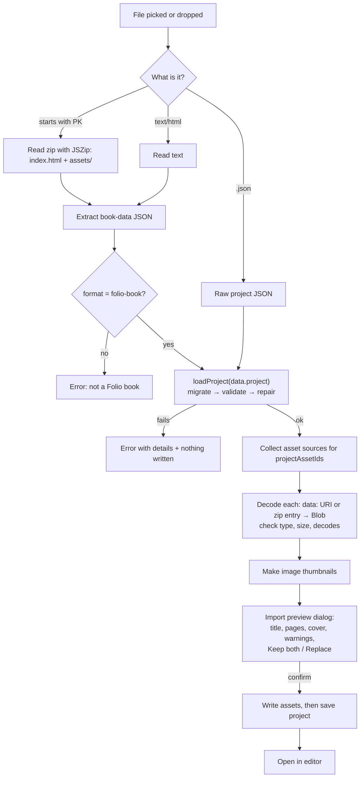

# Import plan: open an exported book and keep editing it

> Status: **plan only**. Nothing in the app has been changed yet.
> Goal: a **Import** button that takes a book exported by Folio (the single `.html` file or the
> `.zip` folder) and turns it back into a normal, fully editable book in the dashboard. Any
> export then doubles as a **backup**.

---

## 1. The promise (acceptance criteria)

A book that goes **export → import** must come back:

1. **Identical in content.** Every page, element, animation step, timeline keyframe, character
   (pivot, idle, shadow, poses), interaction, page flow, goal, sound, reader setting, theme and
   export setting is the same as before export. Only `updatedAt` changes (and `id`/`title` when
   importing as a copy).
2. **Directly editable.** It opens in the editor like any other book. Pictures, poses and sounds
   are real stored assets: you can crop, replace, re-animate, re-export. Nothing is "flattened".
3. **Loss-free on repeat.** `export(import(export(book)))` produces the same book data and the
   same asset bytes as `export(book)`. You can round-trip forever without degrading pictures.
4. **Checked for problems.** The Interact tab's checks show nothing new after import.
5. **Offline and safe.** Import makes zero network requests and never runs the player code that
   is inside the exported file.
6. **Old files still work.** Books exported by earlier versions (schema v1 and v2) import and are
   upgraded by the existing migrations.

---

## 2. How export works today (what import has to undo)

| Piece                            | Where                                                                                                         | What it contains                                                                                                                                                                       |
| -------------------------------- | ------------------------------------------------------------------------------------------------------------- | -------------------------------------------------------------------------------------------------------------------------------------------------------------------------------------- |
| Book data                        | ``, `<!--`, `&`, U+2028, emoji.
- **Old files:** an export with a v1 and a v2 project migrates to the current schema.
- **G7:** a file missing one picture imports with a warning listing it; the reference remains.
- **Copies:** `asCopy` gives a new book id and keeps every internal reference valid
  (`validateInteractivity` returns no new issues).
- **Rejections (nothing written):** not HTML/zip/json; HTML without `#book-data`; `format` ≠
  `folio-book`; broken JSON; schema-invalid project; newer schema than the app; `http:` or
  `blob:` asset URLs; `../` or absolute zip paths; wrong MIME; image that doesn't decode;
  oversized sound.

### 7.2 E2E (Playwright)

1. Build a book in the UI (picture, hidden picture, character + pose, choice buttons, flap,
   sound), export **HTML** and **ZIP**, delete the book, import each file:
   - pages, elements, character, poses and sounds are back; the checks show no problems;
   - un-hiding the hidden picture shows it (G1);
   - edit something (move, retime a timeline bar), autosave, reload: the change persists;
   - re-export works and opens offline.
2. Import the same file while the book still exists: **Keep both** creates a second book;
   **Replace** (after confirming) overwrites it; the "edited more recently" warning appears when
   the local copy is newer.
3. Import a damaged file and a non-Folio HTML file: friendly error, no new book.
4. Drag-and-drop a file onto the dashboard imports it.
5. Import makes **zero network requests**.
6. The sample book survives export → import → preview (both paths still work).

---

## 8. Out of scope / known limits

- Books made by other tools, or Folio exports edited by hand, aren't supported.
- Pictures are imported at their exported size (≤ 2400 px). That is the size the editor already
  works with, so nothing is lost compared to the stored book, but the _original_ upload (if it
  was larger) is not recoverable from an export.
- Undo history is not part of a book and isn't restored.
- The reader's "continue where you left off" position and mute setting are per browser and not
  part of the backup.

---

## 9. Questions for you before building

1. **D1:** OK to always include hidden pictures, unplaced characters and unused sounds in every
   export (slightly bigger files, but every export is a complete backup)? Recommended: yes.
2. **D3:** Default to **Keep both** when the same book already exists? Recommended: yes.
3. Should the editor also get an **"Export backup"** shortcut (e.g. in the top bar menu) that
   downloads the ZIP directly, or is the existing Export dialog enough? Recommended: the
   existing dialog is enough; the README will explain that every export is a backup.
