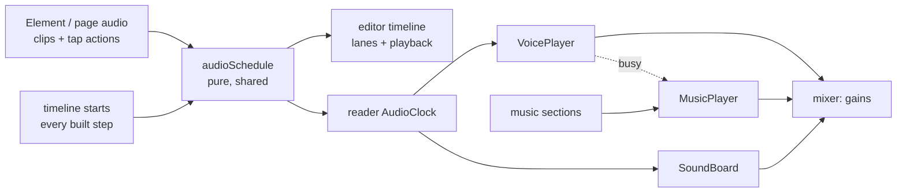

# Folio: justified text, audio on every element, background music, and audio in the timeline

This is a build prompt for Claude Code, written for this repository. Folio v1 (M0–M9), v2
(M10–M16, plus import), the v3 editing tools and page curl (M17–M25) and uploaded voiceover
(M26–M29, `prompt-voiceover.md`) are built and tested. This guide adds four things, held to the
standard of current media editors (Canva, PowerPoint/Keynote, Google Slides), video editors
for audio (CapCut, iMovie) and storybook tools (Book Creator, Apple Books read-alongs):

1. **Justified text.** A fourth alignment, "Justify", for text boxes and speech bubbles, with
   hyphenation, identical in the editor, the preview and the exported book.
2. **Audio on every element.** Any element (picture, character, text, shape, button, bubble,
   group) can have sound effects and/or voiceover that play **when it appears**, **when it's
   tapped**, or **at a set time**, with volume, fades and trimming.
3. **Background music.** A music track, separate from voiceover and sound effects, that plays
   across pages. The author can switch tracks or stop the music from any page ("sections").
   Tracks crossfade, and music ducks while the voiceover speaks.
4. **Audio in the timeline.** Audio lanes under the animation lanes, with waveforms. Move,
   trim, fade and set the volume by dragging. Playback in the timeline plays the audio in sync,
   and the exported book plays it at the same moments.

---

## 0. How to use this prompt (for the person running it)

1. **Prepare a few files** so the agent can test with real material:
   - two music tracks (MP3 or M4A, 1–3 minutes, e.g. a calm one and an upbeat one);
   - three or four short sound effects (a pop, a chime, birds, a door);
   - a page of real story text for justification (a long paragraph).
2. **No accounts or keys are needed.** Everything stays in the browser and is embedded in the
   exported book, which still works offline.
3. Start a Claude Code session in this repository and paste:

   ```text
   Read prompt-audio-timeline.md in full, then every file listed in section 1 under
   "Read first". Enter plan mode and propose a plan for milestones M30–M34. In the plan,
   answer every item in section 3 "Decisions" that isn't confirmed: use the recommended
   default unless you find a concrete reason not to, and say why. Wait for my approval.
   Then build one milestone at a time. After each one, run pnpm check, pnpm test:e2e and
   pnpm size:player, commit, and give me the summary described in section 9.
   Commit as me only: do not add any Co-Authored-By or Claude lines to commits.
   ```

4. After each milestone, work through its **Try it** list (section 6) before you reply
   "continue with the next milestone".

---

## 1. Context for the agent

You are extending a working app, not starting over. `README.md` explains the design;
`prompt-voiceover.md` is the guide this one follows. Reuse what exists. This guide names the
pieces; don't build a second version of any of them.

### Read first

- **Text rendering and fitting:**
  - `src/core/schema/project.ts`: `textStyleSchema` (`align` is `left | center | right`
    today).
  - `src/core/render/nodes.ts`: `buildText`, which sets `textAlign`.
  - `src/core/render/render.css`: `.fl-text`, `.fl-page`.
  - `src/core/text/autofit.ts`: `effectiveFontSize`, `findFitScale`.
  - `src/core/text/split.ts`: `splitRun`, used by Typewriter.
  - `src/editor/text/measure.ts`: `measureTextHeight` and its hidden measuring host.
  - `src/editor/text/fit.ts`: `fitText`.
  - `src/editor/panels/TextPanel.tsx`: the alignment toggle group.
  - `src/editor/actions.ts`: `updateTextStyle`.
  - `src/editor/shortcuts.ts`: `useEditorShortcuts`. There are no alignment shortcuts yet.
  - `src/core/export/build.ts`: `renderBookHtml` writes `<html lang="en">`, hard-coded.
- **Audio today (reuse, don't rewrite):**
  - Sound effects library: `project.sounds`, `soundRefSchema`, `MAX_SOUND_BYTES` (2 MB).
    Also `src/core/sound/validate.ts` (`checkSoundFile`, `checkVoiceFile`) and
    `src/editor/assets/upload-sound.ts` (`importSoundFiles`, `hashAudio`, `readDuration`,
    `pickSoundFiles`).
  - Voiceover:
    - `voiceLineSchema` / `VoiceLine`, `project.voiceover`, `page.voiceover`, `page.openSound`
    - `src/core/voice/*`: `voiceLines`, `pageVoiceLines`, `resolveClip`, `bubbleVoiceCues`,
      `validateVoice`
    - `src/core/ops/voice.ts`: `setVoiceClip`, `addVoiceToTap`, `tapVoiceTarget`
  - Tap actions: `playSound` and `playVoice` in `storyActionSchema`. In
    `src/core/interaction/runtime.ts`: the `playSound` / `playVoice` effects and
    `autoTurnStep`.
  - Editor audio UI: `src/editor/audio/*` (`AudioPanel`, `VoiceoverSection`,
    `SoundEffectsSection`, `VoiceSlots`, `PreviewButton`, `actions.ts`).
  - Player:
    - `src/player/audio.ts`: `SoundBoard`, `bookHasEffects`
    - `src/player/voice.ts`: `VoicePlayer` (one reused element, queue, watchdog, `prime()`) and
      `CueClock`
    - `src/player/listen-card.ts`: the "Listen in…" card, `AudioMenu`
    - `src/player/audio-prefs.ts`: `loadVoicePrefs`, under `folio:voice:<bookId>`
    - `src/player/player.ts`: `showPage`, `startPage`, `sayLine`, `release`, `armAutoTurn`,
      the `playGroup` / `finishGroup` / `playStep` effects
- **Animation timing:**
  - `src/core/animation/schedule.ts`: `scheduleSteps`, `stepSpan`, `groupCount`.
  - `src/core/animation/timeline.ts`: `createPageTimeline`, `seek`, `finish`, `play`,
    `entrances`, and reduced motion.
- **Timeline editor:**
  - `src/editor/timeline/model.ts`: `buildTimelineModel`, `groupSpan`, `snapTime`,
    `snapTargets`, `dragResult`.
  - `src/editor/timeline/session.ts`: `scrubTo`, `playFrom`, `pause`, `endScrub`.
  - `src/editor/timeline/TimelineDock.tsx`: lanes, bars, drag gestures, the playhead, and
    `commitGesture` for one undo step per drag.
  - `src/editor/timeline/actions.ts`.
- **Keeping ids valid, export and import:**
  - `src/core/ops/references.ts`: `cleanReferences`.
  - `src/core/schema/asset-ids.ts`: `projectAssetIds`.
  - `src/core/export/usage.ts`: `exportedAssetIds`, `bookSoundIds`, `bookVoiceIds`.
  - `src/core/export/build.ts`: `buildZip` folders, `estimateSize`, `SIZE_WARNING_BYTES`, the
    CSP.
  - `src/core/import/read.ts`: `FileKind`, `collectFiles`, `checkFile`, `ZIP_ASSET_PATH`.
  - `src/dashboard/import/import-book.ts`: skips thumbnails for audio.
  - `src/editor/export/export-book.ts`: `estimateExport`.
  - `src/editor/Editor.tsx`: which asset ids get object URLs.
- **Migrations:** `src/core/migrations/index.ts`, and the README's "Change the schema" section.
- **Tests to build on:**
  - `tests/e2e/voice-reader.spec.ts`: the `PLAY_SPY` that reads `src` before `currentSrc`,
    `endLine`, and a generated WAV per clip.
  - `tests/e2e/helpers.ts`: `makeWav`, `addLanguages`, `uploadVoiceClip`.
  - `tests/e2e/timeline.spec.ts`, `tests/e2e/sound.spec.ts`.

### Non-negotiable rules (inherited)

- **One runtime, same result everywhere:** the editor, the in-app preview and the exported
  book show the same text wrapping and play audio at the same moments.
- **Exports stay offline:** no network and CSP `default-src 'none'`. The CSP has **no
  `connect-src`**, so the player may not `fetch()` its own embedded files.
- **Player bundle** under 150 KB gzip (35.6 KB today). Ask before adding any player
  dependency; none is needed.
- **Every edit goes through a core op**, one undo step per user action. A drag on the timeline
  is one step.
- **zod schema v6 plus a migration** (5 → 6). Old books keep opening.
- **Accessible:** named controls, keyboard alternatives for every drag, announcements, and
  reduced motion respected.
- **No autoplay before a gesture:** the existing "Listen in…" card and "Tap to listen" pill
  are the first gesture. Music starts there too, never on its own.

---

## 2. What the user wants

> "Add these features: justify for text, audio for each element, background music as an
> additional audio feature, and add the audio part to the timeline."

### User stories

- **Author: tidy paragraphs.** "My story pages have long paragraphs. I click Justify and the
  lines line up on both sides, with words hyphenated when needed, and the book looks the same
  after export."
- **Author: sounds that belong to things.** "The balloon pops when it appears, the door creaks
  when it's tapped, and the birds start two seconds into the page. I set each one on the
  thing itself, and adjust how loud it is."
- **Author: music for the whole book.** "A calm tune plays from the first page. From page 5
  (the adventure) it changes to an upbeat one with a smooth crossfade, and it stops on the
  last page. When the narrator speaks, the music gets quieter by itself."
- **Author: audio on the timeline.** "I see my voiceover, sounds and music under my
  animations, with their waveforms. I drag a sound so it starts exactly when Pip lands, trim
  its silent start, and fade it out. Pressing Play in the timeline plays it all in sync."
- **Reader: my own mix.** "I can turn the music off, or down, and keep the voice. The book
  remembers."

---

## 3. Decisions (confirmed ones are marked ✅; use the recommended default for the rest)

| #   | Decision                           | Choice                                                                                                                                                                                                                                                                                                                               |
| --- | ---------------------------------- | ------------------------------------------------------------------------------------------------------------------------------------------------------------------------------------------------------------------------------------------------------------------------------------------------------------------------------------ |
| 1   | Music scope                        | ✅ **Book-wide, with sections:** one track plays across pages; from any page the author can switch to another track or stop it. Tracks crossfade.                                                                                                                                                                                    |
| 2   | Reader music controls              | ✅ **Its own on/off and volume**, separate from voice and sound effects, remembered per book.                                                                                                                                                                                                                                        |
| 3   | Timeline audio editing             | ✅ **Move, trim, volume and fades**, with waveforms (CapCut/iMovie style).                                                                                                                                                                                                                                                           |
| 4   | Ducking                            | ✅ **Automatic:** music drops to about ⅓ while a voice line plays and comes back smoothly; a per-book switch turns it off.                                                                                                                                                                                                           |
| 5   | Justify shortcuts                  | **Mod+Shift+J** for Justify, plus Mod+Shift+L / E / R for left / center / right (Google Docs, Word, Canva). Test each in Chrome, Safari and Firefox and drop any the browser won't hand over (e.g. if Mod+Shift+R reloads the page).                                                                                                 |
| 6   | Hyphenation                        | On by default for **justified** text only; a "Hyphenate" switch per text. Uses the **book's text language** (decision 7). **Off, always, for text that types in** (Typewriter splits words into pieces, and browsers don't hyphenate across pieces, so editor and reader would wrap differently).                                    |
| 7   | Book text language                 | New `project.language` (BCP 47, default `en`), set under the page panel's book settings. It becomes `<html lang>` in exports and `lang` on every page (editor too), for hyphenation and screen readers. Separate from the voiceover languages.                                                                                       |
| 8   | One audio model                    | Timed audio is a new **`page.audio` clip list**. `page.openSound` (from M26) **migrates into it** as a page-level clip at 0 s, so there's one way to do it. Tap audio keeps using the `playSound` / `playVoice` actions (they gain optional mix settings).                                                                           |
| 9   | When a clip starts                 | Either **at a time** (click group + ms) or **with a step** (an animation step, + offset), so it moves when the animation moves. "When it appears" = with the element's entrance step.                                                                                                                                                |
| 10  | Mix settings                       | Volume 0–100 %, fade in, fade out, and (sound effects and music only) trim in/out points. Non-destructive: the file never changes. Voice lines have no trim, because each language is a different recording; trim them before uploading.                                                                                             |
| 11  | How volume works in the reader     | A small **Web Audio mixer**: each existing `<audio>` element feeds a `GainNode` through `createMediaElementSource`. There's no decoding and no fetch, so the CSP is fine. The fallback is `element.volume` when Web Audio can't take the element (see risks). Rejected: decoding with `decodeAudioData` in the player (needs fetch). |
| 12  | Waveforms                          | Computed **in the editor only** (Web Audio `decodeAudioData` on the stored blob → a peaks array), cached in memory and in IndexedDB. Never in the player bundle.                                                                                                                                                                     |
| 13  | Music files                        | A separate `project.music.tracks` list, ids `mu_` + content hash, up to **15 MB** per track (MP3/M4A/OGG/WAV). Warn when voice + music pass **80 MB**, and suggest ZIP export.                                                                                                                                                       |
| 14  | Which page's section plays         | By **page order**: a page plays the section that starts at or before it. In branching books this is predictable, and the author sees it in the page list (a music note on section starts).                                                                                                                                           |
| 15  | Skipping ahead (finishing a group) | Pending **voice** clips of that group are queued (as bubble lines are today); pending **sound effects are dropped** (a burst of sounds at once is noise).                                                                                                                                                                            |
| 16  | Read to me                         | Waits for the voice queue **and timed voice clips**. Sound effects and music never hold a page.                                                                                                                                                                                                                                      |
| 17  | Reader memory                      | `folio:audio:<bookId>` = `{ lang, readToMe, music, musicVolume }`. Existing `folio:voice:<bookId>` values are read once and moved over.                                                                                                                                                                                              |

---

## 4. Feature spec

### 4A. Justified text (M30)

- **Schema:** `align` becomes `left | center | right | justify`; `textStyleSchema` gains
  `hyphenate?: boolean`. Both apply to text boxes and speech bubbles (they share the style).
- **Rendering** (`buildText`, same code in editor and reader):
  - `text-align: justify` and `text-align-last: start`, so the last line isn't stretched.
  - `hyphens: auto` when hyphenation applies (decision 6), else `manual`.
  - `lang` comes from the page root (decision 7). `PageView` gets a `lang` option and sets it
    on `.fl-page`; the measuring host in `measure.ts` gets the same `lang`, so measurements
    match.
- **Auto-fit:** Grow / Shrink / Fixed keep working. Hyphenation dictionaries differ between
  browsers, so a line can break differently in the reader's browser. When hyphenation is on,
  Shrink keeps a **2 % safety margin**, and the text checks say that hyphenated text may wrap
  slightly differently per browser.
- **Typewriter:** words and letters are split into `.fl-char` spans; justification still works
  across them. Hyphenation is off for these texts in **both** the editor and the reader
  (decision 6), and the Text panel says why ("Hyphenation is off for text that types in").
  Decide this from the page's steps, with the same function in both places
  (`elementsNeedingCharSplit`).
- **Narrow boxes:** justification leaves wide gaps ("rivers") in narrow boxes. When a
  justified box is narrower than about 12 characters of its font size, the Text panel shows a
  hint ("Justified text looks gappy in narrow boxes — try Left or turn on Hyphenate"). It's a
  hint, not an error.
- **Right-to-left:** there's no RTL support yet; using `text-align-last: start` keeps
  justification ready for it. RTL itself is out of scope.
- **UI:**
  - The alignment toggle gets a fourth button (Justify, `AlignJustify` icon).
  - A "Hyphenate" switch appears when Justify is on.
  - The shortcuts from decision 5, announced through the undo label ("Justify").
  - The book settings get "Book language" (presets from `LANGUAGE_PRESETS` plus Custom).

### 4B. Audio on every element (M31)

- **What an element can have** (shown in a new **Audio** section of its Design panel, for
  every element type, empty until used):
  - **When it appears:** a sound effect and/or a voice line, starting with its entrance step
    (+ offset). If the element has no entrance, it starts when the page opens.
  - **When tapped:** sound effect and/or voice. Edits the element's tap actions through
    `addVoiceToTap` and a matching `addSoundToTap`, respecting the 4 taps / 8 actions limits.
    Its wiggle and other reactions stay.
  - **At a time:** "Place on the timeline" adds a clip at the playhead and opens the timeline.
  - Each item shows its sound (pick from the library or "Upload a sound…") or the voice slots
    (`VoiceSlots`), plus an **Adjust** popover: volume, fade in/out, and trim for sounds.
- **The page itself:** "When this page opens" (sound) and the page voiceover stay where they
  are in the Audio tab. The page voiceover gains a start time (`page.voiceoverAt`, ms into the
  page), set on the timeline.
- **The Audio tab** gains "Everything on this page": one list of every sound and voice line on
  the page (page, elements, taps, bubbles), with their trigger and time. Clicking one selects
  its element and scrolls the timeline to it.
- **Playback rules** (they extend the ones in `prompt-voiceover.md`; implement exactly):
  1. Timed and "with a step" clips start when their click group plays, at their resolved
     time. Voice clips go through `VoicePlayer` (one voice at a time, queued); sound clips
     play on `SoundBoard` and may overlap.
  2. A clip with a start offset before its step (negative offset) starts no earlier than the
     group's start.
  3. **Going back** to a page: no timed audio, like the voice today. Going forward: all of it.
  4. Leaving a page stops its sound clips (fading out over 150 ms) and its voice (as today).
     Looping sound clips (ambient) loop until then.
  5. Skipping ahead (`finishGroup`): decision 15.
  6. `seek()` in the editor never plays audio (timeline parity tests stay silent).
  7. Reduced motion: animation delays become 0, so "with a step" clips start at 0 too; timed
     clips keep their time.
- **Mix in the reader** (decision 11):
  - New `src/player/mixer.ts`: one `AudioContext`, created and resumed in `release()` (the
    first gesture).
  - Three channel gains (voice, effects, music) plus one gain per playing element.
  - Fades use `linearRampToValueAtTime`.
  - Trim: set `currentTime` to the in-point before playing, and stop at the out-point (a timer
    from the start, with the fade-out beginning early enough).

### 4C. Background music (M32)

- **Data** (decision 13):
  - `project.music.tracks`: the uploaded tracks, each with an optional loop in/out point.
  - `project.music.sections`: `{ fromPageId, trackId | null, volume }[]`, where `null` means
    silence from that page on.
  - `project.music.ducking` (boolean) and `crossfadeMs` (default 1500).
- **Editor:**
  - A third section in the Audio tab, **Background music**, clearly separate from Voiceover
    and Sound effects.
  - Track library: upload, rename, preview, remove, loop points.
  - "Music from this page": a track, None (stop), or "Same as before".
  - A section volume.
  - Book-wide ducking on/off and crossfade length.
  - The page list shows a small music note on pages where a section starts.
- **Reader** (`src/player/music.ts`, `MusicPlayer`):
  - Two `<audio>` elements, A and B, for crossfades. Both are primed in `release()`, like the
    voice element (iOS).
  - On `showPage`, work out the page's section with a pure `musicSectionAt(project,
pageIndex)`.
    - Same track: keep playing, no restart, even when going back.
    - Another track: crossfade to it.
    - `null`: fade out.
  - **Ducking:** while `VoicePlayer.busy`, the music gain ramps to ⅓ over 300 ms, and back
    over 600 ms when the voice is idle.
  - **Hidden tab:** pause on `visibilitychange` hidden, resume on visible. Timed page audio
    skips what was missed while hidden.
  - **The End screen:** music keeps playing at 50 %. "Read again" restarts the first
    section's track.
  - **Controls:**
    - The audio menu (`AudioMenu`) gains a Music on/off switch and a volume slider (a native
      range input with a label and value text).
    - The toolbar audio button shows when the book has voice **or** music. With music only,
      its icon is a music note and its label is "Audio".
    - A new key, `B`, toggles background music. Announced.
  - **Autoplay:** music starts on the "Listen in…" choice or the first tap (the existing
    `release()`), never before. In the preview it starts right away (the author's click
    counts).

### 4D. Audio in the timeline (M33)

- **Lanes:** below the animation lanes, an **Audio** section (like the audio tracks under video
  tracks in video editors):
  - **Voiceover:** the page voice (draggable start), timed voice clips, and bubble lines
    (pinned to their entrance; hovering says "Moves with the bubble's entrance").
  - **Each element with audio:** its clips, labelled with the element's name.
  - **Page sounds:** page-level clips, including "When this page opens".
  - **Music:** the section's track, read-only context, dimmed. Clicking it opens the Audio
    tab.
  - Tap audio is listed in the existing "When tapped" area, at the tap's local time.
- **Bars:**
  - Each clip is a bar as long as it plays (trimmed length), with a **waveform** and its fade
    ramps drawn over it.
  - The volume is a horizontal line inside the bar.
  - Voice bars show the recording in the timeline's **preview language** (a language picker in
    the timeline header, defaulting to the editor's preview language). The other languages'
    lengths show as a faint outline when longer.
- **Gestures** (one undo step each; extend `dragResult` / `snapTargets` into pure helpers for
  audio):
  - Drag the body to move, snapping to animation bar edges, other clips, group start and the
    playhead. A clip attached to a step moves its offset.
  - Drag an edge to trim (sounds and music). The left edge moves the in-point **and** the
    start, so the audio stays in place.
  - Drag the corner handles to fade in and out.
  - Drag the volume line up and down; the value shows while dragging.
  - Keyboard, on a focused bar:
    - arrows move by 50 ms (Shift: 500 ms)
    - `[` / `]` trim
    - `-` / `+` volume ±5 %
    - Enter opens the Adjust popover
- **Playback in the editor:**
  - `playFrom` (session.ts) also plays audio. A pure `audioSchedule(page, starts)` gives every
    clip's group, start and length.
  - An editor `AudioPreview` starts each clip whose window contains the playhead, at the right
    offset into the file, through the same `mixer.ts` (imported from the player, as the
    timeline preview already imports `Curl`).
  - Pause stops everything. Scrubbing without playing is silent.
- **Group lengths:** a group's length on the ruler includes its audio (a sound that ends after
  the last animation extends the group). `buildTimelineModel` and the reader's
  `groupSpan`-based widths use the same schedule.
- **Parity:** the reader uses the **same** `audioSchedule`. The timeline gains a `starts` list
  (every built step's group and start, like `entrances` today), so "with a step" clips resolve
  identically in both.

### 4E. Checks and accessibility

- Checks (in the Interact tab's checks and the Audio tab):
  - a clip whose sound or voice is gone (normally cleaned; keep the guard);
  - a clip starting after everything else on its page has ended (a warning: "plays after the
    page has finished");
  - a music section pointing at a removed track;
  - voice + music over 80 MB (info, suggest ZIP).
- The timeline audio bars are focusable. Their names include the element, kind, start,
  length and volume ("Door creak, sound, starts 1.20 s, 0.8 s long, volume 70 %").
- The reader's music slider is a labelled range input, and its value is announced.
- Nothing audio-related is required to read the book: text stays the source.

---

## 5. Architecture

### 5.1 Where things go

```
src/core/
  schema/project.ts        align + 'justify', hyphenate, project.language, audioMixSchema,
                           audioClipSchema, page.audio, page.voiceoverAt, music schema, v6
  migrations/index.ts      5 → 6 (language 'en', music defaults, openSound → page.audio)
  audio/                   schedule.ts (audioSchedule), mix.ts (gainAt: fade envelope, pure),
                           music.ts (musicSectionAt), validate.ts (validateAudio)
  ops/audio.ts             addClip, updateClip, removeClip, addSoundToTap, setMusicSection,
                           addMusicTracks, removeMusicTrack
  animation/timeline.ts    `starts` (every built step), next to `entrances`
src/editor/
  assets/upload-music.ts   importMusicFiles (15 MB, mu_ ids, duration)
  audio/                   ElementAudioSection.tsx, AdjustPopover.tsx, MusicSection.tsx,
                           PageAudioList.tsx, waveform.ts (peaks + cache), preview.ts
  timeline/                model.ts (+ audio lanes, audio drag helpers), TimelineDock.tsx
                           (audio section), session.ts (audio playback)
src/player/
  mixer.ts                 AudioContext, channel gains, per-element gains, fallback
  music.ts                 MusicPlayer (A/B crossfade, ducking, visibility)
  audio-clock.ts           generalises CueClock to timed clips (schedule / flush / clear)
```

### 5.2 Data model: schema v6 (a sketch; keep it closed and validated)

```ts
SCHEMA_VERSION = 6;
// migration 5 → 6: language 'en'; music { tracks: {}, sections: [], ducking: true,
// crossfadeMs: 1500 }; each page.openSound becomes a page.audio clip at 0 s.

textStyleSchema.align = z.enum(['left', 'center', 'right', 'justify']);
textStyleSchema += { hyphenate: z.boolean().optional() }; // default: on when justified

projectSchema += { language: languageCodeSchema }; // the book's text language

export const audioMixSchema = z.object({
  volume: z.number().min(0).max(1), // 1 = as recorded
  fadeInMs: z.number().int().min(0).max(10000),
  fadeOutMs: z.number().int().min(0).max(10000),
  trimStartMs: z.number().int().min(0).max(3_600_000), // sounds and music only
  trimEndMs: z.number().int().min(0).max(3_600_000).optional(), // missing = to the end
});

export const audioClipSchema = z.object({
  id,
  /** The element it belongs to (its Design panel shows it); none = the page's own. */
  elementId: id.optional(),
  source: z.discriminatedUnion('kind', [
    z.object({ kind: z.literal('sound'), soundId: id }),
    z.object({ kind: z.literal('voice'), line: voiceLineSchema }),
  ]),
  start: z.discriminatedUnion('kind', [
    z.object({
      kind: z.literal('time'),
      group: z.number().int().min(0),
      at: z.number().int().min(0).max(600_000),
    }),
    z.object({
      kind: z.literal('withStep'),
      stepId: id,
      offset: z.number().int().min(-60_000).max(600_000),
    }),
  ]),
  mix: audioMixSchema,
  loop: z.boolean(), // sounds only: loops until the page is left
});

pageSchema += {
  audio: z.array(audioClipSchema).max(40).optional(),
  voiceoverAt: z.number().int().min(0).max(600_000).optional(),
};
// openSound is removed from the schema (migrated into audio).

storyActionSchema: playSound += { mix: audioMixSchema.optional() };
storyActionSchema: playVoice += { mix: audioMixSchema.optional() };

export const MAX_MUSIC_BYTES = 15 * 1024 * 1024;
export const musicTrackSchema = z.object({
  id, // 'mu_' + content hash
  kind: z.literal('music'),
  mime: z.enum(SOUND_MIMES),
  bytes: z.number().int().positive().max(MAX_MUSIC_BYTES),
  duration: z.number().nonnegative().optional(),
  name: z.string().max(200).optional(),
  loopStartMs: z.number().int().min(0).optional(),
  loopEndMs: z.number().int().min(0).optional(),
});
projectSchema += {
  music: z.object({
    tracks: z.record(id, musicTrackSchema),
    sections: z
      .array(z.object({ fromPageId: id, trackId: id.nullable(), volume: z.number().min(0).max(1) }))
      .max(50),
    ducking: z.boolean(),
    crossfadeMs: z.number().int().min(0).max(8000),
  }),
};
```

- **`cleanReferences` also:**
  - drops clips whose sound is gone, and voice-line entries in undeclared languages (as
    today);
  - drops clips owned by deleted elements;
  - turns "with a step" clips whose step was deleted into timed clips. The op that deletes
    steps passes their last resolved time; the fallback is group 0 at 0;
  - drops sections whose page or track is gone, and merges consecutive identical sections.
- **Element ops:**
  - `duplicateElements` / `cloneElement` copy an element's clips with new ids, re-pointing
    `withStep` at the copied steps.
  - `replaceElement` keeps them (same id).
  - `pasteElements` into another book keeps sound clips only when the sound comes along (the
    same limit as tap sounds today).
- **Asset ids and export:** `projectAssetIds` and `exportedAssetIds` add music tracks.
  `buildZip` puts them in **`assets/music/`**. `estimateSize` and `estimateExport` get a
  `music` figure ("music 8 MB" in the export dialog).
- **Import** (the same traps voice clips hit in M26; fix them all up front):
  - `FileKind` gains `'music'`;
  - `collectFiles` recognises `project.music.tracks`;
  - `checkFile` uses `MAX_MUSIC_BYTES`;
  - `ZIP_ASSET_PATH` accepts `assets/music/`;
  - `import-book.ts` makes no thumbnail for music;
  - the import dialog labels missing files "a music track";
  - `Editor.tsx` registers object URLs for music ids.

### 5.3 Reader runtime

- `audioSchedule(page, starts)` (pure) → `{ clipId, kind, group, at, length }[]`. It's shared
  by the reader and the editor timeline.
- The player's `AudioClock` (generalising `CueClock`) schedules a group's clips when the group
  plays, applies decision 15 on finish, and clears everything on page change and destroy.
- Voice clips resolve through `resolveClip`, with the fallback to the default language.
- `mixer.ts`: channel gains `voice`, `effects`, `music`; per-element gains; fades from `gainAt`
  (pure, unit-tested).
- `MusicPlayer` follows `showPage` and `VoicePlayer.busy` for ducking.
- The reader's audio menu, toolbar button and keys follow 4C. Everything stops on `destroy()`,
  including when the preview remounts.

### 5.4 Data flow



---

## 6. Milestones

Each milestone ends with `pnpm check`, `pnpm test:e2e` and `pnpm size:player` passing, a
commit, and the summary from section 9.

### M30: Justified text and the book's language

- **Build:**
  - `justify` and `hyphenate` in the schema; `project.language`; the 5 → 6 migration (this
    part of it)
  - `buildText` CSS; `lang` on `PageView` and the measuring host; `<html lang>` from the book
  - the Text panel button, the Hyphenate switch and the narrow-box hint; shortcuts; the Book
    language setting
  - the 2 % Shrink margin with hyphenation; hyphenation off for Typewriter texts
- **Done when:**
  - unit: the migration; `buildText` sets `text-align`, `text-align-last`, `hyphens`
    (including off for split texts)
  - E2E: a justified paragraph has the same height and line count in the editor, the preview
    and the exported file (compare line boxes with `Range.getClientRects()`)
  - E2E: the shortcuts work; `<html lang>` matches the book language
- **Try it:** paste a long paragraph, press Mod+Shift+J, turn Hyphenate on and off, export and
  compare.

### M31: Audio on every element

- **Build:**
  - `audioMixSchema`, `audioClipSchema`, `page.audio`, `page.voiceoverAt`, action mixes;
    `openSound` → `page.audio`
  - `ops/audio.ts`, `addSoundToTap`; `cleanReferences`; duplicate, replace and paste handling
  - the Design panel Audio section with its three rows and the Adjust popover; the Audio tab's
    "Everything on this page"
  - `audioSchedule`, `gainAt`, the timeline `starts` list
  - `mixer.ts`, `AudioClock`, trim and fades in the reader; the playback rules in 4B
- **Done when:**
  - unit: `audioSchedule` (time, with a step, negative offset, reduced motion, deleted step);
    `gainAt` (fade in and out, trimmed length); `cleanReferences`; duplicate re-points
    `withStep`
  - E2E (exported book, `PLAY_SPY` with timestamps): a sound "when it appears" plays when its
    element's entrance starts (±100 ms); a timed sound at 1.5 s plays at 1.5 s; going back
    plays nothing; a tap sound plays with its volume (read from a test hook on
    `folioPlayer`)
  - existing `sound.spec.ts` / `voice-reader.spec.ts` pass (openSound's new home only changes
    where it's stored)
- **Try it:** select a balloon, go to Audio, add "When it appears → pop", set it to 60 % with
  a short fade, then preview.

### M32: Background music

- **Build:** music tracks (upload, 15 MB, `mu_` ids), sections, the Background music section,
  page list markers; `musicSectionAt`; `MusicPlayer` with crossfades, ducking, hidden-tab
  pause and End screen behaviour; menu switch and slider, `B` key; `folio:audio:<bookId>` with
  the move from `folio:voice:`; export and import (`assets/music/`, `FileKind 'music'`, no
  thumbnails, labels, object URLs).
- **Done when:**
  - unit: `musicSectionAt` (first page, sections, `null`, pages before the first section);
    the migration of prefs; the import round trip restores a 5 MB track byte-for-byte (HTML and
    ZIP)
  - E2E (exported, spy + mixer hook):
    - music starts on the "Listen in…" choice, not before
    - it keeps playing (no restart) across pages in the same section
    - it crossfades at a section start (both elements playing, gains crossing)
    - it fades out at a `null` section
    - it ducks while a voice line plays and comes back after
    - music off / volume are remembered after a reload
    - zero network
- **Try it:** add two tracks, calm from page 1 and upbeat from page 5, record a voice line,
  then export and listen through.

### M33: Audio in the timeline

- **Build:** audio lanes and bars in `buildTimelineModel` / `TimelineDock`; waveforms
  (`waveform.ts`: decode once, keep peaks, IndexedDB cache); move, trim, fade and volume
  gestures with snapping and keyboard equivalents; the timeline language picker; audio in
  `playFrom` through the shared mixer; groups sized by their audio.
- **Done when:**
  - unit: the audio drag helpers (move, trim left keeps the audio in place, fades clamp to the
    length, volume clamps); group spans include audio; peaks from a known WAV
  - E2E: drag a clip → one undo reverts it; trim and fade change the stored mix; Play in the
    timeline starts each clip at its time (spy timestamps relative to Play)
  - E2E **parity:** the same page's clips start at the same offsets (±100 ms) in timeline
    playback and in the exported book
- **Try it:** open the timeline on a page with a voiceover, a sound and music; drag the sound
  onto an animation's start; trim, fade and turn it down; press Play.

### M34: Polish, performance and documentation

- **Build:** performance (40 clips on a page; a 3-minute track's waveform; dragging at 60 fps);
  an accessibility pass (timeline audio bars, the reader's slider, announcements); README
  sections (justify and book language, element audio, background music, the audio timeline,
  file-size advice); the sample book gains a background-music section made from a generated
  soft loop (like `makeChime`) and a justified paragraph.
- **Done when:** the budgets in section 8 hold, and every earlier test passes.
- **Try it:** open the sample book, look at the timeline on page 1, then read it with music
  on and off.

---

## 7. Testing requirements

- **Unit (Vitest):**
  - migration 5 → 6 (all fixtures);
  - `buildText` justify / hyphenation;
  - `audioSchedule`, `gainAt`, `musicSectionAt`, duck envelope;
  - audio drag helpers, group spans;
  - `cleanReferences` for clips and music;
  - asset ids;
  - export/import round trip with clips and music;
  - prefs migration.
- **E2E (Playwright):**
  - Generate WAVs in the browser with a distinct length per file (`makeWav`).
  - Use `PLAY_SPY` extended with `performance.now()` timestamps.
  - Add a test-only mixer hook on `window.folioPlayer` that returns the current channel and
    element gains.
  - Cover everything listed under "Done when", plus the existing suite.
- **Exports:** zero network requests; no console errors under the CSP (including from
  `AudioContext`).

## 8. Budgets

| Budget                                 | Limit                                                  |
| -------------------------------------- | ------------------------------------------------------ |
| Player bundle (gzip)                   | < 150 KB; expect about +8 KB for this guide            |
| Audio start vs schedule (reader)       | within 50 ms (E2E tolerance 100 ms)                    |
| Waveform for a 3-minute track (editor) | < 400 ms, in chunks, never blocking a drag             |
| Timeline drag with 40 clips            | no long task over 50 ms                                |
| Music track                            | ≤ 15 MB each; warn when voice + music pass 80 MB       |
| Sound clips per page                   | ≤ 40; at most 6 sound effects playing at once (pooled) |

### Risks and how the guide handles them

| Risk                                                                                                                 | Mitigation                                                                                                                                                        |
| -------------------------------------------------------------------------------------------------------------------- | ----------------------------------------------------------------------------------------------------------------------------------------------------------------- |
| iOS ignores `element.volume` (read-only), so fades and ducking would do nothing                                      | Web Audio gains via `createMediaElementSource` (decision 11); the `AudioContext` is resumed in `release()`                                                        |
| Chrome treats `file://` as a unique origin: Web Audio silences media loaded from files (ZIP export opened from disk) | Use the gain path only for `data:` / same-origin `http(s)` sources; for `file://` sources fall back to `element.volume` (works on desktop, where file:// is used) |
| Mobile browsers limit simultaneous audio elements                                                                    | Pool sound effect elements; at most 6 at once; drop the oldest                                                                                                    |
| Hyphenation differs between browsers, so a fitted text can wrap differently                                          | 2 % Shrink margin with hyphenation; a check note; Typewriter texts never hyphenate                                                                                |
| Audio drifts from animations (timers vs WAAPI)                                                                       | Both schedule from the same group start timestamp; re-sync on `visibilitychange`; skip what was missed while hidden                                               |
| Large single-file exports (base64 adds a third)                                                                      | 15 MB per track, the 80 MB warning, ZIP suggestion, and tips (mono 128 kbps music ≈ 1 MB/min)                                                                     |
| Decoding big files for waveforms uses a lot of memory                                                                | Decode once, keep only peaks, release the buffer; cache peaks                                                                                                     |

## 9. Milestone summary format (reply with this after each milestone)

1. **Built:** a bullet list of what exists now.
2. **Try it:** numbered steps for the person to check it by hand.
3. **Tests:** what was added, and the unit and E2E counts.
4. **Bundle:** the player's gzip size and the change from before.
5. **Decisions made:** anything you chose that wasn't specified, and why.
6. **Known limitations** and **next**.

**Stop and ask** (don't guess) at these points:

- after the plan
- before adding any dependency (none should be needed)
- if an existing test needs substantive changes (moving `openSound` into `page.audio` and
  renaming the audio button to "Audio" in music-only books are expected and don't count)
- if the Web Audio path is silent anywhere it should play (show where and in which browser)
- if a requirement here conflicts with how the code actually works

## 10. Out of scope (roadmap)

- recording audio in the browser
- editing audio files themselves (cutting, effects, normalising); everything here is
  non-destructive settings
- word-by-word highlighting while the voice plays
- right-to-left text layout
- per-page music restarts, playlists or shuffle
- music that follows the reader's path in branching books (sections follow page order)
- stereo panning, equaliser, or audio effects

## 11. Tips for steering the build

- **One milestone per turn.** Say "continue with M31" only after M30's Try it list checks out.
- **Use real material.** Your own music and sounds reveal loudness, fades and ducking
  problems quickly.
- **Report bugs precisely:** which page, which element, what you expected to hear and when,
  and whether it happens in the **timeline**, the **preview**, the **exported file**, or all
  of them.
- **Test on a phone.** iPhones and Android phones treat audio differently from laptops; check
  music, ducking and fades on a real device after M32.
- **Treat the exported file as the truth.** If audio only works in the editor, it isn't done.
