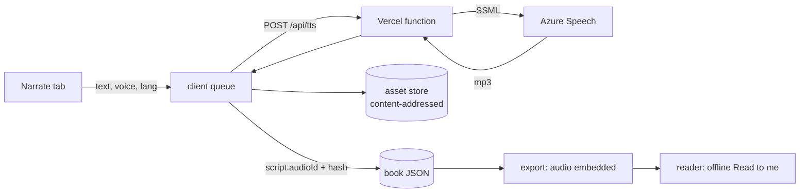

# Folio v3: long-text fixes, pro editing tools, speech bubbles, narration and page curl

This is a build prompt for Claude Code, written for this repository. Folio v1 (M0–M9) and v2
(M10–M16, plus import) are built and tested. This prompt extends the app with seven things,
held to the standard of current media editors (Canva, Figma, PowerPoint/Keynote, Google Slides)
and storybook readers (Apple Books, Book Creator):

1. **Long text that always shows.** Fix the bug where text is visible on the canvas but parts
   are missing in the preview and the exported book, and add standard auto-fit behaviour.
2. **Resizable panels.** Drag (or keyboard-resize) the page list, the properties panel and the
   timeline; collapse them; sizes are remembered.
3. **Grouping.** Group and ungroup elements (Mod+G), and animate a group as one object.
4. **Replace, keeping the animation.** Swap a picture (or any element) and keep its position,
   animations and tap actions.
5. **Speech bubbles.** Dialogue that belongs to a character: the tail points at the speaker and
   follows it when it moves.
6. **Realistic narration.** Neural text-to-speech made in the editor and baked into the book, in
   English and **Filipino** (Filipino is narration-only: the page text stays English), with a
   "Read to me" mode in the reader.
7. **Page curl.** A realistic page-turn animation, plus dragging the page corner to turn.

---

## 0. How to use this prompt (for the person running it)

1. **Set up Azure** before milestone M22 (the narration milestones need it; everything before
   works without it):
   1. In the Azure portal, create an **Azure AI Speech** resource and an **Azure AI
      Translator** resource. The free **F0** tiers are enough to start (check current limits and
      prices on Azure's pricing pages).
   2. Copy each resource's **key** and **region**.
   3. In Vercel → your project → Settings → Environment Variables, add:
      `AZURE_SPEECH_KEY`, `AZURE_SPEECH_REGION`, `AZURE_TRANSLATOR_KEY`,
      `AZURE_TRANSLATOR_REGION`, and optionally `ALLOWED_ORIGINS` (your site's URL, comma
      separated). Redeploy.
   4. For local development, put the same values in `.env.local` in the repo root. It is
      already gitignored (`*.local`); never commit keys.
2. Have some **real long text** (a few paragraphs of your story) and the **Filipino** you'd
   expect for one page, so the agent can test auto-fit and check translations.
3. Start a Claude Code session in this repository and paste:

   ```text
   Read prompt-v3.md in full, then every file listed in section 1 under "Read first".
   Enter plan mode and propose a plan for milestones M17–M25. In the plan, answer every
   item in section 3 "Decisions" that isn't confirmed: use the recommended default unless
   you find a concrete reason not to, and say why. Wait for my approval. Then build one
   milestone at a time. After each one, run pnpm check, pnpm test:e2e and
   pnpm size:player, commit, and give me the summary described in section 9.
   ```

4. After each milestone, work through its **Try it** list (section 6) before you reply
   "continue with the next milestone".

---

## 1. Context for the agent

You are extending a working app, not starting over. Read the existing architecture first and
reuse it. `README.md` explains the design; `prompt.md` is the v2 guide this one follows.

### Read first

- Layout and panels: `src/editor/Editor.tsx`, `src/editor/sidebar/PageList.tsx`,
  `src/editor/panels/RightPanel.tsx`, `src/editor/timeline/TimelineDock.tsx`,
  `src/editor/store/ui-store.ts`, `src/editor/shortcuts.ts`.
- Selection and elements: `src/editor/stage/SelectionLayer.tsx`, `src/editor/stage/Stage.tsx`,
  `src/editor/stage/geometry.ts`, `src/editor/panels/LayersPanel.tsx`,
  `src/editor/panels/ImagePanel.tsx` (today's inline `replaceImage`), `src/editor/actions.ts`,
  `src/core/ops/*` (elements, layers, animations, references `cleanReferences`).
- Text: `src/core/render/nodes.ts` (`buildText`), `src/core/render/render.css`,
  `src/editor/text/measure.ts` (`measureTextHeight`, `fittedTextHeight`),
  `src/editor/stage/TextEditing.tsx`, `src/core/templates/text-fit.ts`,
  `src/core/animation/presets/typewriter.ts`.
- Runtime: `src/core/render/page-view.ts`, `src/core/animation/timeline.ts`,
  `src/core/animation/transitions/index.ts`, `src/core/interaction/runtime.ts`,
  `src/core/interaction/validate.ts`.
- Reader: `src/player/player.ts`, `src/player/audio.ts`, `src/player/player.css`.
- Data: `src/core/schema/project.ts` (schema v3), `src/core/migrations/index.ts`,
  `src/core/schema/asset-ids.ts`, `src/core/export/{build,usage,format}.ts`,
  `src/core/import/read.ts`, `src/editor/assets/upload-sound.ts`, `src/core/sound/validate.ts`.

### Non-negotiable rules (inherited from v1 and v2)

- **One renderer, one animation runtime.** The editor stage, thumbnails, preview and exported
  player all use `PageView` and `createPageTimeline`. What the editor shows at time _t_ is what
  the export shows at time _t_ (the parity E2E test must keep passing).
- **Exports stay offline.** CSP `default-src 'none'`, zero network requests. Anything a book
  needs (including narration audio) is embedded.
- **Player budget.** < 150 KB gzip. **Ask before adding any dependency to the player.**
- **The document changes only through core ops**; every gesture is one undo step.
- **Schema changes are versioned** (zod + a migration), and `cleanReferences` keeps references
  valid.
- **Reduced motion** is respected everywhere; everything works with the keyboard and a screen
  reader.
- **New:** the app must keep working **without a backend**. When the narration service isn't
  configured or reachable, narration features show "Narration isn't set up" and everything
  else works.

---

## 2. What the user wants

> "Resizable panels, dialogue box, text-to-speech (realistic), translated to Filipino in the
> text-to-speech only. A page-curl book animation for the next page. Grouping of elements, and
> replacing an element on the canvas with the same animation as the original. There are also
> issues with longer text: the text shows on the canvas but sections are missing when
> previewing or in the exported book."

### User stories

- **Author: long text just works.** Paste a long passage: it fits (the box grows, or the text
  shrinks to fit the box) and never silently runs off the page. If something doesn't fit, the
  stage says so. The preview and export always show all of it, with or without Typewriter.
- **Author: arrange my workspace.** Drag the edges of the page list, the properties panel and
  the timeline; double-click to reset; hide the side panels to focus. It stays that way next
  time.
- **Author: group things.** Select the character and its hat, press Mod+G, and move, resize,
  rotate and animate them together. Double-click to edit one item inside.
- **Author: swap a picture.** Drag a new picture onto an old one (or right-click → Replace): it
  takes the old one's place, and its walk-in and tap reaction still work.
- **Author: make characters talk.** Add a speech bubble, drag its tail onto Pip, type "Hello!".
  When Pip walks, the bubble walks with Pip; it can pop in on a tap or with the narration.
- **Author: narrate in two languages.** Pick a voice, click **Generate**: every page is read
  aloud by a natural voice. Click **Translate** for Filipino, fix the wording, generate Filipino
  narration. The page text stays English.
- **Reader (a child with a parent):** press **Read to me**, choose **English** or **Filipino**,
  and listen as pages turn by themselves with a realistic page curl, stopping at choices. Or
  drag the page corner to turn pages yourself.

---

## 3. Decisions (confirmed ones are marked ✅; use the recommended default for the rest)

| #   | Question                                  | Decision / recommended default                                                                                                                                                                         |
| --- | ----------------------------------------- | ------------------------------------------------------------------------------------------------------------------------------------------------------------------------------------------------------ |
| 1   | What "dialogue box" means                 | ✅ **Speech bubbles** that belong to a character; the tail points at the speaker and the bubble moves with it; text can type in; bubbles pop in/out on the timeline or on a tap                        |
| 2   | Voice engine                              | ✅ **Cloud neural voices baked into the book**: generated in the editor, saved as audio, played offline in exports                                                                                     |
| 3   | Provider                                  | ✅ **Microsoft Azure**: Azure AI Speech (`fil-PH-BlessicaNeural`, `fil-PH-AngeloNeural`, English neural voices) and Azure AI Translator. Keys only in Vercel server-side functions                     |
| 4   | Filipino                                  | ✅ Page text stays English; **only the narration is Filipino**. **Auto-translate, then the author reviews and edits** before audio is generated                                                        |
| 5   | Reader narration                          | ✅ **Read-to-me mode** (auto-plays each page, turns pages itself, pause/play) plus a per-page speaker button. Reader chooses **English or Filipino** (remembered)                                      |
| 6   | Page curl                                 | ✅ **Realistic curl + drag the corner** (Apple Books style), **one page at a time**; reduced motion → fade                                                                                             |
| 7   | Group model                               | **Nested `group` element** (children in group-local coordinates), like Figma/Keynote/PowerPoint. Rejected: a flat `groupId` on elements, because a group couldn't then animate or rotate as one unit   |
| 8   | Resizing a group                          | **Scales the children's geometry; font sizes stay and text re-wraps** (PowerPoint behaviour)                                                                                                           |
| 9   | Ungroup                                   | **Children keep their place on the page; the group's own animations and tap actions are removed with a notice** (Undo restores them), as PowerPoint does                                               |
| 10  | Replacing a picture                       | **Keep the box and fill it** (cover crop, today's behaviour) with a **"Fit whole picture"** button afterwards                                                                                          |
| 11  | Replacing a character's picture           | **Ask**: "Update Pip on every page" (the character's art changes everywhere; pivot recomputed; poses warning) or "Only this picture" (this instance stops being Pip)                                   |
| 12  | Text auto-fit                             | Per text box: **Grow** (box grows to fit; default for new text), **Shrink** (text scales down to fit the box; default for template captions and speech bubbles), **Fixed** (overflow allowed, flagged) |
| 13  | Long typewriter text                      | Typewriter gets **By letter / By word**; **Auto** (default) uses By word above 600 characters                                                                                                          |
| 14  | Curl's back side                          | **Plain paper with shading** (not a mirrored copy of the page): cheap, and looks like book paper                                                                                                       |
| 15  | Where narration is edited                 | A new **Narrate** tab in the right panel                                                                                                                                                               |
| 16  | Word-by-word highlighting while narrating | **Roadmap** (the Azure REST API returns audio without word timings)                                                                                                                                    |
| 17  | Local development of the API              | A **Vite dev middleware** runs the same handlers as Vercel, with `.env.local`. Without keys, a **mock voice** (deterministic tone) is used; tests always use the mock                                  |
| 18  | Missing Filipino narration on a page      | The reader **falls back to the page's English clip**; the Narrate tab and the checks flag the gap                                                                                                      |
| 19  | Bubble moving with its speaker            | **On by default** ("Move with speaker"): the bubble copies the speaker's x/y motion (never rotation or squash, so text stays readable). Off: bubble and tail stay put                                  |

---

## 4. Feature spec

### 4A. Long text (M17, fixes first)

#### The bug, and its two root causes

Reproduced headlessly: a 1,580-character text on a 1600 × 1200 page.

1. **Typewriter leaves letters invisible forever.**
   - Typewriter animates each letter separately (`presets/typewriter.ts`, and the `chars`
     branch of `applySpecs` in `core/animation/timeline.ts`). Each letter has a **fractional
     delay** (e.g. 859.987 ms) and `steps(1, end)` easing.
   - When a letter's animation finishes, floating-point error can leave its progress a hair
     under 1; `steps(1, end)` turns that into `opacity: 0`.
   - Result: 692 of 1,580 letters (every letter after about the 820th) stayed hidden with
     `playState: 'finished'`. The editor canvas never runs this animation, so it looks fine
     there.
2. **The canvas scrolls away from the real page.**
   - `.fl-page` uses `overflow: hidden` (`core/render/render.css`). Hidden overflow can still
     be scrolled by the browser.
   - While typing or pasting in a tall text box, the browser scrolls the page to follow the
     caret (measured `scrollTop` 4,039 px) and it stays scrolled. The canvas then shows text
     that in reality runs off the bottom of the page.
   - Text boxes can silently grow far past the page (4,680 px tall on a 1,200 px page). There
     is no auto-fit and no overflow warning. Quick-create only _estimates_ font sizes
     (`templates/text-fit.ts`) and never re-measures.

#### Fixes and standard behaviour

- **Typewriter:**
  - Delays and durations are **whole milliseconds**.
  - Keyframes are fully visible at the end regardless of easing, e.g.
    `[{ opacity: 0 }, { opacity: 1, offset: 0.001 }, { opacity: 1 }]` with linear easing (the
    letter appears when its turn comes and can't end hidden).
  - New parameter `by: 'auto' | 'letter' | 'word'`. The renderer splits into `.fl-word` spans
    for words (the split request becomes a map `elementId → 'chars' | 'words'`).
  - **Cap:** at most 800 animated targets per step. Above that, consecutive words are wrapped in
    `.fl-chunk` spans and revealed chunk by chunk.
- **The canvas can't scroll:** `.fl-page { overflow: clip }` (clip can't be scrolled, even by
  code). The editor also resets any stray `scrollTop`. While editing, the caret is kept in view
  by scrolling the **stage's** scroll container instead.
- **Auto-fit** (`style.autofit: 'grow' | 'shrink' | 'none'`, see decision 12):
  - _Grow_: today's behaviour. The box grows to fit **but never past the page bottom**. When
    growing would pass the page, the box stops at the page and switches to _Shrink_, with a toast
    "Text shrunk to fit the page" and Undo.
  - _Shrink_: the box keeps its size and the text scales down to fit. The editor measures and
    stores `style.fitScale` (0.3–1) whenever content, size or style changes. The renderer uses
    `fontSize × fitScale`, so **the player never measures anything** (parity).
  - _Fixed_: overflow is allowed but flagged.
- **Overflow indicator on the stage** (like InDesign's overset marker and Canva's): a red "⋯"
  badge at the bottom edge and a dashed outline when the text doesn't fit its box or runs off the
  page. Clicking the badge offers "Shrink text to fit" / "Grow box" / "Continue on a new page".
- **Checks:** "Text runs off the page" and "Text doesn't fit its box" join the checks list in
  the Interact tab. These need measurement, so they live in the editor
  (`src/editor/checks/text-checks.ts`) and are merged with `validateInteractivity`.
- **Quick-create** waits for `document.fonts.ready`, measures each generated text box and uses
  _Shrink_ for captions. The wizard's review step warns about very long lines ("This line will
  be shrunk to fit").
- **Paste** stays plain text (today's behaviour) and follows the auto-fit rules.

### 4B. Resizable panels (M18)

| Panel              | Range                          | Default |
| ------------------ | ------------------------------ | ------- |
| Page list (left)   | 160–320 px                     | 184 px  |
| Properties (right) | 272–480 px                     | 288 px  |
| Timeline (bottom)  | 160 px to 60 % of the viewport | 240 px  |

- A small in-house `usePanelSize` hook and `<ResizeHandle>` component in `src/editor/layout/`.
  No new dependency: react-resizable-panels solves nested proportional layouts, which three
  independent panels don't need.
- The handle has `role="separator"`, `aria-orientation`, `aria-valuenow/min/max`,
  `aria-controls`. Arrow keys move it ±16 px (Shift ±64 px), Home/End go to min/max, double-click
  resets. It uses **pointer capture** while dragging and shows a highlighted line on hover and
  focus.
- Sizes and collapsed states are saved in `localStorage` (`folio:layout`, wrapped in
  try/catch) by a small `layout-store.ts`.
- **Collapse:** a collapse button on each side panel; **Mod+\\** hides both side panels ("focus
  mode", like Figma); the timeline keeps its **T** shortcut.
- The page list's thumbnails scale with its width (`THUMB_WIDTH` becomes derived; the
  virtualizer re-measures). The right panel's tabs switch to icons below 300 px.
- **Fixes an existing bug:** `TimelineDock` saves the height captured _before_ the drag (stale
  closure in its `pointerup` handler), so the new height is never remembered. Its separator also
  isn't keyboard-accessible. Both are replaced by the shared handle.
- The stage already re-fits on resize (`ResizeObserver` in `Stage.tsx`).

### 4C. Context menu (M18)

- New `src/ui/context-menu.tsx` (Radix ContextMenu, shadcn style), used on stage elements, layer
  rows and the empty canvas. Right-click on an unselected element selects it first.
- Items, each with its shortcut shown:
  - Cut / Copy / Paste / Duplicate / Delete
  - Group / Ungroup (M19)
  - Bring to front / forward / backward / to back
  - Replace… (M20)
  - Lock / Hide
  - Animate… (opens the Animate tab) / Add tap action… (opens the Interact tab)
- On the empty canvas: Paste, Select all, Page background…, Add page after.
- Keyboard: the Menu key and Shift+F10 open it for the selection.

### 4D. Grouping (M19)

- **Shortcuts:** Mod+G groups the selection (2+ elements); Mod+Shift+G ungroups. Mod+G and
  Mod+Shift+G are unused today; add them before the `if (mod) return;` fall-through in
  `shortcuts.ts`.
- **Selection:**
  - A click selects the **outermost group**.
  - A double-click (or Mod+click) **enters** the group and selects the child under the pointer.
  - Esc selects the parent group, then clears.
  - Marquee selection picks top-level elements only (children too when inside an entered group).
- **Transform:** move, resize and rotate the group as one (decision 8). Children inside a rotated
  group are edited through the chained transform (generalise `elementToPage` / `pageToElement`
  in `stage/geometry.ts`).
- **Layers panel becomes a tree:** a disclosure triangle per group, indentation, drag to
  reorder within a parent, drop onto a group row to move inside it, drag out to the page.
- **Animations and interactions:**
  - A group can have its own animation steps (they move the whole group), tap actions and
    screen-reader name.
  - Children keep their own animations, which run inside the group's movement (like Keynote).
  - The timeline and Animation Pane show a group lane with collapsible children.
- **Copy, paste, duplicate:** deep copies with new ids; "play step" actions inside are
  re-pointed to the copies (extend `cloneElement` / `duplicateElements`).
- **Delete** removes the group, its children and their steps. Groups can nest **up to 3 deep**.
- **Ungroup** follows decision 9.
- **Reader:** tapping anywhere on a group runs the group's tap actions; a child with its own
  tap actions takes priority (the closest `[data-interactive]` wins, as today).

### 4E. Replace, keeping the animation (M20)

- **Core op:** `replaceElement(draft, pageId, id, source)` in `src/core/ops/replace.ts` (moving
  today's inline `ImagePanel.replaceImage` into core).
  - Keeps: **id**, position, rotation, z-order, lock/hide, animations, tap actions and the
    screen-reader name.
  - Sources: picture (a new upload or an existing asset), shape, text, button, speech bubble.
  - Returns the steps it had to remove.
- **Entry points** (Canva and PowerPoint conventions):
  - The Replace button in the Image panel (exists).
  - **Drag a picture file onto a picture** on the stage: the target highlights and the drop
    replaces instead of inserting.
  - Right-click → **Replace…** (picture), and a **Replace with…** submenu (shape, text,
    button, bubble).
- **Pictures:** decision 10. "Fit whole picture" resizes the box to the new picture's aspect
  ratio, centred on the old box.
- **Across types:** steps that no longer apply are removed and listed in a toast with Undo. For
  example: Typewriter on something that isn't text, character moves on a non-character, Ken
  Burns on a non-picture. Checked with each preset's `appliesTo`, `requiresCharacter` and
  `splitText`.
- **Characters:** decision 11.
  - "Update Pip on every page": `updateCharacter` changes the art; **every instance's
    `assetId` changes** (instances render from their own `assetId`); the pivot is recomputed
    from the new picture's visible area; a warning appears if the character has poses.
  - "Only this picture": `linkCharacter(…, undefined)`, then replace.

### 4F. Speech bubbles (M21)

- **A new `bubble` element:**
  - Text: the same paragraphs/runs and text style as text boxes, auto-fit **Shrink** by
    default.
  - `bubble`: `shape` ∈ speech (rounded), thought (cloud with a trail of circles), shout
    (spiky), whisper (dashed outline), caption (rectangle, no tail); plus `fill`, `stroke`,
    `strokeWidth`, `radius`.
  - `tail`:
    - `targetId` (a character instance, optional)
    - `anchor` (0–1 within the target; defaults to the top-centre of the character's visible
      pixels, using `opaqueBounds`)
    - `tip` (page coordinates, used when free)
    - `width`
  - `speakerId` (character id, for "Pip says…"), `moveWithSpeaker` (decision 19), and
    `narration` (see 4G).
- **Rendering** (`buildBubble` in `core/render/nodes.ts`): an HTML body for the text plus an
  SVG outline and tail. Tail geometry comes from a pure function
  (`core/render/bubble-geometry.ts`): the tail leaves from the side of the body nearest the tip.
- **Moving with the speaker:**
  - When a character step is built, `createPageTimeline` also builds a **translation-only**
    copy of its x/y track on each attached bubble's anim layer (same timing), so the bubble and
    tail move together.
  - It stays seekable, so editor = export.
  - Idle loops are not copied (bubbles don't bob).
- **Editor:**
  - Insert → **Speech bubble** (a small gallery of the five shapes).
  - Edit text inline like a text box.
  - A **tail tip handle** on the stage: drag it onto a character to attach (the character
    highlights; it snaps to the anchor), or anywhere to leave it free.
  - Design panel: shape, colours, speaker, "Move with speaker".
- **Animations:** new presets **Pop from tail** (entrance and exit; scales from the tail tip)
  and a gentle **Wobble**. Typewriter works in bubbles. Triggers as usual: when the page opens,
  on click, or on tap (e.g. tap Pip → the bubble appears).
- **Accessibility:** the bubble is announced as "Pip says: Hello!" and is read in page order
  after the main text.
- **Checks:** "Bubble points at a deleted character"; text overflow as in 4A.
  `cleanReferences` clears a dangling `targetId` (the tail becomes free at its last tip).

### 4G. Narration and text-to-speech (M22 editor, M23 reader)

#### Server: Vercel functions (the only backend)

- `api/tts.ts`: POST `{ text, voice, lang, rate }` → `audio/mpeg`.
  - Calls `https://{AZURE_SPEECH_REGION}.tts.speech.microsoft.com/cognitiveservices/v1`.
  - Headers: `Ocp-Apim-Subscription-Key`, `Content-Type: application/ssml+xml`,
    `X-Microsoft-OutputFormat: audio-24khz-48kbitrate-mono-mp3`.
  - Body: SSML
    `<speak version="1.0" xml:lang="fil-PH"><voice name="…"><prosody rate="…">…</prosody></voice></speak>`.
    **XML-escape the text.**
- `api/translate.ts`: POST `{ texts: string[] }` → `{ texts: string[] }`.
  - Calls `https://api.cognitive.microsofttranslator.com/translate?api-version=3.0&from=en&to=fil`.
  - Headers: `Ocp-Apim-Subscription-Key`, `Ocp-Apim-Subscription-Region`.
- `api/voices.ts`: GET → a curated list.
  - Fetched from `…/cognitiveservices/voices/list`, filtered to `fil-PH`, `en-PH`, `en-US` and
    `en-GB` neural voices. Cached for a day.
  - Defaults: English **`en-US-JennyNeural`**, Filipino **`fil-PH-BlessicaNeural`**. Verify they
    exist in the region; Azure occasionally retires voices.
- **Provider interface** in `server/providers/`:

  ```ts
  interface NarrationProvider {
    synthesize(req: {
      text: string;
      voice: string;
      lang: 'en' | 'fil';
      rate: number;
    }): Promise<ArrayBuffer>;
    translate(texts: string[], from: 'en', to: 'fil'): Promise<string[]>;
    voices(): Promise<Voice[]>;
  }
  ```

  Implementations: `azure.ts` and `mock.ts` (a short sine tone whose length depends on the text,
  plus a "[fil] …" translation). The provider is `mock` when keys are missing and in all tests.

- **Handler shape:** web-standard `export async function POST(request: Request): Promise<Response>`,
  so the same handlers run on Vercel, in the Vite dev middleware (`vite-plugins/api-dev.ts`)
  and in Vitest.
- **Abuse protection** (the app has no accounts):
  - Allow only origins in `ALLOWED_ORIGINS` (plus localhost in dev).
  - At most **1,500 characters** per TTS request and 5,000 per translate request.
  - A per-IP token bucket (in-memory, per instance; note that a shared store such as Vercel KV
    is the upgrade path).
  - Map Azure errors (401, 403, 429, 5xx) to friendly codes.
- **Keys never reach the browser.**

#### Data (schema v4)

- Book: `project.narration = { voices: { en, fil }, rate: -30…+30 (percent), pageDelayMs }`.
- Page: `page.narration?.{ en?, fil? }`, each a
  `script = { text, source: 'auto' | 'edited', audioId?, hash? }`.
- Bubble: `bubble.narration?.{ en?, fil? }` (same script shape).
- Character: `character.voice?: { en?, fil? }`. Bubbles spoken by that character use it; page
  narration uses the book's narrator voice.
- **Audio:**
  - Stored like sounds, in the same content-addressed store, as `soundRef` with a new
    `purpose: 'narration'`. Narration clips can be up to **5 MB** and are hidden from the Sounds
    list.
  - `hash = sha256(lang | voice | rate | text)`. A clip is regenerated **only when its hash
    changes** (so re-running "Generate all" is free when nothing changed).
  - Identical clips dedupe automatically in the asset store.

#### Narrate tab (editor)

- **Book section:** English and Filipino voice pickers with a preview button, speaking rate,
  pause between pages.
- **Per page:**
  - The **English script** defaults to the page's text in reading order (visible text boxes,
    top-to-bottom then left-to-right; buttons are not read), with "Reset to page text".
  - The **Filipino script** comes from **Translate** (per page, or "Translate all"). It is shown
    side by side with the English and is editable. Editing marks it `edited`; translating again
    warns before overwriting edits.
  - **Generate** per language, per page, and **Generate all**.
  - **Status chips:** Up to date · Text changed since generated · Missing.
  - A play button for each clip.
- **Per bubble:** the same two scripts, in the bubble's Design panel or a list in the Narrate
  tab.
- **Requests:** a client queue with 2 concurrent requests, retry with backoff on 429, and a
  progress bar for "Generate all".
- **Privacy note:** "Your text is sent to Microsoft Azure to make the voice."
- **Without the backend:** buttons are disabled and "Narration isn't set up" links to the README
  section.
- **Checks:** "Page 3 has no Filipino narration", "Narration is out of date on page 5".

#### Reader: Read to me (M23)

- **Controls:**
  - A **Read to me** toggle (headphones icon) in the controls.
  - On the cover of books that have narration, a choice: **▶ Read to me** / **Read myself**.
  - A language chip **EN / FIL**, shown only when both exist (remembered in `localStorage`).
  - A per-page **speaker** button.
  - Pause/play. Mute also mutes narration.
- **Flow in read-to-me mode:**
  1. The page's narration plays after the page turn.
  2. Click groups advance **automatically**, each after the previous narration and animations
     finish.
  3. Bubbles speak when their entrance plays.
  4. When the page is done, after `pageDelayMs` it turns (with the curl).
  5. It **stops at locked pages and choices**: the reader decides, then it continues.
  - A page with no narration in the chosen language falls back to English (decision 18). With
    no narration at all it waits `max(3 s, words × 0.35 s)`.
  - Any manual navigation keeps read-to-me on and continues from the new page.
- **State machine** (`core/interaction/runtime.ts`):
  - New state `readAloud`, `lang`.
  - New events `toggleReadAloud`, `setLang`, `narrationEnded`, `groupsDone`.
  - New effects `playNarration { clipId }`, `stopNarration`.
  - Pure and unit-tested, like the rest.
- **Player module:** `src/player/narration.ts` (uses `HTMLAudioElement`, like `SoundBoard`).
  Nothing plays before the first gesture: the cover choice is that gesture.
- **Export and import:**
  - Narration audio is in `exportedAssetIds`, embedded offline; the CSP is unchanged
    (`media-src data:` / `'self'`).
  - Import restores it.
  - `BOOK_FORMAT_VERSION` becomes 3.

### 4H. Page curl (M24)

- A new transition preset **`curl`** in `transitions/index.ts` (the schema enum gains `curl`).
  The transition picker's grid in `AnimationPane.tsx` (`grid-cols-5` today) becomes 3 × 2 with
  a looping mini preview on hover.
- **Geometry**, a pure module `src/core/animation/curl/geometry.ts`:
  - Input: page size, the corner being turned, and a **drag point** (or a progress 0–1 mapped
    onto a lifted path).
  - The **fold line** is the perpendicular bisector between the corner and the drag point.
    Clamp the drag point so the page never "tears" from its spine.
  - Output: clip-path polygons with a **constant point count**, for:
    - the part of the turning page not yet turned
    - the curled-over flap (a plain-paper back, decision 14, placed with a mirror transform
      across the fold line as a CSS `matrix()`)
    - the next page revealed underneath
    - gradient shadows along the fold and under the flap
- **Rendering** (`src/player/curl.ts`): driven by `requestAnimationFrame` **only while a turn is
  happening** (no idle work). WAAPI isn't used because the geometry depends on the drag point.
- **Drag to turn:**
  - `pointerdown` within the bottom-right corner area (next) or bottom-left (back), about 15 %
    of the page.
  - Uses `setPointerCapture`.
  - Release completes the turn past 35 % or on a fast fling, and springs back otherwise.
    `pointercancel` springs back.
  - The next page is **mounted underneath at drag start without changing reader state**: preview
    the target with the pure reducer; commit (`dispatch`) only when the turn completes; unmount on
    cancel.
  - On a locked page the corner resists (a small elastic pull) and the hint shows.
- **Automatic turns:** keys, taps, buttons and read-to-me play the same curl over the page's
  transition duration. Going back **uncurls** (reverse direction).
- **Reduced motion:** fade. The existing swipe gesture stays for non-curl transitions.
- **Performance:** ≤ 4 ms of script per frame; no long tasks while dragging (measured in E2E).

---

## 5. Architecture

### 5.1 Where things go

```
api/                      tts.ts, translate.ts, voices.ts   (Vercel functions, web Request/Response)
server/providers/         azure.ts, mock.ts, types.ts        (NarrationProvider)
vite-plugins/api-dev.ts   runs api/* during pnpm dev with .env.local
src/core/
  schema/tree.ts          walkElements, findElement, parentOf, flattenElements, pathTo
  text/autofit.ts         pure auto-fit rules (scale bounds, when to switch Grow → Shrink)
  render/bubble-geometry.ts, nodes.ts (+ buildBubble, word/chunk splitting, group frames)
  animation/curl/         geometry.ts (pure), + 'curl' transition
  narration/              script.ts (reading order, default scripts), hash.ts, status.ts
  ops/                    groups.ts (group/ungroup/regroup), replace.ts, bubbles.ts, narration.ts
src/ui/context-menu.tsx
src/editor/
  layout/                 ResizeHandle.tsx, usePanelSize.ts, layout-store.ts
  checks/text-checks.ts   measurement-based checks
  narration/              NarratePanel.tsx, client.ts (queue, retries), VoicePicker.tsx
  stage/                  OverflowBadge.tsx, BubbleTailHandle.tsx, DropReplaceTarget.tsx
src/player/               curl.ts, narration.ts
```

### 5.2 Data model: schema v4 (a sketch; refine it, but keep it closed and validated)

```ts
SCHEMA_VERSION = 4;
// migration 3 → 4: add project.narration defaults; everything else is optional.

textStyleSchema += {
  autofit: z.enum(['grow', 'shrink', 'none']).optional(), // missing = 'grow'
  fitScale: z.number().min(0.3).max(1).optional(), // set by the editor for 'shrink'
};

groupElementSchema = z.object({
  ...baseElementShape,
  type: z.literal('group'),
  get children() {
    return z.array(pageElementSchema).min(1);
  }, // recursive, local coordinates
});

bubbleElementSchema = z.object({
  ...baseElementShape,
  type: z.literal('bubble'),
  content: z.array(paragraphSchema),
  style: textStyleSchema,
  bubble: z.object({
    shape: z.enum(['speech', 'thought', 'shout', 'whisper', 'caption']),
    fill: cssColor,
    stroke: cssColor.optional(),
    strokeWidth: z.number().min(0).max(40),
    radius: z.number().min(0).max(400),
  }),
  tail: z.object({
    targetId: id.optional(),
    anchor: z.object({ x: unit, y: unit }),
    tip: z.object({ x: z.number(), y: z.number() }),
    width: z.number().min(4).max(200),
  }),
  speakerId: id.optional(),
  moveWithSpeaker: z.boolean(),
  narration: narrationScriptsSchema.optional(),
});

narrationScriptSchema = z.object({
  text: z.string().max(5000),
  source: z.enum(['auto', 'edited']),
  audioId: id.optional(),
  hash: z.string().max(80).optional(),
});
narrationScriptsSchema = z.object({
  en: narrationScriptSchema.optional(),
  fil: narrationScriptSchema.optional(),
});

pageSchema += { narration: narrationScriptsSchema.optional() };
characterSchema += {
  voice: z.object({ en: z.string().max(80).optional(), fil: z.string().max(80).optional() }).optional(),
};
projectSchema += {
  narration: z.object({
    voices: z.object({ en: z.string().max(80), fil: z.string().max(80) }),
    rate: z.number().min(-30).max(30),
    pageDelayMs: z.number().min(0).max(10000),
  }),
};
soundRefSchema += { purpose: z.enum(['sound', 'narration']).optional() }; // narration ≤ 5 MB
PAGE_TRANSITIONS += 'curl';
typewriter params += { by: 'auto' | 'letter' | 'word' };
```

- `cleanReferences` also:
  - walks nested children
  - drops empty groups
  - clears bubble `targetId` / `speakerId` that no longer resolve
  - removes narration `audioId`s whose sound is gone
- `projectAssetIds` / `exportedAssetIds` walk groups and include narration audio.
- Import (`core/import/read.ts`) needs no change beyond the schema; a round-trip unit test covers
  groups, bubbles and narration.

### 5.3 Renderer changes

- **Groups:** a group entry is a normal frame (`.fl-el[data-type=group]` → `.fl-anim`) whose
  children's frames sit inside its anim layer. `getNodes(id)` stays a flat map over every node,
  so animation steps on children keep working. `update()` diffs recursively.
- **Bubbles:** frame → anim → body (text) + SVG (outline and tail).
- **Text:** `fontSize × (fitScale ?? 1)`; word and chunk splitting next to letters.
- **CSS:** `.fl-page { overflow: clip }`.

### 5.4 Animation runtime changes

- The `chars` branch uses integer timing and end-safe keyframes; words and chunks are new
  targets.
- Bubble followers: translation-only copies of their speaker's element tracks.
- `curl` is handled by the player (and the editor preview), not by keyframes.

### 5.5 Data flow: narration



---

## 6. Milestones

Each milestone ends with `pnpm check`, `pnpm test:e2e` and `pnpm size:player` passing, a
commit, and the summary from section 9.

### M17: Long text (fixes first)

- **Build:**
  - the two root-cause fixes (Typewriter timing and keyframes; `overflow: clip` and stray-scroll
    reset)
  - auto-fit Grow / Shrink / Fixed with the page-bottom rule
  - the overflow badge and its quick fixes
  - text checks
  - Quick-create re-measuring
  - Typewriter by word and chunking
- **Done when:**
  - a unit test proves every Typewriter target ends fully visible for 2,000 letters, with
    integer delays
  - auto-fit unit tests pass
  - E2E: a 2,000-letter Typewriter text shows **every letter** in the preview and in the exported
    file
  - E2E: pasting a long passage never scrolls the canvas; the box stops at the page and shrinks
  - E2E: Quick-create with long lines produces no overflow checks
- **Try it:**
  1. Paste several paragraphs into a text box.
  2. Add Typewriter.
  3. Preview and export: all the text is there.
  4. Switch the box between Grow, Shrink and Fixed.

### M18: Resizable panels and the context menu

- **Build:** `ResizeHandle` / `usePanelSize` / `layout-store`; the three panels; collapse and
  Mod+\\; thumbnails that scale; the timeline height fix; `context-menu.tsx` with the existing
  actions.
- **Done when:**
  - E2E: drag and keyboard resizing, remembered after reload
  - E2E: double-click resets
  - E2E: focus mode
  - E2E: the right-click menu works on the stage and in the layers panel
  - axe-style checks: separators have the right roles and values
- **Try it:** resize every panel, reload, collapse them, then right-click an element.

### M19: Grouping

- **Build:**
  - schema v4 group element and migration
  - `core/schema/tree.ts`, then move the ~36 flat `page.elements.find/filter` call sites to the
    helpers
  - group/ungroup ops, selection rules and transforms
  - the layers tree
  - timeline and Animation Pane group lanes
  - renderer nesting
  - context-menu items
- **Done when:**
  - unit: group/ungroup keep every child's page position (including rotated groups)
  - unit: cloning re-points steps
  - unit: `cleanReferences` handles nested elements
  - E2E: Mod+G / Mod+Shift+G / enter a group
  - E2E: a group animation shows the same frame in the editor and the export (parity)
  - E2E: undo is one step per action
- **Try it:**
  1. Group Pip and a hat.
  2. Add "Hop" to the group.
  3. Preview.
  4. Double-click to edit the hat.
  5. Ungroup.

### M20: Replace, keeping the animation

- **Build:** `replaceElement`; drop-to-replace; Replace… / Replace with…; "Fit whole picture";
  the character choice dialog; the incompatible-step toast.
- **Done when:**
  - unit: which steps are kept or removed for each type pair
  - E2E: dropping a picture onto a picture keeps its Walk-in and its tap action, in the preview
    and the export
  - E2E: replacing a character's picture with "Update Pip on every page" changes every page
- **Try it:** drag a new picture onto an animated one; replace a shape with text.

### M21: Speech bubbles

- **Build:** the bubble element and renderer; tail geometry; the tail handle with
  attach-to-character; the five shapes; Pop from tail and Wobble; move-with-speaker followers;
  the Design panel; accessibility; checks.
- **Done when:**
  - unit: tail geometry (tail side, tip, target anchor)
  - E2E: a bubble attached to a walking Pip moves with it; editor = export at the same time
    (parity)
  - E2E: a tap on Pip shows the bubble
  - E2E: a screen reader name "Pip says: …"
- **Try it:** add a bubble, attach its tail to Pip, make Pip walk in, then preview.

### M22: Narration backend and the Narrate tab

- **Stop and ask first:** are the Azure resources and keys set up (section 0)? Confirm the free
  tier and cost limits you're comfortable with.
- **Build:**
  - `api/*` with the provider interface, Azure and mock
  - the dev middleware and abuse protection
  - schema v4 narration fields
  - the Narrate tab: scripts, translation review, voices, Generate with hashing and the queue
  - status chips and checks
- **Done when:**
  - unit: handlers with the mock (validation, 1,500-character limit, origin, rate limit, error
    mapping)
  - unit: SSML escaping; script extraction order; hash-based regeneration
  - E2E (mock): translate → edit → generate → the clip plays in the editor; nothing is
    regenerated when nothing changed
  - manual check with real Azure keys: an English and a Filipino page sound natural
- **Try it:** generate English and Filipino narration for three pages; edit one Filipino line
  and regenerate just that page.

### M23: Narration in the reader

- **Build:** the reader state machine changes; `player/narration.ts`; the Read-to-me cover
  choice; controls, language chip, speaker button; auto-advance rules; export and import of
  narration audio.
- **Done when:**
  - unit (reducer): read-to-me advances pages, stops at a locked page and at a choice, falls back
    to English, restarts after a manual turn
  - E2E (mock audio, `play()` spy): an exported book, offline, with Read to me in Filipino plays
    every page's clip in order, auto-turns, and stops at a choice
  - zero network requests
  - import restores narration
- **Try it:** export, open offline, choose Read to me → Filipino, and listen through to a choice.

### M24: Page curl

- **Stop and ask after a spike:** build the geometry and a bare prototype first; show a short
  recording or screenshots at 25 / 50 / 75 % before polishing.
- **Build:** the geometry module, the player curl with automatic turns and drag-to-turn, the
  locked-page resistance, reduced-motion fade, and the editor picker with a preview.
- **Done when:**
  - unit: fold line, clamping, constant polygon point count, progress path
  - E2E: next and back with the curl; dragging past 35 % turns and a short drag springs back
  - E2E: a locked page doesn't turn
  - E2E: reduced motion fades
  - E2E: no long tasks while dragging; frame script time within budget
- **Try it:** set the curl on a book, press → and drag the corner, on a laptop and a tablet.

### M25: Polish, performance and documentation

- **Build:**
  - performance tests: a 3,000-character page, 10 groups × 5 children, curl frames
  - an accessibility pass: menus, separators, bubbles, narration controls
  - the sample book gains a speech bubble, narration scripts (English + hand-written Filipino,
    ready to generate) and the curl
  - README sections: auto-fit, panels, grouping, replace, bubbles, narration (with Azure setup),
    curl
  - screenshots
- **Done when:** the budgets in section 8 hold, and every earlier test passes.

---

## 7. Testing requirements

- **Unit (Vitest):**
  - Typewriter end-state visibility
  - auto-fit rules
  - tree helpers
  - group/ungroup geometry
  - replace compatibility
  - bubble geometry
  - curl geometry
  - narration script, hash and status
  - the reducer (read-to-me)
  - API handlers with the mock provider
  - schema v4 migration (v1–v3 fixtures upgrade)
  - export → import round trip with groups, bubbles and narration
- **E2E (Playwright):** everything listed under "Done when", plus the existing suite (parity,
  offline export, import).
- **Tests never call Azure.** They use the mock provider and generated audio.
- **Exports:** still zero network requests, and `expect(errors).toEqual([])` with the CSP.

## 8. Budgets

| Budget                          | Limit                                                                |
| ------------------------------- | -------------------------------------------------------------------- |
| Player bundle (gzip)            | < 150 KB hard limit; aim ≤ 45 KB after M25 (about 25 KB today)       |
| Typewriter targets per step     | ≤ 800 (words and chunks beyond that)                                 |
| Page turn with the curl         | ≤ 4 ms script per frame; no long task over 50 ms while dragging      |
| Page turn (30-page mascot book) | < 100 ms to the first frame (unchanged)                              |
| Narration clip                  | ≤ 5 MB each; warn when a book's audio passes 60 MB                   |
| `/api/tts` request              | ≤ 1,500 characters; per-IP rate limit; 2 concurrent requests per tab |
| Group depth                     | ≤ 3                                                                  |

## 9. Milestone summary format (reply with this after each milestone)

1. **Built:** a bullet list of what exists now.
2. **Try it:** numbered steps for the person to check it by hand.
3. **Tests:** what was added, and the unit and E2E counts.
4. **Bundle:** the player's gzip size and the change from before.
5. **Decisions made:** anything you chose that wasn't specified, and why.
6. **Known limitations** and **next**.

**Stop and ask** (don't guess) at these points:

- after the plan
- before M22 (Azure resources, keys and cost limits)
- after the page-curl spike in M24
- before adding any dependency to the player
- if an existing test needs substantive changes
- if a requirement here conflicts with how the code actually works

## 10. Out of scope (roadmap)

- word-by-word highlighting during narration (needs word timings from the Speech SDK)
- translating the page text itself (only narration is Filipino)
- two-page spreads, and a mirrored page on the curl's back
- voice cloning or custom voices
- accounts, per-user quotas and billing
- other narration languages (the provider interface makes them easy to add later)

## 11. Tips for steering the build

- **One milestone per turn.** Say "continue with M18" only after M17's Try it list checks out.
- **Use real material.** Paste your real long story text and your expected Filipino wording;
  auto-fit and translation review improve a lot.
- **Report bugs precisely.** Say which page and element, what you expected and what happened,
  the steps to reproduce, and whether it happens on the **canvas**, in **Preview**, in the
  **exported file**, or all of them.
- **Ask for options when unsure.** For example: "Give me 2 options for the bubble tail with
  trade-offs before building."
- **Keep changes scoped.** For example: "Fix only this. Don't refactor unrelated code."
- **Treat the exported file as the truth.** If something only works in the editor, it isn't
  done.
- **Keep keys secret.** Never paste Azure keys into the chat or commit them; they belong in
  Vercel's environment variables and `.env.local`.
