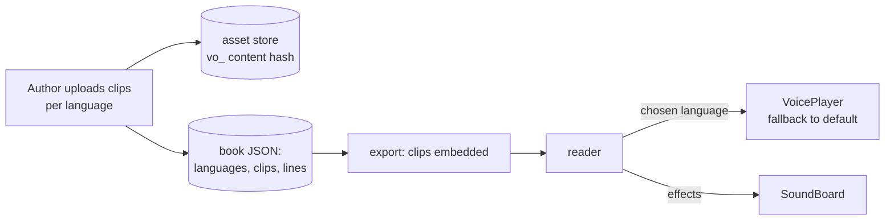

# Folio: uploaded voiceover in several languages, and sound effects as their own section

This is a build prompt for Claude Code, written for this repository. Folio v1 (M0–M9), v2
(M10–M16, plus import) and the v3 editing tools (M17–M21) are built and tested; the page curl
(M24) and polish (M25) from `prompt-v3.md` come before this guide. This guide **replaces M22
and M23 in `prompt-v3.md`** (Azure text-to-speech): there is **no text-to-speech**. Authors
upload their own recordings instead.

It adds four things, held to the standard of current storybook tools (Book Creator, Apple
Books read-along books, Epic!, Canva's audio panel):

1. **Uploaded voiceover per language.** The author uploads recordings, for example English and
   Tagalog, for each page, for a character's line when tapped, and for speech bubbles.
2. **A language button outside the page.** In the reader's toolbar (never on the canvas), a
   button lists the languages that were uploaded: "English", "Tagalog", or no voice. The
   reader is also asked once, when the book opens.
3. **Audio triggers.** Play audio **when a page turns** (the page opens), **when a character
   (or anything) is tapped**, and **when a speech bubble appears**.
4. **Two separate kinds of audio.** **Voiceover** and **Sound effects** live in entirely
   separate sections, in the editor and in the reader.

---

## 0. How to use this prompt (for the person running it)

1. **Prepare a few real recordings** so the agent can test with them:
   - English and Tagalog voiceover for three pages, plus one character line (for a tap) and
     one bubble line.
   - Formats: MP3, M4A, OGG or WAV. Up to 10 MB per clip.
   - Naming them like `page-01-en.mp3`, `page-01-tl.mp3`, `page-02-en.mp3` lets you upload a
     whole book's voiceover at once (section 4C).
2. **Finish the page curl first.** M24 (page curl) and M25 (polish) from `prompt-v3.md`
   change the same player code (`showPage`, `afterTransition`, page adoption). Start M26 only
   after they have landed.
3. **No accounts or keys are needed.** Everything is stored in the browser and embedded in
   the exported book, which still works offline.
4. Start a Claude Code session in this repository and paste:

   ```text
   Read prompt-voiceover.md in full, then every file listed in section 1 under "Read first".
   Enter plan mode and propose a plan for milestones M26–M29. In the plan, answer every
   item in section 3 "Decisions" that isn't confirmed: use the recommended default unless
   you find a concrete reason not to, and say why. Wait for my approval. Then build one
   milestone at a time. After each one, run pnpm check, pnpm test:e2e and
   pnpm size:player, commit, and give me the summary described in section 9.
   ```

5. After each milestone, work through its **Try it** list (section 6) before you reply
   "continue with the next milestone".

---

## 1. Context for the agent

You are extending a working app, not starting over. `README.md` explains the design;
`prompt-v3.md` is the guide this one follows (ignore its M22/M23 narration milestones).

### Read first

- **Sound effects today (reuse, don't rewrite):**
  - Schema: `src/core/schema/project.ts` (`SOUND_MIMES`, `MAX_SOUND_BYTES` = 2 MB,
    `soundRefSchema`, the `playSound` story action, `readerSettingsSchema.pageTurnSound`,
    `projectSchema.sounds`).
  - Core: `src/core/sound/validate.ts` (`checkSoundFile`), `src/core/ops/sounds.ts`,
    `src/core/ops/references.ts` (`cleanReferences`), `src/core/schema/asset-ids.ts`
    (`projectAssetIds`), `src/core/interaction/validate.ts`.
  - Editor: `src/editor/assets/upload-sound.ts` (`importSoundFiles`, content-hash ids,
    `readDuration`, `pickSoundFiles`), `src/editor/sound/actions.ts`,
    `src/editor/panels/InteractPanel.tsx` (`SoundsSection`, the "Play a sound" action row,
    `PreviewSoundButton`), `src/editor/interaction/actions.ts` (`ACTION_LABELS`,
    `defaultAction`, `editWithAction`), `src/editor/assets/asset-urls.ts`.
  - Player: `src/player/audio.ts` (`SoundBoard`, `bookHasSound`, the global `folio:muted`
    key), `src/player/player.ts` (`button()`, the `fp-controls` toolbar, `showPage`,
    `apply`, `dispatch`, `afterTransition`, the `unlock` listeners, the `M` key),
    `src/player/dom.ts` (`ICON_PATHS`), `src/player/menu.ts` (`PageMenu`, the dialog
    pattern), `src/player/resume.ts`, `src/player/player.css`.
  - Export/import: `src/core/export/usage.ts` (`exportedAssetIds`), `src/core/export/build.ts`
    (data URIs, `assets/audio/` in the zip, `EXT_BY_MIME`, `estimateSize`, the CSP with
    `media-src data:`), `src/core/import/read.ts` (`collectFiles`, `checkFile`,
    `ZIP_ASSET_PATH`, `FileKind`), `src/dashboard/import/import-book.ts` (skips thumbnails
    for audio), the import dialog, `src/editor/export/export-book.ts` (`estimateExport`) and
    the export dialog (`SizeEstimate`).
  - Object URLs and storage: `src/editor/Editor.tsx` (which ids get object URLs),
    `src/storage/dexie/project-repo.ts` (garbage collection of unowned files).
  - Checks: the Interact tab's checks section (`textIssues` + `validateInteractivity`).
- **Reader logic:** `src/core/interaction/runtime.ts` (`ReaderState`, `ReaderEvent`,
  `ReaderEffect`, `reduce`, `tap`, `isNextLocked`, `nextTarget`).
- **Animation schedule:** `src/core/animation/schedule.ts` (`scheduleSteps`,
  `isInteractionStep`), `src/core/animation/timeline.ts`.
- **Characters and bubbles:** `src/editor/panels/CharacterPanel.tsx`,
  `src/core/character/reaction.ts` (`addTapReactionTo`), `src/editor/panels/BubblePanel.tsx`,
  `src/core/ops/bubbles.ts` (`showBubbleOnTap`, `bubbleTapStep`).
- **Panels:** `src/editor/panels/RightPanel.tsx` (tabs, compact mode),
  `src/editor/store/ui-store.ts` (`RightTab`).
- **Migrations:** `src/core/migrations/index.ts`, and the README's "Change the schema" section.
- **Tests to build on:** `tests/e2e/sound.spec.ts` (a WAV made in the browser and a spy on
  `HTMLMediaElement.prototype.play`), `src/core/import/import.test.ts`,
  `src/core/export/export.test.ts`, `src/dashboard/sample-art.ts` (`makeChime`).

### Non-negotiable rules (inherited)

- **One runtime, same behaviour everywhere:** the in-app preview and the exported book use the
  same `Player`; what one plays, the other plays.
- **Exports stay offline:** no network, CSP `default-src 'none'`; audio is embedded as data
  URIs (single file) or files next to the page (zip). The CSP already allows `media-src`.
- **Player bundle** under 150 KB gzip; ask before adding any player dependency (none is
  needed: use `HTMLAudioElement`).
- **Every edit goes through a core op**, one undo step per user action; audio uploads and bulk
  uploads are one step each.
- **zod schema plus a migration** for every shape change; old books keep opening.
- **Accessible:** named buttons, keyboard access, focus management, live-region
  announcements. Voice is an addition to the page text, never a replacement.
- **No autoplay before a gesture:** browsers block it, and a book shouldn't start talking on
  its own. The opening "Listen in…" card provides that first gesture.
- **`HTMLAudioElement` only, no Web Audio:** the export CSP has no `connect-src`, so
  `fetch()` of the embedded data URIs is blocked; decoding with Web Audio isn't possible.

---

## 2. What the user wants

> "Enable the uploading of a voiceover, no need for text-to-speech. A button, not in the
> canvas but outside, that can choose from the languages available (uploaded): if the author
> uploaded English and Tagalog, the options are English or Tagalog. Audio can play on page
> turn, or when a character is clicked. The audio should be in two parts, the voiceover and
> sound effects, in entirely different sections."

### User stories

- **Author: record once per language.** "I add the languages English and Tagalog. On each page
  I upload the English and the Tagalog recording. When I'm missing a Tagalog clip, the book
  tells me it will use English there."
- **Author: upload a whole book at once.** "I drop 24 files named `page-01-en.mp3`…
  `page-12-tl.mp3` and they land on the right pages."
- **Author: a character that speaks.** "When Pip is tapped, Pip says 'Hello!' in the reader's
  language, and still wiggles."
- **Author: bubbles that speak.** "When Pip's speech bubble pops in, its line is heard."
- **Author: sound effects are separate.** "Birds chirp when the forest page opens; a 'pop'
  plays when the balloon is tapped; the page-turn swoosh stays. None of these are voiceover,
  and they're managed in their own section."
- **Reader: choose a language.** "When the book opens it asks: English, Tagalog, or read it
  myself. There's a button beside the page to change it any time."
- **Reader: control the audio.** "I can turn the voice off but keep the effects, or the other
  way round. The book remembers my choice."
- **Reader: Read to me.** "With Read to me on, each page turns by itself when the voice
  finishes, but it waits on pages where I have to choose or find something."

---

## 3. Decisions (confirmed ones are marked ✅; use the recommended default for the rest)

| #   | Decision                            | Choice                                                                                                                                                                                                                                                                                    |
| --- | ----------------------------------- | ----------------------------------------------------------------------------------------------------------------------------------------------------------------------------------------------------------------------------------------------------------------------------------------- |
| 1   | Text-to-speech                      | ✅ **None.** Voiceover is uploaded recordings only.                                                                                                                                                                                                                                       |
| 2   | Two kinds of audio                  | ✅ **Voiceover** (per language) and **Sound effects** (no language), in separate sections in the editor and separate on/off controls in the reader.                                                                                                                                       |
| 3   | Choosing a language in the reader   | ✅ Asked **when the book opens** ("Listen in: English · Tagalog · Read it myself") **and** a **toolbar button outside the page** to switch any time. Remembered per book.                                                                                                                 |
| 4   | Missing clip in the chosen language | ✅ **Falls back to the book's default language.** Editor checks list which clips will fall back.                                                                                                                                                                                          |
| 5   | Auto-turn                           | ✅ Optional **Read to me**, off by default; turns after the page's voice ends; stops at locked pages, choices and the last page.                                                                                                                                                          |
| 6   | Reader controls                     | ✅ **Voice on/off and sound effects on/off are separate.**                                                                                                                                                                                                                                |
| 7   | Triggers                            | ✅ **Page opens**, **tap** (characters or any element), and **speech bubble appears**.                                                                                                                                                                                                    |
| 8   | Tap during a voiceover              | ✅ **The tap interrupts:** the page voice stops, the tapped line plays. "Listen again" replays the page.                                                                                                                                                                                  |
| 9   | Going back                          | ✅ **Voice plays only going forward.** A page reached backwards is quiet until "Listen again".                                                                                                                                                                                            |
| 10  | Languages per book                  | Up to **8**. Each has a code and a display name; presets English (`en`), Tagalog (`tl`), Filipino (`fil`), Cebuano (`ceb`), Ilocano (`ilo`), Spanish (`es`), plus Custom. The first added is the **default**.                                                                             |
| 11  | Voice clip size                     | **10 MB per clip** (MP3/M4A/OGG/WAV/AAC), warn when a book's voice passes **80 MB** (single-file HTML grows ~⅓ from encoding). Sound effects keep **2 MB**.                                                                                                                               |
| 12  | Queueing                            | **One voice at a time.** Page voice first, then bubble lines in timeline order; a tap interrupts; sound effects overlap anything.                                                                                                                                                         |
| 13  | Where tap lines live                | On the **tapped element's interaction** (a new "Play voiceover" action), not on the book-level character, so each page can have a different line. Rejected: one voice per character for the whole book.                                                                                   |
| 14  | Remembering reader choices          | Per book, key `folio:audio:<bookId>`: `{ lang, voice, effects, readToMe }`. The old global `folio:muted` is read once as the starting value for effects.                                                                                                                                  |
| 15  | Editor home for audio               | A new right-panel tab **Audio** with two separate sections (Voiceover, Sound effects). The Sounds list moves out of the Interact tab into it.                                                                                                                                             |
| 16  | Clip ids                            | Content hash like sounds: `vo_` + first 40 hex of SHA-256, stored in the same asset store (`assetRepo`); the same file is stored once. A clip's details live **inside the line that uses it** (no separate clip library), so nothing unused lingers in exports and undo stays consistent. |

---

## 4. Feature spec

### 4A. The Audio tab: two separate sections (M26)

A fifth right-panel tab, **Audio** (headphones icon), beside Design, Animate, Interact and
Layers. With five tabs the panel uses icon-only tabs (with tooltips) below about 340 px wide:
raise the existing compact threshold in `RightPanel.tsx`.

**Section 1: Voiceover** (always first).

- **Languages** (book-wide):
  - "Add a language" menu with the presets from decision 10 and "Custom…" (name + code).
  - Each language row: name (editable), code, "Default" badge or "Make default", remove
    (with a confirm that says how many clips will be removed, and Undo).
  - With no languages yet, the section shows one button: "Add your first language".
- **This page's voiceover** (plays when the page opens):
  - One **slot per language**. An empty slot is a drop zone plus an "Upload" button; a filled
    slot shows the file name, duration, play/stop, replace and remove.
  - A slot with no clip in a non-default language shows "Uses English" (the fallback).
- **Voice lines on this page:** a list of the page's elements and bubbles that speak (tap
  lines and bubble lines), each opening its slots; clicking selects the element on the stage.
- **Voiceover overview…** opens the book-wide grid (4C).

**Section 2: Sound effects** (clearly separated, its own heading and icon).

- **Library** (book-wide): the current `SoundsSection` moves here unchanged (rename,
  duration, preview, remove, upload).
- **Page-turn sound** (book-wide): unchanged (`reader.pageTurnSound`).
- **When this page opens** (this page): a select of library sounds, "None", "Upload a
  sound…".

The Interact tab keeps tap actions; when nothing is selected it shows a one-line link "Sounds
and voiceover are in the Audio tab".

Both slots and library rows use the same preview player: starting one preview stops the
previous (extend `PreviewSoundButton` into a small shared hook).

### 4B. Triggers (M26 page open, M27 taps and bubbles)

| Trigger            | Voiceover                                                   | Sound effect                                             |
| ------------------ | ----------------------------------------------------------- | -------------------------------------------------------- |
| **Page opens**     | `page.voiceover` (a voice line)                             | `page.openSound`, plus the book's `reader.pageTurnSound` |
| **Tap**            | new action **Play voiceover** `{ type: 'playVoice', line }` | existing action, renamed **Play a sound effect**         |
| **Bubble appears** | `bubble.voice`, heard when the bubble's entrance starts     | (use a tap action or page-open effect)                   |

- **Interact tab:** "Play voiceover" is a new action type after "Play a sound effect" in
  `ACTION_ORDER`. Its row shows the per-language slots inline (same slot component as the
  Audio tab). Adding it when the book has no languages opens "Add your first language" first.
- **Character shortcut:** in `CharacterPanel`, **"Speak when tapped"** adds a Play voiceover
  action to the character instance's **existing** tap interaction (the wiggle one, if there
  is one), like `addTapReactionTo` does. Respect the limits: at most 4 interactions per
  element and 8 actions per interaction (`addVoiceToTap` makes a new interaction only when
  there's room). It then opens the slots. If the instance already speaks, the
  button reads "Edit what Pip says".
- **Bubbles:** the Bubble panel gets a **Voice** field with the same slots. The line is heard
  when the bubble's entrance step starts: on the timeline (page open or click group) or from a
  tap (`showBubbleOnTap` / an interaction step). A voiced bubble without its own entrance uses
  its nearest group's entrance; with none at all it is heard when the page opens, after the
  page voiceover.

### 4C. Voiceover overview and bulk upload (M27)

- A dialog with a grid: **rows** are pages (thumbnail + number) and, indented, the page's
  voice lines (taps, bubbles); **columns** are the languages. Cells: ✓ (clip, with play), "↩ EN"
  (falls back to the default), or empty (nothing will play). A header shows totals ("Tagalog:
  10 of 12 pages").
- **Bulk upload:** drop or pick many files. Names are matched to pages and languages:
  `page-03-tl.mp3`, `p3_tl.m4a`, `03 tl.wav`, `page3-tagalog.mp3` (language by code or by
  name, case-insensitive; page by its number). A preview table shows each file → page →
  language, flags unmatched files and replacements, and "Apply" makes one undo step.
- Matching is a pure function (`matchVoiceFiles(names, pages, languages)`) with unit tests.

### 4D. The reader (M28, M29)

**Opening card.** When the book has any voiceover and no saved choice, a card over the first
page (inside the book area, focus-trapped like `PageMenu`) asks:

> **Listen in:** [English] [Tagalog] · [Read it myself]

The default language comes first. The choice counts as the gesture that unlocks audio, so page
1's voice starts right away. With a saved choice, the card isn't shown; instead a small
**"Tap to listen"** pill appears until the first gesture (browsers block audio before it), and
disappears on any tap or key.

- **Page 1 waits for that gesture.** Today the first page's animations (group 0) start as soon
  as the book mounts. In a book with voiceover, hold group 0 until the card choice or the
  first tap/key, then start the page as if it had just arrived: animations, open sound, voice
  and bubble cues together. Books without voiceover behave exactly as today.
- The card takes over the "Welcome back, continuing on page 5 · Start over" message when both
  would show.
- A saved language the book no longer has is ignored (the default is used).
- **Preview:** the in-app preview shows no card and no pill (the author's click to open it is
  the gesture), plays in the default language, keeps a language picked in the preview in the
  editor's ui-store (the Player is recreated on every change), and never writes
  `localStorage`.

**Toolbar button (outside the page).** In `fp-controls`, after the page indicator group:

- A **language button** labelled with the current choice: "EN", "TL" (the code in capitals)
  or a crossed voice icon when off. `aria-label` "Voiceover: Tagalog. Change language".
- It opens a small **audio menu** (a popover above the toolbar, same focus/Escape rules as
  `PageMenu`, `role="dialog"`):
  - the languages (radio items) and **No voice**;
  - **Read to me** (a switch);
  - **Listen again** (replays this page's voice and its bubble lines).
- The existing mute button becomes **Sound effects on/off** (labels "Mute sound effects" /
  "Unmute sound effects", icon unchanged). It shows only when the book has sound effects; the language button shows
  only when the book has voiceover.
- **Keyboard:** `V` toggles the voice, `L` opens the audio menu, `M` toggles sound effects.
  Changes are announced in the live region ("Voiceover: Tagalog", "Sound effects off").

**Playback rules** (implement exactly; they are what the tests check):

1. **One voice at a time** (`VoicePlayer`), separate from sound effects (`SoundBoard`), which
   may overlap anything.
2. **Page arrives going forward:** play the page-turn swoosh and `page.openSound` (effects),
   then the page's voice line. Bubble lines are cued at their entrance times; if the page
   voice is still playing, a cued bubble line **waits** and plays when it ends.
3. **Page arrives going back, or by restart:** effects as usual; **no voice** (decision 9).
4. **Leaving a page** stops its voice and clears its queue immediately.
5. **Tap with Play voiceover:** stops the current voice and clears the queue, then plays the
   tapped line (decision 8). A tap that shows a voiced bubble plays the bubble's line the same
   way.
6. **Language resolution:** chosen language → the book's default language → nothing
   (decision 4). With "No voice", nothing voice-related plays; effects are unaffected.
7. **Switching language mid-page** stops the current voice; the new language is used from the
   next voice onward ("Listen again" replays in the new language).
8. **Reduced motion** doesn't change audio. The page's animations still run as they do today.
9. The in-app **preview** recreates the Player on every document change: stop all audio on
   `destroy()` so nothing keeps playing.
10. **Skipping ahead:** when the reader finishes a click group early, that group's pending
    bubble cues go into the queue at once, in order.
11. **Carry-over:** a tap whose actions play a voice line **and** turn the page in the same tap
    lets that line finish; the old page's queue is dropped and the new page's voice queues
    behind it. (Without this rule, "the page turn stops the voice" would cut the line off
    instantly.)
12. **The end screen** stops the voice and clears the queue.
13. **One reused voice element.** The voice uses exactly one `HTMLAudioElement`, whose source
    is swapped per clip, and it first plays inside the card/pill tap: iOS only lets an element
    start later, outside a tap, if it has already played inside one. If `play()` is still
    rejected (`NotAllowedError`), the language button pulses and reads "Tap to listen"; the
    next tap plays the pending line.
14. **Stalls never hang the book:** on `error` or `stalled`, or if `ended` hasn't fired by the
    clip's duration + 2 s (a watchdog), skip to the next line. Read to me depends on this.

**Read to me** (M29). When on, and the page's voice queue is idle **and** the page's
animations have finished, the book turns after a 1 s pause, unless:

- the page is locked (`isNextLocked`), or has a goal not yet reached;
- the page is a **choice** (any visible element with a `goToPage` action);
- it's the last page (the end screen shows instead of turning);
- the page has no voice at all in the resolved language (then it waits for the reader).

Any manual turn, tap, menu, or switching Read to me off cancels the pending turn. The pure
decision lives in `runtime.ts` as `autoTurnAllowed(project, state)`, unit-tested.

**Remembering.** Per book in `localStorage` under `folio:audio:<bookId>`:
`{ lang?: string, voice: boolean, effects: boolean, readToMe: boolean }`, validated on load.
If it names a language the book no longer has, fall back to the default. Wrap every access in
try/catch (private mode, blocked storage).

**Preloading.** When a page shows, create (don't play) the audio element for the next page's
voice clip in the chosen language, like `preloadAround` does for images.

### 4E. Checks (M27)

A new `validateVoice(project)` joins the existing checks (shown in the Interact tab's
checks section, and the voice issues also in the Audio tab and the overview):

- **Error:** a Play voiceover action or bubble voice with no clips at all ("…won't say
  anything").
- **Warning:** a line that has other languages but not the default one (it can't fall back).
- **Warning:** a page or line with a clip in some languages but not in the chosen one: "Page 4
  has no Tagalog voiceover; it will use English." Grouped per language in the overview.
- **Info:** the book's total voice size, with the 80 MB warning.

### 4F. Accessibility

- The opening card and audio menu are dialogs with a focus trap, Escape to close, focus
  returned to the button that opened them.
- The language button has `aria-haspopup="dialog"` and a label that says the current
  language; the effects button uses `aria-pressed`.
- Slots in the editor are buttons with names ("Upload Tagalog voiceover for page 3",
  "Play English voiceover").
- Voice never replaces text: captions and page text stay the readable source.

---

## 5. Architecture

### 5.1 Where things go

```
src/core/
  schema/project.ts        languageSchema, voiceClipSchema, voiceLineSchema, schema v5
  migrations/index.ts      4 → 5
  voice/                   lines.ts (voiceLines: every page, bubble and tap line in the book),
                           resolve.ts (resolveClip, lineStatus), match.ts (matchVoiceFiles),
                           cues.ts (bubbleVoiceCues), queue.ts (the pure queue policy),
                           validate.ts (validateVoice)
  ops/voice.ts             addLanguage, removeLanguage, renameLanguage, setDefaultLanguage,
                           setLineClip (page | bubble | tap action), addVoiceToTap, setPageOpenSound
  interaction/runtime.ts   playVoice / stopVoice effects, autoTurnAllowed
src/editor/
  assets/upload-voice.ts   importVoiceFiles (10 MB, vo_ ids, duration), like upload-sound.ts
  audio/                   AudioPanel.tsx (the tab), VoiceoverSection.tsx, SoundEffectsSection.tsx,
                           VoiceSlots.tsx (shared slot row), VoiceOverviewDialog.tsx, actions.ts
src/player/
  voice.ts                 VoicePlayer (one reused element, queue, interrupt, watchdog, onIdle)
  cues.ts                  CueClock (timers for bubble cues)
  audio-menu.ts            the language / Read to me menu
  listen-card.ts           the opening "Listen in…" card and the "Tap to listen" pill
  audio-prefs.ts           folio:audio:<bookId>
```

### 5.2 Data model: schema v5 (a sketch; keep it closed and validated)

```ts
SCHEMA_VERSION = 5;
// migration 4 → 5: add project.voiceover = { languages: [] }; everything else optional.

export const MAX_VOICE_BYTES = 10 * 1024 * 1024;
const languageId = z.string().regex(/^[a-z]{2,3}(-[a-z0-9]{2,8})?$/);

languageSchema = z.object({ id: languageId, name: z.string().trim().min(1).max(40) });

voiceClipSchema = z.object({
  id, // 'vo_' + 40 hex of SHA-256 (sound effects use 'snd_')
  kind: z.literal('voice'),
  mime: z.enum(SOUND_MIMES),
  bytes: z.number().int().positive().max(MAX_VOICE_BYTES),
  duration: z.number().nonnegative().optional(),
  name: z.string().max(200).optional(), // original file name, for the author
});

/** One thing said, in each language it was recorded in (the clip's details live here). */
voiceLineSchema = z.record(languageId, voiceClipSchema);

projectSchema += {
  voiceover: z.object({
    languages: z.array(languageSchema).max(8), // unique ids (refine)
    defaultLanguage: languageId.optional(), // repaired to languages[0] when missing
  }),
};
pageSchema += {
  voiceover: voiceLineSchema.optional(), // plays when the page opens
  openSound: id.optional(), // a sound effect when the page opens
};
bubbleElementSchema += { voice: voiceLineSchema.optional() };
storyActionSchema += z.object({ type: z.literal('playVoice'), line: voiceLineSchema });
```

- **One walker, `voiceLines(project)`**, finds every line (pages, bubbles in groups, hidden
  ones, tap actions). Asset ids, export, import, checks, the overview and `bookHasVoice` all use
  it.
- `cleanReferences` also:
  - drops line entries for languages that aren't declared; removes an empty `page.voiceover` /
    `bubble.voice`; keeps an empty `playVoice` action (the checks flag it);
  - clears `page.openSound` when the sound is gone;
  - removes duplicate language codes (first wins) and resets `defaultLanguage` to the first
    language when it's missing.
- **Storage:** `projectAssetIds` adds every voice clip id, or the blobs could be
  garbage-collected when a book is deleted (`project-repo.ts`).
- **Editor object URLs:** `Editor.tsx` also registers voice clip ids (today it only covers
  pictures and sound effects).
- **Export:** `exportedAssetIds` adds voice clips; `buildZip` puts them in **`assets/voice/`**
  (it picks the folder by kind today: `sounds` → audio, everything else → images);
  `estimateExport` and `SizeEstimate` get a separate voice figure ("voiceover 12 MB · sound
  effects 1 MB" in the export dialog).
- **Import** (today a voice clip would break it, so this is required):
  - `FileKind` gains `'voice'`; `collectFiles` recognises voice ids through `voiceLines`
    (today anything that isn't a sound is treated as a picture);
  - `checkFile` uses `MAX_VOICE_BYTES` for voice (today audio over 2 MB is rejected);
  - `ZIP_ASSET_PATH` accepts `assets/voice/`;
  - `import-book.ts` skips thumbnails for voice (it would try to decode it as a picture); the
    import dialog labels missing files "a voice clip".
- Copy/paste: the clipboard payload carries the voice clips and languages that pasted elements
  use (so a pasted speaking character keeps its lines in another book when the language codes
  match).

### 5.3 Reader runtime

- `ReaderEffect` gains `{ type: 'playVoice'; line: VoiceLine; source: 'tap' | 'bubble' }`.
  `tap()` emits it for `playVoice` actions (like `playSound`: doesn't change state, doesn't
  stop later actions).
- Page voice and page-open effects are driven by the player's `showPage` (they depend on
  direction and on the reader's preferences), not by the reducer.
- **Knowing when a bubble appears:** `createPageTimeline` exposes a read-only
  `entrances: { elementId, stepId, group: number | null, at }[]`, listing only the entrance
  steps it actually built, with the delay actually used (0 under reduced motion; `group: null`
  for interaction steps). `bubbleVoiceCues(page, entrances)` maps each visible voiced bubble to
  its own entrance, else its nearest group's entrance, else page open. The player's `CueClock`
  sets timers when a group plays, flushes them on finish, fires interaction-step cues on
  `playStep`, and clears everything on page change and destroy. `seek()` never fires cues, so
  the editor/export parity tests are unaffected.
- `autoTurnAllowed(project, state)`: pure (locked, goal, choice, last page).
- `bookHasSound` splits into `bookHasEffects` and `bookHasVoice`.

### 5.4 Data flow



---

## 6. Milestones

Each milestone ends with `pnpm check`, `pnpm test:e2e` and `pnpm size:player` passing, a
commit, and the summary from section 9.

### M26: Audio foundations — two sections, languages, page voiceover

- **Build:**
  - schema v5 and the 4 → 5 migration
  - `upload-voice.ts` (10 MB, `vo_` ids, duration) and `ops/voice.ts`
  - the **Audio** tab: the Voiceover section (languages manager, this page's slots) and the
    Sound effects section (library moved from Interact, page-turn sound, "When this page
    opens")
  - `voiceLines`, `cleanReferences`, asset ids, editor object URLs, export (`assets/voice/`,
    size estimate) and import (`FileKind 'voice'`, size limit, zip path, no thumbnail)
  - the in-app preview plays the page voice in the default language (the full reader UI comes
    in M28)
- **Done when:**
  - unit: migration of v1–v4 fixtures; the schema rejects bad codes, more than 8 languages and
    clips over the limit; `resolveClip` fallback; `cleanReferences` for removed languages,
    duplicates and `openSound`; `voiceLines` finds bubbles inside groups and hidden ones; asset
    and export ids include voice; export → import round trip restores a 3 MB voice clip
    byte-for-byte (HTML and zip)
  - E2E: add English and Tagalog, upload both clips for a page, export, import the export:
    both clips are still there; the Sound effects section still works as before
  - existing tests pass with these **expected** label changes (listed here so they don't count
    as a substantive test change): "Play a sound" → "Play a sound effect"; the Sounds list
    moves from the Interact tab to the Audio tab's Sound effects section; "Mute sounds" /
    "Unmute sounds" → "Mute sound effects" / "Unmute sound effects". Affected:
    `tests/e2e/sound.spec.ts`, `tests/e2e/import.spec.ts`, `tests/e2e/sample.spec.ts`
- **Try it:** add English and Tagalog, upload a clip for each on page 1, play them in the
  Audio tab, set a "When this page opens" effect on page 2.

### M27: Taps, bubbles, overview and checks

- **Build:**
  - the **Play voiceover** action with inline slots; "Play a sound" renamed "Play a sound
    effect"
  - CharacterPanel **Speak when tapped**; the Bubble panel **Voice** field
  - `timeline.entrances` and `bubbleVoiceCues`; `addVoiceToTap`; `validateVoice`
  - the **Voiceover overview** grid and **bulk upload** with `matchVoiceFiles`
  - checks (4E)
- **Done when:**
  - unit: `matchVoiceFiles` (codes, names, zero-padded numbers, unmatched files);
    `bubbleVoiceCues` (own entrance, group's entrance, interaction step, none, reduced motion);
    `entrances` with an injected `animate`; `addVoiceToTap` respects the 4 and 8 limits
  - E2E: bulk upload of `page-01-en.wav`, `page-01-tl.wav`, `page-02-en.wav` fills the right
    cells; the checks warn that page 2 has no Tagalog clip and will use English
  - E2E: "Speak when tapped" on a character adds a tap line and keeps its wiggle
- **Try it:** bulk-upload a folder of named files; make Pip speak when tapped; give Pip's
  bubble a line.

### M28: The reader — language button, separate controls, fallback

- **Build:** `VoicePlayer` (one reused element, pure queue policy, watchdog), `CueClock`, the
  opening card and "Tap to listen" pill with page 1 waiting for the gesture, the toolbar
  language button and audio menu, sound effects on/off (separate), fallback, per-book memory,
  Listen again, carry-over, the blocked-playback state, preview integration, keyboard,
  announcements, preloading the next clip, `destroy()` stopping all audio.
- **Done when** (exported book opened from disk, spy on `play()`):
  - the card offers exactly the uploaded languages plus "Read it myself"; choosing Tagalog
    plays page 1's Tagalog clip
  - → plays page 2's Tagalog clip; switching to English in the toolbar menu plays English from
    then on
  - a page without a Tagalog clip plays the English one
  - tapping the character stops the page voice and plays its line
  - a voiced bubble's line plays after the page voice
  - sound effects off: taps' effects are silent, the voice still plays; voice off: effects
    still play
  - going back plays no voice; "Listen again" does
  - after a reload the choice is remembered and the card doesn't show; the "Tap to listen"
    pill does
  - a tap line followed by a page turn in the same tap finishes before the new page's voice
  - the preview plays with no card
  - unit: every row of the playback rules in the queue policy; preference parsing
  - zero network requests; no console errors
  - **manual:** a real iPhone (Safari) and an Android phone play the voice after the card, turn
    pages with the voice following, and handle a tap line. If iOS blocks it, **stop and ask**.
- **Try it:** export, open offline, choose Tagalog, turn pages, tap Pip, switch to English,
  turn the voice off but keep effects.

### M29: Read to me, polish and documentation

- **Build:** Read to me (auto-turn and its stop rules), `autoTurnAllowed`, cancel rules; the
  sample book gains English and Tagalog language entries and a spoken first page (a generated
  tone as a stand-in, made the same way as `makeChime`), plus a page-open effect; README
  sections "Voiceover" and "Sound effects".
- **Done when:**
  - unit: `autoTurnAllowed` (locked page, goal, choice page, last page, normal page)
  - E2E: with Read to me on, the book turns after each clip ends, stops at a locked page and at
    a choice, and a manual turn cancels a pending auto-turn
  - every earlier test passes
- **Try it:** turn on Read to me and listen through to the first choice.

---

## 7. Testing requirements

- **Unit (Vitest):** migration; `resolveClip`/`lineStatus`; `cleanReferences`; asset ids;
  export/import round trip with voice; `matchVoiceFiles`; `voiceLines`; `bubbleVoiceCues`; the queue policy; `autoTurnAllowed`;
  the reducer emitting `playVoice` for taps (and continuing with later actions).
- **E2E (Playwright):** generate WAVs in the browser (reuse the helper from
  `tests/e2e/sound.spec.ts`), give each clip a distinct length so the spy can tell them apart,
  and spy on `HTMLMediaElement.prototype.play` / `pause`. Everything listed under "Done when",
  plus the existing suite.
- **Exports:** still zero network requests, and no console errors under the CSP.

## 8. Budgets

| Budget                                  | Limit                                               |
| --------------------------------------- | --------------------------------------------------- |
| Player bundle (gzip)                    | < 150 KB; expect about +4 KB for this guide         |
| Voice clip                              | ≤ 10 MB each; warn when a book's voice passes 80 MB |
| Sound effect                            | ≤ 2 MB each (unchanged)                             |
| Languages per book                      | ≤ 8                                                 |
| Voice start after a page arrives        | < 150 ms (preloaded clip)                           |
| Opening the Audio tab on a 30-page book | < 100 ms (no audio decoding until play)             |

### Risks and how the guide handles them

| Risk                                                                   | Mitigation                                                                                                         |
| ---------------------------------------------------------------------- | ------------------------------------------------------------------------------------------------------------------ |
| iOS Safari blocks audio that didn't first play inside a tap            | One reused voice element, first played in the card/pill tap; "Tap to listen" fallback; manual phone check in M28   |
| A clip never fires `ended` (stalls, codec quirks), so Read to me hangs | Skip on `error`/`stalled`; watchdog at duration + 2 s                                                              |
| Large single-file HTML (base64 adds about a third; parsed at startup)  | 10 MB per clip, 80 MB book warning, the existing "export as ZIP" suggestion; tip: mono 64 kbps is about 0.5 MB/min |
| Browser storage full, or Safari clearing site data                     | Content-hash dedupe; a friendly quota error on upload; exports are full backups                                    |
| Clashes with the page curl work in `player.ts`                         | Build M26 only after M24 and M25                                                                                   |

## 9. Milestone summary format (reply with this after each milestone)

1. **Built:** a bullet list of what exists now.
2. **Try it:** numbered steps for the person to check it by hand.
3. **Tests:** what was added, and the unit and E2E counts.
4. **Bundle:** the player's gzip size and the change from before.
5. **Decisions made:** anything you chose that wasn't specified, and why.
6. **Known limitations** and **next**.

**Stop and ask** (don't guess) at these points:

- after the plan
- before adding any dependency (none should be needed)
- if an existing test needs substantive changes (the label changes listed under M26 are
  expected and don't count)
- if the manual phone check in M28 fails
- if a requirement here conflicts with how the code actually works

## 10. Out of scope (roadmap)

- text-to-speech of any kind
- recording audio inside the editor (a later "Record" button could reuse the same slots)
- word-by-word highlighting while the voice plays
- translating page text (only the voiceover is multilingual)
- background music that loops across pages
- per-language page text or pictures
- accounts, sharing or cloud storage of audio

## 11. Tips for steering the build

- **One milestone per turn.** Say "continue with M27" only after M26's Try it list checks out.
- **Use real recordings.** Test with your own English and Tagalog clips; long clips reveal
  queueing and Read to me problems quickly.
- **Report bugs precisely:** which page, which language, what you tapped, what you heard, and
  whether it happens in the **Preview**, in the **exported file**, or both.
- **Treat the exported file as the truth.** If audio only works in the editor, it isn't done.
- **Keep changes scoped.** For example: "Fix only the fallback. Don't refactor the Player."
