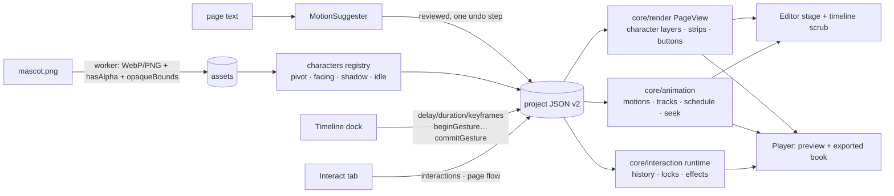

# Folio v2: mascot animation, page timeline and interactive storybook

This is a build prompt for Claude Code, written for this repository. Folio v1 (milestones M0–M9) is
already built and tested. This prompt extends it with three features:

1. **Characters.** Turn a single PNG (transparent background) into a character that moves in step
   with the story, mostly automatically.
2. **Page timeline.** An editable time ruler under the stage for every animation on a page, split by
   the reader's clicks.
3. **Interactive storybook.** Story buttons, tap reactions, reveals, choices and branching, locked
   pages, and a fun reader experience.

---

## 0. How to use this prompt (for the person running it)

1. Get two things ready: your **real mascot PNG** (transparent background) and **5–10 lines of real
   story text**. The agent tests and tunes better with real material.
2. Start a Claude Code session in this repository and paste:

   ```text
   Read prompt.md in full, then every file listed in section 1 under "Read first".
   Enter plan mode and propose a plan for milestones M10–M16. In the plan, answer every
   item in section 3 "Decisions to confirm": use the recommended default unless you
   find a concrete reason not to, and say why. Wait for my approval. Then build one
   milestone at a time. After each one, run pnpm check, pnpm test:e2e and
   pnpm size:player, commit, and give me the summary described in section 9.
   ```

3. After each milestone, work through its **Try it** list (section 6) before you reply "continue
   with the next milestone".
4. See section 11 for tips on steering, bug reports and change requests.

---

## 1. Context for the agent

You are extending a working app, not starting over. Before you plan anything, read the existing
architecture and reuse it.

### Read first

| Path                                                                                                            | Why it matters                                                                                                                                                                                          |
| --------------------------------------------------------------------------------------------------------------- | ------------------------------------------------------------------------------------------------------------------------------------------------------------------------------------------------------- |
| `README.md`                                                                                                     | Architecture, design rules and key decisions (including why the app uses the Web Animations API instead of GSAP)                                                                                        |
| `src/core/schema/project.ts`                                                                                    | The zod schema. `SCHEMA_VERSION = 1`. Defines the element union, `animationStepSchema` (triggers `onPageEnter`, `withPrevious`, `afterPrevious`, `onClick`) and `pageSchema`                            |
| `src/core/migrations/index.ts`                                                                                  | The `MIGRATIONS` array and `repairProject`, which drops dangling references                                                                                                                             |
| `src/core/ops/*`                                                                                                | Every document edit is an Immer recipe recorded by the patch history                                                                                                                                    |
| `src/core/render/page-view.ts`, `nodes.ts`, `render.css`                                                        | The one renderer. Each element is a **frame** (layout) containing an **anim** layer (animations) containing the **content**. `splitTextFor` is the hook that splits text into characters for typewriter |
| `src/core/animation/*`                                                                                          | Preset registry (one file per preset), `schedule.ts` (click groups), `timeline.ts` (`createPageTimeline`: play, finish, finishAll, cancel, isRunning), easings, transitions                             |
| `src/core/image/process.ts`                                                                                     | Upload pipeline. It already keeps transparency: WebP with alpha, or PNG when WebP isn't available and the image has transparency (`hasTransparency`)                                                    |
| `src/player/player.ts`                                                                                          | The vanilla reader: next, prev, goTo, click groups, pointer, keyboard and swipe handling                                                                                                                |
| `src/editor/store/doc-store.ts`                                                                                 | `change()` for edits, and `beginGesture()` / `commitGesture()` to make one gesture a single undo step                                                                                                   |
| `src/editor/panels/AnimationPane.tsx`, `src/editor/animation/preview.ts`, `src/editor/stage/SelectionLayer.tsx` | The Animation Pane, stage previews, and live gesture rendering that commits once                                                                                                                        |
| `src/core/templates/*`, `src/wizard/*`                                                                          | Layout templates and the quick-create flow                                                                                                                                                              |
| `src/core/export/build.ts`, `tests/e2e/export-roundtrip.spec.ts`                                                | The export's CSP (`default-src 'none'`), inlining, size estimate, and the `file://` zero-network test harness to extend                                                                                 |

### Non-negotiable rules (inherited from v1)

1. **The project JSON is the single source of truth.** All edits go through Immer recipes in
   `core/ops` and are recorded by the patch history. Reader state at runtime (history, unlocked
   pages, collected items) never enters the document.
2. **One renderer and one animation runtime.** New visual behaviour goes in `core/render` and
   `core/animation`. The editor stage, thumbnails, preview and exported player must stay identical.
   Never implement anything a second time in React.
3. **Everything time-based must be seekable.** Every effect must be a Web Animations API animation,
   or a pure function of time driven by one. No free-running `requestAnimationFrame` loops and no
   `setInterval` animations. The timeline has to scrub to any time `t` and show exactly what the
   player shows at `t`.
4. **Exports make zero network requests and work from `file://`.** The CSP stays
   `default-src 'none'`. Only M15 may widen it, and only for media.
5. **The player bundle stays under 150 KB gzipped.** It is about 10.4 KB today. Report the change
   in size at every milestone. No React and no GSAP in the player.
6. **User content is never parsed as HTML.**
   - Labels are set with `textContent`.
   - Icons come from a closed, built-in set.
   - Actions are a closed zod union: no URLs, no scripts, no `eval`.
7. **Schema changes follow the migration process.**
   - Bump `SCHEMA_VERSION` and add a migration.
   - Extend `repairProject` to drop dangling references.
   - Existing books must keep loading.
   - Books already exported embed their own player, so they are unaffected.
8. **Accessibility.**
   - Anything interactive is a real, focusable control with an accessible name, and works from the
     keyboard.
   - `prefers-reduced-motion` is respected everywhere.
9. **Don't break what works.** The existing 84 unit tests and 18 E2E tests must keep passing. If a
   test genuinely has to change, explain why in the commit message.
10. **Dependencies.** Justify each new one: license (MIT, Apache, BSD, ISC or OFL) and size.
    **Ask before adding any dependency to the player bundle.**

---

## 2. What the user wants

> "We're making a story with one main character. I have a single PNG of the character. I want it to
> move (walk in, hop, wave, react) in step with the story, with minimal effort. I also want to
> fine-tune the timing of every animation on every page. The book should feel like a fun
> interactive ebook: buttons tied to the story, next and previous, choices and surprises."

### User stories

- **Author: create a character in one click.** Upload one transparent PNG and click **Make it a
  character**. It automatically gets:
  - a pivot at its feet
  - a soft ground shadow
  - a gentle idle animation (breathing)
- **Author: animate the whole story.** **Animate my story** suggests a motion for each page based on
  the page text (for example "jumped" becomes Hop). It keeps the character's position consistent from
  page to page. The author reviews the list and applies it as one undo step.
- **Author: pick from ~30 motions.** Examples: walk in, hop, wave, wiggle, turn around, snooze, walk
  out. Each has simple options such as direction, height and intensity.
- **Author: work on a timeline.** Open a **timeline** under the stage and see every animation on the
  page as bars on a time ruler, split into "page opens / click 1 / click 2". From there the author
  can:
  - scrub to any moment and see it on the stage
  - drag bars to change timing
  - edit keyframes and the character's motion path
- **Author: add interactive mechanics.**
  - story buttons such as "Help Pip jump!", "Go left / Go right" and "Next →"
  - tap reactions on the character
  - lift-the-flap reveals
  - "next" locked until the reader taps the right thing
- **Reader** (a child on a tablet, or a parent on a laptop):
  - tap, swipe or use the keyboard
  - buttons are big and obvious
  - hints glow when the reader gets stuck
  - "back" returns to the page the reader actually came from

---

## 3. Decisions to confirm (recommended defaults in bold)

| #   | Question                                                               | Options                                                                       | Recommended                                                                                      |
| --- | ---------------------------------------------------------------------- | ----------------------------------------------------------------------------- | ------------------------------------------------------------------------------------------------ |
| 1   | How to bend a flat image (sway, jelly, lean)                           | DOM strip warp (horizontal slices animated by WAAPI) / WebGL mesh warp / none | **DOM strip warp**, validated by a spike in M11. If seams look bad, stop and propose WebGL       |
| 2   | Branching stories (choice buttons that jump to other pages)            | yes / no                                                                      | **Yes**, with history-based "back"                                                               |
| 3   | Tap anywhere on the page to advance                                    | on / off / per page                                                           | **On by default, automatically off on locked pages.** Taps on interactive elements never advance |
| 4   | Sound (tap sounds, page-turn sound)                                    | include as M15 / skip                                                         | **Include as M15, the last milestone.** It can be skipped                                        |
| 5   | Language of the motion suggestions                                     | English keywords / pluggable                                                  | **English keywords behind a `MotionSuggester` interface** (an AI suggester is roadmap)           |
| 6   | Poses (extra PNGs per character for talking, blinking, moods)          | M14 P2 / roadmap                                                              | **M14 P2** (build it if time allows)                                                             |
| 7   | Character stays still while the page turns around it                   | build / roadmap                                                               | **Roadmap** (it needs a persistent overlay in the player)                                        |
| 8   | Timeline units and grid                                                | seconds with a 0.1 s grid / frames                                            | **Seconds, 0.1 s grid**, hold Shift to ignore the grid                                           |
| 9   | Collectibles ("Find 3 stars")                                          | M14 P2 / roadmap                                                              | **M14 P2**                                                                                       |
| 10  | Characters with an opaque background (JPEG, or a PNG with a white box) | allow with a warning / block                                                  | **Allow, with a clear warning.** Background removal is out of scope                              |

---

## 4. Feature spec

### 4A. Characters: "Make it move"

A character is an ordinary image element that references a **character definition** stored at book
level. Every page that shows the mascot reuses the same asset, deduplicated by hash. Its pivot,
facing, shadow and idle settings are defined once for the whole book.

#### Setup ("Make it a character")

- **Available from** the Design tab when one image is selected, the Insert toolbar (upload a
  character), and the wizard (section 4A, "Automation").
- **Automatic detection from the alpha channel.** At upload, the image worker computes:
  - `hasAlpha`
  - `opaqueBounds`: the bounding box of pixels with alpha above ~8, normalized, sampled on a
    downscaled copy of about 256 px
- **Defaults it sets:**
  - The pivot goes at the **bottom centre of the opaque bounds** (the feet). The user can drag a
    pivot handle on the stage to change it.
  - A ground shadow: a soft ellipse under the feet whose width follows the opaque width.
  - An idle motion of **Breathe**.
  - Facing **right** (the user can change it).
  - A tap reaction (**Wiggle**) is offered.
- **Opaque images get a warning:** "This image has a solid background, so characters look best as
  PNGs with transparent backgrounds." The image can still be used.
- **Check edge quality.** Lossy WebP at q=0.85 can halo alpha edges. If halos show up, encode images
  that have alpha at a higher quality, or keep the original PNG when it is small enough. Document
  what you chose.

#### Motion library

Each motion is a file in `src/core/animation/motions/`. It emits **structured property keyframes**
(`x`, `y`, `rotate`, `scaleX`, `scaleY`, `opacity`) for named targets, not raw transform strings.
This is what makes a motion editable on the timeline and convertible to keyframes.

**Motion design rules:**

- **Anticipation.** Before a jump or throw, add a small opposite motion lasting 15–20 % of the
  duration.
- **Squash and stretch** preserve volume: `scaleX ≈ 1 / sqrt(scaleY)`. Scale about the pivot so the
  feet stay planted.
- **Arcs.** Hops rise with ease-out and fall with ease-in.
- **Overshoot** of 8 % or less on settles.
- **Couple the shadow:** it shrinks and fades while the character is in the air.
- **`intensity`** (0.25–2) scales amplitude, not timing. Timing comes from the duration.
- **Keep it small and friendly.** Children's-book motion is bouncy, never violent.

| id           | Label           | Kind     | Notes                                                                                                          |
| ------------ | --------------- | -------- | -------------------------------------------------------------------------------------------------------------- |
| `walkIn`     | Walk in         | entrance | From left or right. Bobs once per step (`steps` 2–8), faces the way it travels, settles with a small overshoot |
| `hopIn`      | Hop in          | entrance | 2–3 arcing hops in from the side, squashing on each landing                                                    |
| `dropIn`     | Drop in         | entrance | Falls from above the page, squashes on impact, bounces once. The shadow grows as it lands                      |
| `popUp`      | Pop up          | entrance | Rises from below its feet line, as if out of a hole. Clipped below the feet during the motion                  |
| `peekIn`     | Peek in         | entrance | Slides in from the nearest edge and stops partly visible (`amount`). Pairs well with a tap reveal              |
| `hop`        | Hop             | emphasis | `height`, `count`. Anticipation, then stretch up, then a squash on landing                                     |
| `excited`    | Jump for joy    | emphasis | A quick double hop plus a wiggle                                                                               |
| `wave`       | Wave            | emphasis | Rocks ±`angle` around the feet, 3 cycles                                                                       |
| `bow`        | Bow / nod       | emphasis | Tilts forward and back, `count` times                                                                          |
| `shakeNo`    | Shake "no"      | emphasis | Fast, small side-to-side rotations                                                                             |
| `wiggle`     | Wiggle (tickle) | emphasis | Fast rotation with a little scale jitter. The default tap reaction                                             |
| `shiver`     | Shiver          | emphasis | Tiny fast sideways jitter and a slight shrink ("scared", "cold")                                               |
| `spin`       | Spin            | emphasis | 360° around the centre (the only motion that overrides the pivot)                                              |
| `turnAround` | Turn around     | emphasis | Squeezes `scaleX` through 0 to face the other way (target `face`). Keeps the new facing                        |
| `lookAround` | Look around     | emphasis | Faces left, pauses, faces right, then back                                                                     |
| `grow`       | Grow / shrink   | emphasis | `scale` 0.5–2. Keeps the new size                                                                              |
| `dance`      | Dance           | emphasis | Alternates rocking and small hops. Can loop                                                                    |
| `talk`       | Talk            | emphasis | A tiny rhythmic squash. Can loop. With poses, it alternates mouth poses                                        |
| `jelly`      | Jelly wobble    | emphasis | **Warp.** A decaying sideways wobble with the feet fixed                                                       |
| `lean`       | Lean            | emphasis | **Warp.** Bends toward a direction and keeps the bend                                                          |
| `breathe`    | Breathe         | idle     | Loops. `scaleY` +2.5 % with `scaleX` compensated, about 3 s. The default idle                                  |
| `float`      | Float           | idle     | Loops. Bobs ±8 px; the shadow shrinks when the character is high                                               |
| `bouncy`     | Bouncy          | idle     | Loops. Small continuous hops                                                                                   |
| `sway`       | Sway            | idle     | Loops. **Warp.** The top sways while the feet stay planted                                                     |
| `snooze`     | Snooze          | idle     | Loops. A slow, deep breathe with a slight tilt                                                                 |
| `walkOut`    | Walk out        | exit     | Walks off to the left or right, facing the way it travels                                                      |
| `hopOut`     | Hop out         | exit     | Arcing hops off the page                                                                                       |
| `jumpAway`   | Jump away       | exit     | A big hop up and off the top of the page                                                                       |
| `sinkDown`   | Sink down       | exit     | Drops below the feet line, clipped                                                                             |

**Tiers:**

- **Tier 1: whole-body transforms.** Every motion in the table not marked **Warp**. This is required.
- **Tier 2: warp.**
  - **What it is:** the image is rendered as N horizontal strips (N ≤ 24, each overlapping by 1 px
    to hide seams). Each strip is animated with WAAPI, with amplitude as a function of its height
    above the feet.
  - **Where:** strip rendering sits behind `character.warp` and a `splitStripsFor(page)` hook in the
    renderer, which mirrors `splitTextFor`.
  - **Spike first:** build `sway` and look at it before building the rest. If it looks bad,
    **stop and ask.**
- **Tier 3: poses (P2).**
  - **What it is:** extra PNGs per character (happy, sad, eyes closed, mouth open).
  - **How:** all poses are stacked in the content layer and switched with `opacity` step keyframes,
    so switching stays seekable.
  - **Motions it enables:** `talk` alternates mouth poses, `blink` briefly shows the eyes-closed
    pose, and `setPose` switches pose.

#### Automation

- **One-click character:** see "Setup" above.
- **Animate my story.** A dialog in the Animate tab. It is local, deterministic and instant.
  1. Pick the character.
  2. The suggester reads each page's text and proposes **entrance / action / exit / idle**, showing
     a reason such as `matched "jumped"`.
  3. The result is shown as a table of pages. Each row has dropdowns to edit the choices and a
     checkbox to include or exclude the page.
  4. **Apply** makes it a single undo step labelled "Animate story".
- **Suggester** (`core/story/suggest-motions.ts`, implementing a `MotionSuggester` interface):
  - English keyword groups, matched on whole words with simple stems, highest priority first:
    - jump, hop, leap, bounce: `hop`
    - walk, run, went, came, arrive: `walkIn`
    - wave, hello, hi: `wave`
    - happy, yay, cheer, laugh, giggle, celebrate: `excited`
    - dance, party: `dance`
    - sleep, tired, yawn, night, dream: idle `snooze`
    - scared, afraid, cold, nervous: `shiver`
    - "no", refuse: `shakeNo`
    - look, search, find, where: `lookAround`
    - fly, float, balloon: idle `float`
    - grow, big: `grow`
    - wow, surprise, gasp: `hop` at intensity 0.6
    - leave, left, away, goodbye, bye: `walkOut`
  - Negation isn't handled; document that limitation.
  - **Continuity rules:**
    - The first page where the character appears gets `walkIn` from the left.
    - A page where the character is still there from the previous page gets **no entrance**.
    - After a `walkOut` to the right, the next entrance comes from the left, as if the character
      kept travelling.
    - The last page gets `wave`.
- **Placement** (used by the wizard and by Animate my story, when a page doesn't have the character
  yet):
  - Use the **same slot** (position and size) on every page unless the user has moved it.
  - Pick the left or right third with the least overlap with text elements' bounds (use
    `rotatedBounds`).
  - Height about 40 % of the page, feet on a ground line at 92 % of the page height.
- **Wizard.** Add an optional **Add a character** step after "Pages":
  - upload the character PNG, with the transparency check and warning
  - a toggle for "Animate it automatically", which runs the suggester and placement across the
    generated pages

### 4B. Page timeline

#### Layout

- **Where:** a bottom dock under the stage.
  - Collapsed by default.
  - Toggle it with a **Timeline** button, or `T` when the user isn't typing (no existing shortcut
    uses `T`).
  - Resizable from 160 to 480 px. The height is remembered in `localStorage` (UI state only).
- **Header controls:**
  - play/pause, stop, loop, speed (0.25×, 0.5×, 1×)
  - a time readout
  - a time-axis zoom slider and **Fit**
- **Ruler:** one segment per click group, side by side: **Page opens | Click 1 | Click 2 …**.
  - Each segment has its own local 0 s.
  - Separators show a "waits for tap" icon.
  - Clicking a segment header plays that group.
- **Lanes:**
  - One row per element that has steps, in layer order (top-most first).
  - An **Idle** lane per character.
  - An **On interaction** section at the bottom for steps that play only when an action triggers
    them. They have no place in the click sequence and each has its own local time.
- **Bars:**
  - Coloured by kind, using the pane's existing colours: entrance emerald, emphasis amber, exit
    rose.
  - Labelled with the effect name.
  - Loops show a repeating hatch to the end of the group.
  - Selection stays in sync with the Animation Pane and the stage.
- **Keyframe sub-lanes:** a lane that contains a keyframes step expands into one sub-lane per
  property, with diamond markers for keyframes.

#### Scrub and play

- **Scrubbing** calls `timeline.seek(group, ms)` on the stage's `PageView`, which is the same code as
  the player.
- While previewing on the timeline:
  - The stage is in a preview state: selection handles are hidden and editing is off, like the
    existing `previewing` flag.
  - **Esc** (or clicking the stage) returns to editing and cancels every effect.
- **Play** runs from the playhead to the end of the group, or repeats if loop is on.

#### Edit

- **Bar body drag** changes **`delay` only**, measured from the step's anchor.
  - The delay is clamped to 0 or more.
  - If the user drags earlier than the anchor, a tooltip explains why: "Starts after previous. Change
    Start in the Animation Pane to move it earlier."
  - Bars can't be dragged across click groups; that is done in the pane.
- **Right edge** changes `duration` (50 ms to 60 s).
- **Left edge** changes `delay` and `duration` together, keeping the end fixed.
- **Snapping** targets: other bars' start and end, the playhead, the group start, and a 0.1 s grid.
  Hold **Shift** to turn snapping off. A snap line is shown.
- **Undo:** each drag is **one undo step** (`beginGesture` and `commitGesture`), with a live seek
  preview while dragging.
- **Keyboard:**
  - Bars are focusable.
  - ←/→ nudge the delay by 0.1 s (Shift for 1 s).
  - Alt+←/→ change the duration.
  - Delete removes the step.
  - Enter opens it in the Animation Pane.
- **New keyframes step:** double-click empty lane space to add a **Custom move** (a keyframes step)
  starting at the playhead.

#### Keyframes (a step with preset `keyframes`)

- **Properties:** `x`, `y` (a px offset from the layout position), `rotate`, `scaleX`, `scaleY`,
  `opacity`.
  - Keyframe time `t` is normalized to 0–1 of the step, so changing the duration stretches the
    keyframes.
- **Editing keyframes:**
  - Add a keyframe at the playhead; it takes the value currently sampled.
  - Drag diamonds to retime them, and press Delete to remove them.
  - An inspector edits the value and the easing to the next keyframe.
- **Convert to keyframes:** available on any structured (character) motion step. It bakes the motion
  into an editable keyframes step, which links automation and hand-tuning.
- **Motion path:**
  - When a keyframes step has `x`/`y`, the stage draws its path: a dot per keyframe and a dashed
    curve.
  - Dragging a dot edits its position values.
  - **Record mode** (stretch): with record on, dragging the element on the stage at the playhead
    time writes `x`/`y` keyframes instead of moving the element.
- **Parity requirement.** At any time `t`, the element's transforms on the editor stage must equal
  those in the exported player. An E2E test checks this.

### 4C. Interactive storybook

#### New elements

- **Button** (`type: 'button'`)
  - **Content:** a label and an optional built-in icon. The icons are a closed set: arrowRight,
    arrowLeft, home, restart, star, heart, question, check, play, soundOn, soundOff, paw.
  - **Style:** font, size, weight, text colour, fill, border, radius and shadow.
  - **Motion:** a pressed effect (CSS `:active` scale) and an optional "attract" wiggle.
  - **Insert presets:** **Next →**, **← Back**, **Choice pair**, **Start over**, **Tap me!**
  - **Rendering:** a real `<button type="button">` in the player; a non-interactive look-alike in the
    editor and thumbnails.
- **Hotspot** (`type: 'hotspot'`)
  - An invisible tap area for things like "tap the tree" or flaps.
  - In the editor: a dashed outline and a label.
  - In the player: invisible, but focusable, with a visible focus ring.
- **Any element can be interactive:** an image, text, shape or character with interactions gets
  `role="button"` and `tabindex="0"` in the player. It requires an **accessible label**.

#### Interactions and actions

An interaction reads "**When tapped** → run these actions, in order". Its options:

- **Once:** only the first tap counts.
- **Accessible label:** required for anything that isn't a button element.

| Action       | Effect                                                                                                             |
| ------------ | ------------------------------------------------------------------------------------------------------------------ |
| `next`       | The same as the reader's Next: plays the page's next click group first, then turns the page (respecting page flow) |
| `prev`       | Goes back through history (the page the reader came from)                                                          |
| `goToPage`   | Jumps to a page for branching, and pushes it onto history                                                          |
| `firstPage`  | Restarts the book and clears history                                                                               |
| `playStep`   | Plays an animation step whose Start is **On interaction**: a reveal, a reaction or an exit                         |
| `unlockNext` | Unlocks the page's Next (see page flow)                                                                            |
| `burst`      | Confetti, sparkles or hearts from the tapped element (M14)                                                         |
| `playSound`  | M15 only                                                                                                           |

- **Order:** actions run in order. A navigation action ends the list, and the editor warns about any
  actions after it.
- **New Start option: "On interaction".** Available in the Animation Pane.
  - Such steps are left out of the click sequence.
  - **Entrances in this mode start hidden**, which gives reveals and lift-the-flap for free.
  - Tapping again replays the step unless the interaction is `once`.

#### Page flow (page settings when nothing is selected, in the Interact tab)

- **Next goes to:** the next page (default), a specific page, or **End of book**.
- **Lock Next until an Unlock action runs.** While locked:
  - The Next button is disabled.
  - Swipe and tap-to-advance are ignored.
  - Pressing → shows a hint.
- **Choice page recipe:** lock Next, then add two buttons with `goToPage`.
- **Editor checks.** The Interact tab lists problems:
  - missing labels
  - actions that point to deleted pages, steps or elements
  - **a locked page with no unlock or navigation action**, which would be a dead end

#### Reader rules (player)

- **Taps and keys:**
  - Tapping an interactive element **never** advances the page.
  - Enter or Space on a focused interactive element activates it; it doesn't mean "next".
- **Back** follows **history**, and falls back to index − 1.
- **The End:** pressing Next on the last page (or when `flow.next = 'end'`) shows a **The End**
  overlay with Restart and the page menu.
- **Hints:** on a locked page, if the reader hasn't interacted for 4 s, interactive elements pulse.
  With reduced motion they get a static outline instead.

#### Fun extras

- **P1 (M14):**
  - a default tap reaction when a character is created
  - a **lift-the-flap** insert preset: a hotspot plus a hidden image with an On interaction entrance
  - hint glow
  - **bursts**: DOM particles animated with WAAPI and removed afterwards; turned off with reduced
    motion
  - The End overlay and Restart
  - a **page menu**: a grid of lazy `PageView` thumbnails in the reader
  - **resume where you left off**, stored per book in `localStorage` wrapped in try/catch
    (best-effort, since `file://` origins differ between browsers)
- **P2 (M14 if time allows):**
  - **Collectibles**, such as "Find 3 stars":
    - a page `goal` with a count and a label
    - a `collect` action
    - a counter badge
    - when the goal is reached, the page unlocks automatically and plays a burst
  - **Poses** (Tier 3)
- **P3 (roadmap):** drag-to-target mini-games.

### 4D. Sound (M15, optional; confirm before starting)

- **Assets:**
  - A new audio asset kind: mp3, ogg, wav or m4a, up to 2 MB each. Warn when a book's audio totals
    30 MB.
  - Stored in Dexie like images and deduplicated by hash. No transcoding.
- **Uses:** the `playSound` action and a page-turn sound (a book setting).
  - Per-page background loops are a stretch goal.
- **Player:**
  - Plays with `HTMLAudioElement`.
  - **Nothing plays before the first user gesture**, because of browser autoplay policies.
  - A mute toggle in the reader controls is remembered between visits.
- **Export:**
  - Audio is base64 in the single-file export, or in `assets/audio/` in the zip.
  - The size estimate includes audio.
  - The CSP adds only `media-src data:` (single file) or `media-src 'self' data:` (zip).

---

## 5. Architecture

### 5.1 Where things go

```
src/core/
  character/     character.ts (setup, pivotToLocal, placement), alpha.ts (opaque bounds), strips.ts (strip geometry)
  animation/
    motions/     one file per character motion (structured property keyframes) + registry
    tracks.ts    keyframe tracks → WAAPI keyframes; compileTransform (fixed order translate → rotate → scale)
    schedule.ts  + loops, + onInteraction
    timeline.ts  + seek, playStep, startIdle, loop-safe finish
  interaction/   schema helpers, runtime.ts (pure reader state machine), validate.ts (editor checks)
  story/         suggest-motions.ts (MotionSuggester + English rules), keywords.ts
  render/        nodes.ts: + buildButton, buildHotspot, character layers, strips
src/player/      player.ts becomes a thin shell over core/interaction/runtime; burst.ts, menu.ts, end.ts, (audio.ts)
src/editor/
  timeline/      TimelineDock, Ruler, Lane, Bar, KeyframeLane, useTimelinePreview, snapping.ts (lazy-loaded chunk)
  panels/        CharacterPanel, InteractPanel, PageFlowPanel
  character/     AnimateStoryDialog, PivotHandle, MotionPathOverlay
src/wizard/steps/CharacterStep.tsx
```

### 5.2 Data model: schema v2 (a sketch; refine it, but keep it closed and validated)

```ts
// Assets: filled in by the upload worker.
assetRefSchema += {
  hasAlpha: z.boolean().optional(),
  opaqueBounds: normalizedRectSchema.optional(),
};

// Book-level cast.
const characterSchema = z.object({
  id,
  name: z.string().max(60),
  assetId,
  pivot: z.object({ x: unit, y: unit }), // asset-normalized (0..1); default = bottom-centre of opaqueBounds
  facing: z.enum(['left', 'right']), // the direction the art faces
  shadow: z.object({ enabled: z.boolean(), opacity: unit, size: z.number().min(0.2).max(2) }),
  idle: z.object({ preset: presetId, intensity: z.number().min(0).max(2) }).nullable(),
  warp: z.boolean(),
  poses: z.array(z.object({ id, name: z.string().max(40), assetId })).max(8), // Tier 3
});
projectSchema += {
  characters: z.record(idSchema, characterSchema),
  reader: z.object({
    tapToAdvance: z.boolean(),
    showNavButtons: z.boolean(),
    showPageMenu: z.boolean(),
    rememberPosition: z.boolean(),
    hints: z.boolean(),
  }),
};

// Elements.
baseElement += {
  interactions: z.array(interactionSchema).max(4).optional(),
  a11yLabel: z.string().max(120).optional(),
};
imageElementSchema += {
  characterId: idSchema.optional(),
  idleOverride: z.union([presetId, z.literal('none')]).optional(),
};
const buttonElementSchema = base.extend({
  type: z.literal('button'),
  label: z.string().max(60),
  icon: z.enum(BUTTON_ICONS).optional(),
  iconPosition: z.enum(['start', 'end', 'only']),
  style: buttonStyleSchema,
});
const hotspotElementSchema = base.extend({ type: z.literal('hotspot') });

// Interactions: a closed union, with ids checked by regex.
const actionSchema = z.discriminatedUnion('type', [
  z.object({ type: z.literal('next') }),
  z.object({ type: z.literal('prev') }),
  z.object({ type: z.literal('firstPage') }),
  z.object({ type: z.literal('goToPage'), pageId: idSchema }),
  z.object({ type: z.literal('playStep'), stepId: idSchema }),
  z.object({ type: z.literal('unlockNext') }),
  z.object({ type: z.literal('burst'), effect: z.enum(['confetti', 'sparkles', 'hearts']) }),
  // M15: z.object({ type: z.literal('playSound'), assetId: idSchema }),
]);
const interactionSchema = z.object({
  id: idSchema,
  trigger: z.literal('tap'),
  actions: z.array(actionSchema).min(1).max(8),
  once: z.boolean(),
});

// Animation steps.
ANIMATION_TRIGGERS += 'onInteraction';
const keyframeSchema = z.object({
  t: unit,
  v: z.number().min(-10000).max(10000),
  easing: z.string().max(40).optional(),
});
const trackSchema = z.object({
  property: z.enum(['x', 'y', 'rotate', 'scaleX', 'scaleY', 'opacity']),
  keyframes: z.array(keyframeSchema).min(1).max(64),
});
animationStepSchema += {
  loop: z.boolean().optional(),
  tracks: z.array(trackSchema).max(8).optional(),
}; // tracks only when preset === 'keyframes'

// Pages.
pageSchema += {
  flow: z
    .object({ next: z.union([idSchema, z.literal('end')]).optional(), lockNext: z.boolean() })
    .optional(),
};
```

**Migration from v1 to v2:**

- Set `schemaVersion: 2` and add `characters: {}` and the `reader` defaults. Everything else is
  optional, so no other data is rewritten.
- Test it against a **v1 fixture JSON** saved from the current app (the sample book).

**Keeping references valid:**

- `repairProject` must drop actions and step references that point to deleted pages, steps or
  elements.
- **Ops must do the same:** deleting a page removes `goToPage` actions that target it, and undo
  restores them. Unit-test both.

### 5.3 Render layers for characters (other elements are unchanged)

```
.fl-el            frame: layout x/y/w/h/rotation     ← moveable target (unchanged)
  .fl-shadow      ground ellipse at the feet line    ← animation target 'shadow'
  .fl-anim        story steps; origin = pivot         ← target 'element'
    .fl-idle      idle loop; origin = pivot           ← target 'idle'
      .fl-image
        .fl-image-flip                                ← target 'face' (turnAround / lookAround)
          img  |  .fl-strips > .fl-strip × N  |  .fl-pose × M      ← targets 'media' | 'strips' | 'poses'
```

- `pivotToLocal(asset, crop, box, pivot)` converts the pivot from asset coordinates to
  element-local percentages using the existing `imageLayout` crop math. Unit-test it.
- Keeping story steps and the idle loop on separate layers means they combine without conflict: the
  character keeps breathing while it hops in.

### 5.4 Changes to the animation runtime

- **Structured motions.** Motions implement
  `buildTracks(ctx) → Record<Target, PropertyKeyframes>`, which is compiled with `compileTransform`.
  Because they're structured, they can be baked into a keyframes step.
- **Compiling keyframe tracks.** Each track needs independent, seekable, deterministic easing.
  Choose one approach and document it:
  - CSS individual transform properties (`translate`, `rotate`, `scale`) as separate animations,
    merging the x/y and scaleX/scaleY pairs by sampling
  - or sampling everything at up to 60 samples per second, with at most 240 keyframes per step
- **Loops.**
  - Loops use `iterations: Infinity`.
  - `schedule` counts **one cycle** when anchoring `afterPrevious`.
  - `finish()` must **skip infinite animations.** Today it catches the error and cancels, which
    would kill idle loops.
- **`seek(group, ms)`:**
  - Pause everything.
  - Groups before `group` go to their end state, excluding loops.
  - Groups after it go to t = 0 (so entrances are hidden).
  - The current group gets `currentTime = ms`. This is exact because each animation is created with
    `delay: start`.
- **`playStep(stepId)`** plays On interaction steps. Those steps are built when the page mounts so
  that their entrances start hidden.
- **`startIdle()`** starts idle loops when the page mounts. It doesn't run under reduced motion.
- **Reduced motion for characters:**
  - entrances and exits become short fades
  - emphasis motions are skipped
  - idle and warp are off
  - interactions still work

### 5.5 Reader runtime (`core/interaction/runtime.ts`)

A pure reducer that is fully unit-tested without the DOM:

```ts
type ReaderState = {
  page: number;
  group: number;
  history: number[];
  unlocked: Record<string, true>;
  consumed: Record<string, true>;
};
type ReaderEvent =
  | { type: 'next' }
  | { type: 'prev' }
  | { type: 'goto'; page: number }
  | { type: 'tap'; elementId: string }
  | { type: 'restart' };
function reduce(state, event, book): { state: ReaderState; effects: Effect[] };
// Effects: showPage(index, direction) | playGroup(g) | finishGroup(g) | playStep(id) | burst(effect, elementId) | hint | showEnd
```

**How Next resolves:**

1. If the page has more click groups, play the next group.
2. Otherwise, if the page is locked and not yet unlocked, show a **hint**.
3. Otherwise go to `flow.next`, or index + 1. `'end'` shows the end overlay.

`Player` becomes a shell that turns DOM input into events and carries out the effects. The in-app
preview mounts the same `Player`, so interactions can be tested with **Preview**.

### 5.6 Editor changes

- **Right panel tabs:** **Design | Animate | Interact | Layers**.
- **Design tab, image selected:** a "Make it a character" button, or the Character panel (name,
  pivot, facing, shadow, idle, warp, poses).
- **Animate tab:**
  - The Add animation menu gains a **Character** group (Entrances, Actions, Idle, Exits) when a
    character is selected.
  - **Animate my story** lives here.
- **Insert toolbar:** Button (presets), Hotspot, Character.
- **Stage:** a pivot handle, the motion path overlay, hotspot outlines, and the timeline preview
  state.
- **Loading:** the timeline dock is lazy-loaded so the editor chunk doesn't grow for users who never
  open it.

### 5.7 Data flow



---

## 6. Milestones

Each milestone ends with `pnpm check`, `pnpm test:e2e` and `pnpm size:player` passing, a commit, and
a summary (section 9).

### M10: Schema v2 and runtime foundations

- **Build:**
  - schema v2, the migration and repair, and the ops (including cleaning up references when things
    are deleted)
  - `compileTransform` and the structured keyframes, plus the new animation targets
  - the character render layers (pivot, shadow, idle)
  - button and hotspot renderers
  - the `onInteraction` trigger and loops in `schedule`
  - `seek`, `playStep`, `startIdle` and a loop-safe `finish` in the timeline
- **Done when:**
  - every existing test passes
  - the v1 fixture migrates and round-trips
  - unit tests cover seek math with a fake `animate`, loop scheduling, repair and ops cleanup,
    `pivotToLocal`, and button-label injection
- **Try it:** open an existing book. Nothing looks or behaves differently.

### M11: Characters, motion library and automation

- **Build:**
  - Make it a character: automatic bounds, pivot and shadow; the pivot handle; facing; idle
  - all Tier 1 motions
  - the Tier 2 **spike** (`sway`), then **stop and show me** before building `jelly` and `lean`
  - Animate my story: suggester, placement and continuity
  - the wizard's Add a character step
- **Done when:**
  - Unit tests:
    - every motion is deterministic and schema-valid
    - the feet stay planted during `breathe`, `hop` and `wave` (the pivot's page position is
      constant within 0.5 px at sampled times)
    - squash keeps volume within 5 %
    - suggester keyword and continuity tables
    - placement avoids text bounds
  - E2E:
    - upload a transparent PNG generated in the test and make it a character; the pivot sits at the
      bottom of the opaque bounds
    - apply Walk in; it plays in the preview and in the exported book over `file://`
    - Animate my story on a 5-page book, then a single undo reverts everything
- **Try it:**
  1. Upload your mascot and click Make it a character.
  2. Run Animate my story on your real text.
  3. Preview and export the book.

### M12: Page timeline

- **Build:**
  - the dock, the ruler split by click group, and the lanes (including idle and On interaction)
  - scrub, play, loop and speed
  - bar drag and resize with snapping and one undo step per drag, plus keyboard control
  - keyframes steps: add, move, delete, value and easing inspector
  - Convert to keyframes and the motion path overlay (record mode is a stretch goal)
- **Done when:**
  - E2E: dragging a bar right by N px increases `delay` by the expected milliseconds, and a single
    undo reverts it
  - E2E: editing keyframes changes the playback
  - **Parity E2E:** seek the editor stage and the exported player to the same `t` and check that the
    computed transforms of the anim and idle layers match
- **Try it:**
  1. Open the timeline on a page with 3 steps and a click.
  2. Scrub, retime a step and convert a Hop to keyframes.
  3. Drag the motion path.

### M13: Interactive storybook

- **Build:**
  - button and hotspot elements with their insert presets
  - the Interact tab and every action except `burst` and `playSound`
  - the On interaction Start option in the pane
  - page flow (next override, lock, end)
  - the reader runtime reducer, with the player refactored onto it
  - tap and keyboard rules
  - the editor checks panel
- **Done when:**
  - Unit tests of the reducer: branch A/B, back retraces the actual path, lock and unlock, `once`,
    end of book
  - E2E: a branching book exported and read over `file://` **with the keyboard only** reaches both
    endings with zero network requests
  - E2E: tapping the mascot plays its reaction and doesn't turn the page
  - E2E: a locked page can't be skipped
- **Try it:** build a two-choice page ("Go left / Go right") that leads to two endings, and a
  lift-the-flap page.

### M14: Reader extras and fun mechanics

- **Build:** everything in P1 (section 4C), then P2 if time allows (collectibles, poses).
- **Done when:**
  - E2E: the hint glow appears after 4 s on a locked page, and is static under reduced motion
  - E2E: bursts clean up their DOM nodes
  - E2E: the page menu navigates
  - E2E: resume offers the last page
  - E2E: The End overlay restarts the book
- **Try it:** read the whole sample story as a child would, on a narrow (tablet-width) window.

### M15: Sound (optional; confirm before starting)

- **Build:** section 4D.
- **Done when:**
  - E2E: tapping plays a sound (check with an `HTMLMediaElement` spy)
  - E2E: mute is remembered
  - E2E: the size estimate includes audio
  - E2E: the export still makes zero network requests
  - E2E: nothing plays before the first gesture

### M16: Polish, performance and documentation

- **Performance:** a 30-page book with the mascot on every page must meet:
  - page turn to first frame under 100 ms
  - no long task over 50 ms during 3 s of idle, measured with `PerformanceObserver('longtask')` in
    Chromium
- **Accessibility pass** over all the new UI.
- **Rebuild the sample book** as "A Day in the Hills" with the mascot, a choice page and a
  lift-the-flap.
- **README:** add "Add a character motion", "Add an action" and "How the timeline maps to the data
  model".
- **Screenshots:** refresh them.

---

## 7. Testing requirements

- **Fixtures come from code, not binaries.**
  - A test helper draws a **transparent mascot** on a canvas: a body circle, ears and eyes, with
    transparent padding so the opaque-bounds detection is actually tested.
  - There is also an **opaque variant** to test the warning.
- **Unit tests (Vitest)** cover everything marked "Done when" above, plus:
  - `compileTransform` order and the pivot origin
  - track compilation, where sampled values match the analytic values within a tolerance
  - strip geometry
  - the editor checks: dead-end locked pages and dangling targets
- **E2E tests (Playwright)** extend `tests/e2e/export-roundtrip.spec.ts` rather than duplicating it:
  - character motion
  - a branching story
  - keyboard-only reading
  - zero network requests, in both the HTML and zip exports
- **Parity** (stage compared with the exported player at the same `t`) is a required test, not an
  optional one.
- **Reduced motion** gets its own E2E case: no idle loop, reveals still work.

## 8. Budgets

| Budget                          | Limit                                                                |
| ------------------------------- | -------------------------------------------------------------------- |
| Player bundle (gzip)            | < 150 KB hard limit; aim for < 40 KB after M16 (about 10.4 KB today) |
| Strips per warped character     | ≤ 24                                                                 |
| Warped characters per page      | ≤ 3 (the editor warns above this)                                    |
| Keyframes per step              | ≤ 64 authored; ≤ 240 compiled                                        |
| Page turn (30-page mascot book) | < 100 ms to the first frame                                          |
| Idle frame budget               | no long task over 50 ms during 3 s of idle                           |

## 9. Milestone summary format (reply with this after each milestone)

1. **Built:** a bullet list of what exists now.
2. **Try it:** numbered steps for the person to check it by hand.
3. **Tests:** what was added, and the unit and E2E counts.
4. **Bundle:** the player's gzip size and the change from before.
5. **Decisions made:** anything you chose that wasn't specified, and why.
6. **Known limitations** and **next**.

**Stop and ask** (don't guess) at these points:

- after the plan
- after the Tier 2 warp spike
- before adding any dependency to the player
- before starting M15
- if an existing test needs substantive changes
- if a requirement here conflicts with how the code actually works

## 10. Out of scope (roadmap)

- AI background removal
- AI or LLM motion suggestions (the `MotionSuggester` interface is designed for it)
- automatic rigging or body-part segmentation
- lip-sync or read-aloud narration with word highlighting
- drag-and-drop mini-games
- keeping a character still while the page turns around it
- video
- external links
- reader analytics
- collaboration

## 11. Tips for steering the build

- **One milestone per turn.** Say "continue with M12" only after its Try it list checks out.
- **Use real material.** Attach your mascot PNG and paste real story lines; the suggester and motion
  tuning improve a lot.
- **Report bugs precisely.** Say which page and element, what you expected and what happened, the
  steps to reproduce, and whether it happens in **Preview**, the **exported file**, or both.
- **Ask for options when you're unsure.** For example: "Give me 2 options for X with trade-offs
  before building."
- **Keep changes scoped.** For example: "Fix only this. Don't refactor unrelated code."
- **Treat the exported file as the truth.** If something only works in the editor, it isn't done.
